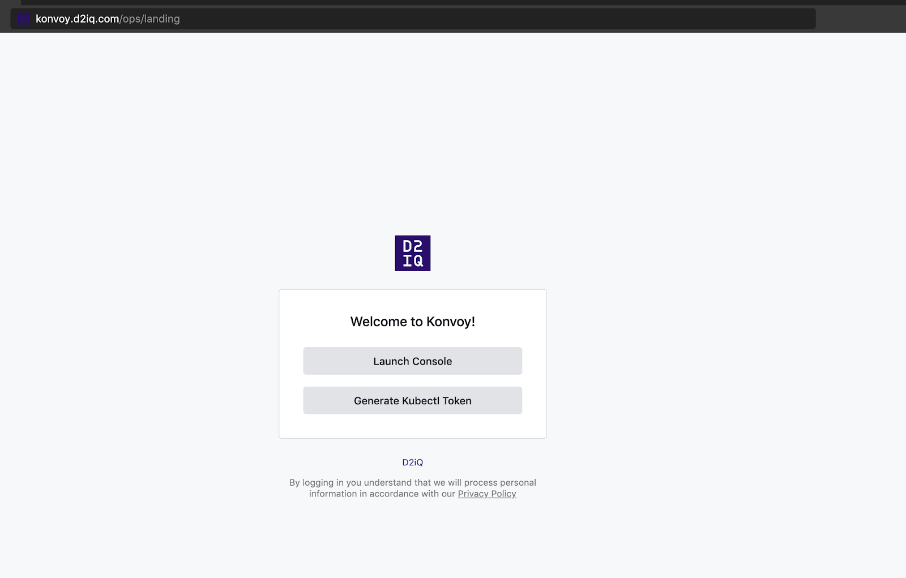

1.  Obtain a token from the web landing page.

    
    Select the "Generate kubectl Token" button.

1.  Select an identity provider and cluster.

    As many of the backends provide single-sign on (SSO), you may already be signed in. Otherwise, you will be redirected to your identity provider’s web page to login. Once you have signed in, a page will show the commands required to configure `kubectl` to access the Konvoy cluster.

    When the token expires, it is necessary to repeat the above process to obtain a fresh token. When refreshing a token, only the `kubectl config set-credentials` command needs to be executed with the new token.
