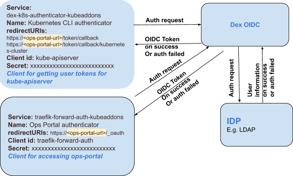

All Kubernetes clusters have two categories of users: service accounts and normal users. Kubernetes manages authentication for service accounts, but the cluster adminstrator, or a separate service, manages authentication for normal users.

Konvoy configures the cluster to use OpenID Connect (OIDC), a popular and extensible user authentication method, and installs Dex, a popular, open-source software that integrates your existing Identity Providers with Kubernetes.

To begin, set up an Identity Provider with Dex, then use OIDC as the Authentication method.

## Identity Provider

An Identity Provider (IdP) is a service that lets you manage identity information for users, including groups. A Konvoy cluster uses Dex as its IdP. Dex, in turn, delegates to one or more external IdPs.

If you use already use one or more of the following IdPs, you can configure Dex to use them:

| Name | Supports Refresh Tokens | Supports Groups Claim | Supports `preferred_username` Claim | Status | Notes |
| ---- | ----------------------- | --------------------- | --------------------------------- | ------ | ----- |
| [LDAP](https://github.com/dexidp/dex/blob/v2.22.0/Documentation/connectors/ldap.md) | yes | yes | yes | stable | |
| [GitHub](https://github.com/dexidp/dex/blob/v2.22.0/Documentation/connectors/github.md) | yes | yes | yes | stable | |
| [SAML 2.0](https://github.com/dexidp/dex/blob/v2.22.0/Documentation/connectors/saml.md) | no | yes | no | stable |
| [GitLab](https://github.com/dexidp/dex/blob/v2.22.0/Documentation/connectors/gitlab.md) | yes | yes | yes | beta | |
| [OpenID Connect](https://github.com/dexidp/dex/blob/v2.22.0/Documentation/connectors/oidc.md) | yes | yes | yes | beta | Includes Salesforce, Azure, etc. |
| [Google](https://github.com/dexidp/dex/blob/v2.22.0/Documentation/connectors/google.md) | yes | yes | yes | alpha | |
| [LinkedIn](https://github.com/dexidp/dex/blob/v2.22.0/Documentation/connectors/linkedin.md) | yes | no | no | beta | |
| [Microsoft](https://github.com/dexidp/dex/blob/v2.22.0/Documentation/connectors/microsoft.md) | yes | yes | no | beta | |
| [AuthProxy](https://github.com/dexidp/dex/blob/v2.22.0/Documentation/connectors/authproxy.md) | no | no | no | alpha | Authentication proxies such as Apache2 mod_auth, etc. |
| [Bitbucket Cloud](https://github.com/dexidp/dex/blob/v2.22.0/Documentation/connectors/bitbucketcloud.md) | yes | yes | no | alpha | |
| [OpenShift](https://github.com/dexidp/dex/blob/v2.22.0/Documentation/connectors/openshift.md) | no | yes | no | stable | |

<strong>NOTE: </strong>These are the Identity Providers supported by Dex <a href="https://github.com/dexidp/dex/blob/v2.22.0/README.md">2.22.0</a>, the version used by Konvoy.

## Identity Provider Procedures

[Set up an identity provider with Dex](./set-up-identity-provider-with-dex)

## Authentication

OpenID Connect is an extension of the [OAuth2 authentication protocol](https://oauth.net/2/). As required by OAuth2, the client must be registered with the IdP; in this case, Dex. Do this by passing the name of the application and a callback/redirect uri. These handle the processing of the OpenID token after the user authenticates successfully. Upon registration Dex returns a “client_id” and a “secret”. Authentication requests use these, between the client and Dex, to identify the client.

Users access Konvoy in two ways:

- To interact with Kubernetes API, usually through `kubectl`.
- To interact with the Konvoy Ops Portal, which has GUI dashboards for Konvoy, Kommander, Prometheus, Kibana, etc.

In Konvoy, Dex comes pre-configured with a client for the above access use cases. The clients talk to Dex for authentication. Dex talks to the configured IdP (Identity Provider, for example LDAP, SAML etc.) to perform the actual task of authenticating the user. If the user authenticates successfully Dex pulls the user’s information from the IdP and forms an OpenID token. This token contains this information and returns it to the respective client’s callback url. The client or end user uses this token for communicating with the Konvoy Ops Portal or Kubernetes API respectively.

This figure illustrates these components and their interaction at a high level:

## Authentication Procedures

- [Generate client access token](./generate-client-access-token)
- [Change token lifetime](./change-token-lifetime)
- [Change the group prefix](./change-group-prefix)

## Users & Groups

<!--
TODO High-level overview of why there is a user and a group.
-->

## Users & Groups Procedures

<!--
TODO Assign Permission to Users & Groups (Note: This should link to procedure under the forthcoming RBAC section.)
-->

## Troubleshoot

[Troubleshoot OIDC and Dex](./troubleshoot)
