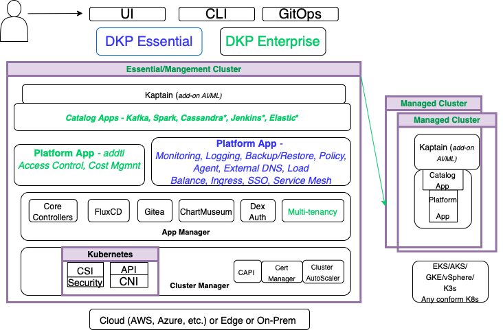

Kubernetes provides the foundation of a DKP cluster.
Because of this fundamental relationship, you should be familiar with a few key concepts and terms.
The topics in this section provide a brief overview of the native Kubernetes architecture, a simplified view of the DKP architecture - both Essential and Enterprise versions. Also, it shows the operational workflow for a DKP cluster.

The following diagram provides a simplified architectural overview to help you visualize the flow of the key components:

Figure 1 - Architectural overview

## Components for the Kubernetes control plane

The native Kubernetes cluster consists of **components** that provide the cluster’s **control plane** and **worker nodes** that run users' containers and maintain the runtime environment.

DKP supplements the native Kubernetes cluster by providing a predefined and pre-configured set of applications.
Because this predefined set of applications provides critical features for managing a Kubernetes cluster in a production environment, the default set is identified as DKP **platform services**.

See [Platform applications](/../../dkp/kommander/2.2/projects/applications/platform-applications/) for the full set of DKP platform services.

## Related information

For information on related topics or procedures, refer to the following:

[kubedoc](https://kubernetes.io/docs/concepts/overview/components/)
