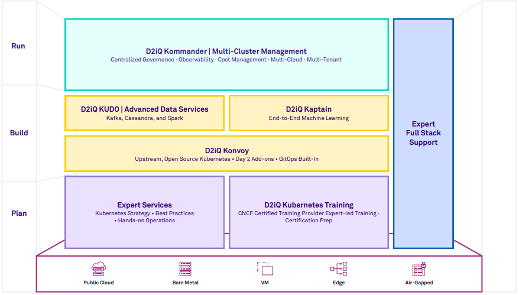

As the leading independent platform for Kubernetes in production, the D2iQ Kubernetes Platform (DKP) provides a holistic approach and a complete set of enterprise-grade technologies, services, training, and support to build and run applications in production at scale. Built around the open-source Cluster API, the new version of DKP becomes the single, centralized point of control for an organization’s application infrastructure, empowering organizations to more easily deploy, manage, and scale Kubernetes workloads in Day 2 production environments.

| **Features**                                          | **Benefits**                                                                                                                                                                                                                                                                                                                                                                                                                                                                                                                           |
| ----------------------------------------------------------- | -------------------------------------------------------------------------------------------------------------------------------------------------------------------------------------------------------------------------------------------------------------------------------------------------------------------------------------------------------------------------------------------------------------------------------------------------------------------------------------------------------------------------------------------- |
| **Simplify and Accelerate Kubernetes Adoption**       | Enable Day 2 Readiness Out-of-the-Box Without Lock-In DKP takes care of the heavy lifting by providing a comprehensive, enterprise-grade Kubernetes distribution and a full stack of CNCF-certified Day 2 platform applications that are integrated, automated, and tested at scale for an out-of-the-box, production-ready experience. DKP is a complete solution built on pure upstream open-source Kubernetes, providing you the freedom to leverage ongoing open-source innovation, immune to the lock-in of proprietary solutions. |
| **Expand Kubernetes Across Distributed Environments** | Ensure Consistency, Security, and Performance DKP provides centralized governance, control, and declarative provisioning of any Kubernetes cluster or CNCF-conformant Kubernetes distribution, as well as end-to-end declarative lifecycle management for both infrastructure and applications from a single central point of control. Both allow for greater standardization, security, and performance across disparate clusters with zero downtime.                                                                                  |
| **Enable a Broader Set of Advanced Applications**     | Ensure Fast, Simple Deployment of ML and Fast Data Pipeline DKP builds on its legacy of delivering enterprise-grade stateful applications by enabling advanced application use cases for Kubernetes, such as machine learning and fast data pipelines. With DKP, you can automatically provision Spark, Cassandra, and Kafka from the Kommander catalog of platform applications, and get a robust Kubernetes platform, a powerful ML platform, and the NVIDIA DGX into a certified and tested solution.                                |
| **Leverage Cloud Native Expertise**                   | Harness the Power of Experience DKP provides expert consulting services, training, and support for both Kubernetes and the entire cloud-native stack of platform applications in your deployment. By leveraging our knowledge, expertise, and operational guidance, you can avoid common pitfalls and ensure faster time to market.                                                                                                                                                                                                     |
