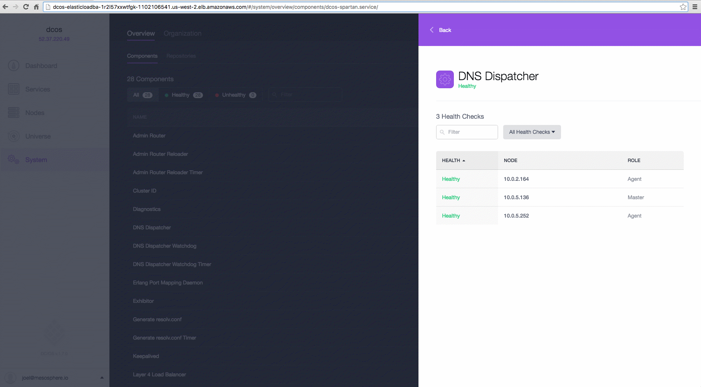

DC/OS cluster nodes generate logs that contain diagnostic and status information for DC/OS core components and DC/OS services.

## Service and Task Logs

If you're running something on top of DC/OS, you can get started right away by running this [DC/OS CLI][2] command: 

```bash
dcos task log --follow my-service-name
```

For more information about accessing your logs, see the service and task logs [documentation][1].

## System Logs

You can find which components are unhealthy in the DC/OS UI on the **System** tab.



You can also aggregate your system logs by using ELK and Splunk. See our [ELK][3] and [Splunk][4] tutorials to get started.

All of the DC/OS components use `systemd-journald` to store their logs. To access the DC/OS core component logs, [SSH into a node][5] and run this command to see all logs:

```bash
journalctl -u "dcos-*" -b
```

You can also view the logs for specific components by entering the component name: 

**Admin Router**
    
```bash
journalctl -u dcos-nginx -b
```
            
**DC/OS Marathon**

```bash
journalctl -u dcos-marathon -b
```

**gen-resolvconf**

```bash
journalctl -u dcos-gen-resolvconf -b
```
    
**Mesos master node**

```bash
journalctl -u dcos-mesos-master -b
``` 

**Mesos agent node**

```bash
journalctl -u dcos-mesos-slave -b
```

**Mesos DNS**

```bash
journalctl -u dcos-mesos-dns -b
```

**ZooKeeper**

```bash
journalctl -u dcos-exhibitor -b
```

## Next Steps

- [Service and Task logs][1]
- Log Aggregation

    - [ELK][3]
    - [Splunk][4]

[1]: /docs/1.7/administration/logging/service-logs/
[2]: /docs/1.7/usage/cli/install/
[3]: /docs/1.7/administration/logging/elk/
[4]: /docs/1.7/administration/logging/splunk/
[5]: /docs/1.7/administration/sshcluster/
