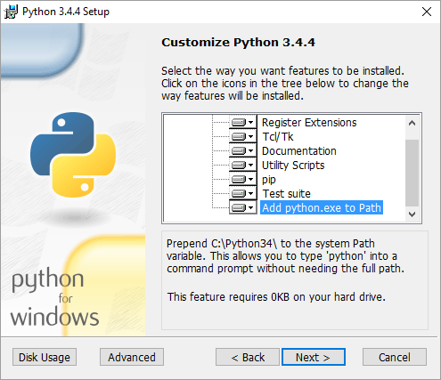
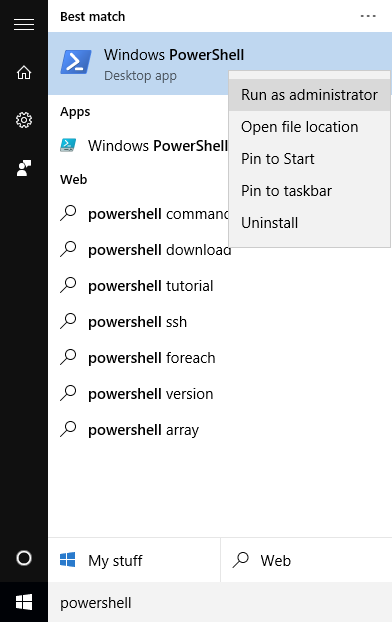
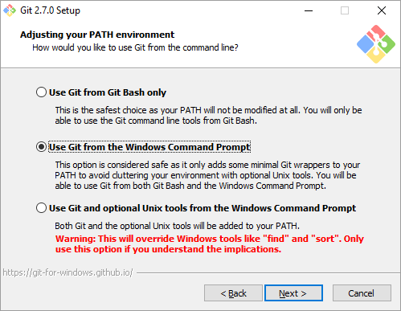

**Important:** DC/OS 1.8 introduces binary CLIs for Linux, Windows, and Mac. The install script is replaced with a simple binary CLI. The 1.8 CLI is compatible with DC/OS 1.6.1 forward. For more information, see the [documentation](/docs/1.7/usage/cli/install/).

*   [Installing the DC/OS CLI on Unix, Linux, and macOS][1]
*   [Installing the DC/OS CLI on Windows][2]

# <a name="linux"></a>Installing on Unix, Linux, and macOS

The easiest way to install the DC/OS CLI is by clicking the signpost icon in the lower left corner of the DC/OS web interface. Or, you can manually install the CLI by following these instructions.

#### Prerequisites

*   A system external to your DC/OS cluster that you can install the CLI
*   Network access from the external system to your DC/OS cluster
*   A command-line environment, such as Terminal
*   cURL: Installed by default on macOS and most Linux distributions.
*   Python 2.7.x or 3.4.x: Installed by default on macOS and most Linux distributions. (Python 3.5.x will not work.)
*   Pip: See the <a href="https://pip.pypa.io/en/stable/installing.html#install-pip" target="_blank">installation documentation</a>.
*   Git:
    *   **macOS:** Get the installer from [Git downloads][3].
    *   **Unix/Linux:** See these <a href="https://git-scm.com/book/en/v2/Getting-Started-Installing-Git" target="_blank">installation instructions</a>.

#### Installing the DC/OS CLI

1.  Install **virtualenv**:

    ```bash
    sudo pip install virtualenv
    ```

    **Tip:** On some older Python versions, you might receive an "Insecure Platform" warning, but you can safely ignore this. For more information, see <a href="https://virtualenv.pypa.io/en/latest/installation.html" target="_blank">https://virtualenv.pypa.io/en/latest/installation.html</a>.

2.  From the command line, create a new directory named `dcos` and change your working directory to it.

    ```bash
    mkdir dcos && cd dcos
    ```

3.  Download the DC/OS CLI install script to your new directory:

    ```bash
    curl -O https://downloads.dcos.io/dcos-cli/install.sh
    ```

4.  Run the DC/OS CLI install script, where `<installdir>` is the DC/OS installation directory and `<hosturl>` is the hostname of your master node prefixed with `http://`:

    ```bash
    bash install.sh <install_dir> http://<hosturl>
    ```

    For example, if the hostname of your AWS master node is `dcos-ab-1234.us-west-2.elb.amazonaws.com`:

    ```bash
    bash install.sh . http://dcos-ab-1234.us-west-2.elb.amazonaws.com
    ```

5.  Follow the on-screen DC/OS CLI instructions. You can ignore any Python "Insecure Platform" warnings.

6.  Authenticate your CLI with your master node and set the auth token, run the below command on bootstrap instance:

    ```bash
    dcos auth login
    ```

    You will be provided an URL and prompted to enter the authentication token. Visit the URL to get your authentication token.

7. Enter the URL in your browser.

8. You will be asked to authenticate. Once done, the authentication token will be provided. Copy and paste the token into your terminal. Your CLI should now be authenticated with your cluster!

    You can now use the CLI.

    ```bash
    Command line utility for the Datacenter Operating
    System (DC/OS). DC/OS is a distributed operating
    system built around Apache Mesos. This utility provides tools
    for easy management of a DC/OS installation.

    Available DC/OS commands:

        config Get and set DC/OS CLI configuration properties
        help Display command line usage information
        marathon Deploy and manage applications on the DC/OS
        node Manage DC/OS nodes
        package Install and manage DC/OS packages
        service Manage DC/OS services
        task Manage DC/OS tasks

    Get detailed command description with 'dcos <command> --help'.
    ```


# <a name="windows"></a>Installing on Windows

#### Prerequisites

*   A system external to your DC/OS cluster onto which you will install the CLI
*   Network access from the external system to your DC/OS cluster
*   Windows PowerShell: Installed by default on Windows 7 and later

To install the DC/OS CLI, you must first install Python, pip, Git, and virtualenv.

**Important:** Disable any security or antivirus software before beginning the installation.

#### Installing Python

1.  Download the Python 2.7 or Python 3.4 installer <a href="https://www.python.org/downloads/windows/" target="_blank">here</a>.

    **Important:** You must use Python version 2.7.x or 3.4.x. Python version 3.5.x will not work with the DC/OS CLI. Use the x86-64 installer for 64-bit versions of Windows and the x86 installer for 32-bit versions of Windows.

2.  Run the installer and select the "Add python.exe to Path" option when you are prompted to "Customize Python" as shown in the screenshot below.

    

    **Important:** If you do not select the "Add python.exe to Path" option, you must manually add the Python installation folder to your Path or the DC/OS CLI will not work.

#### Upgrading pip

Pip is included with Python, but you must upgrade pip for it to work properly with the DC/OS CLI.

1.  Download the `get-pip.py` script from <a href="https://pip.pypa.io/en/stable/installing.html#install-pip" target="_blank">the pip download page</a>.

2.  Run Powershell as Administrator by right-clicking the Start menu shortcut as shown in the screenshot below:

    

    **Important:** You must run Powershell as Administrator or the CLI installation will fail.

3.  Run the script.

    ```powershell
    PS C:\> python get-pip.py
    ```

#### Installing Git

1.  Download the Git installer from <a href="http://git-scm.com/download/win" target="_blank">the Git download page</a>.

2.  Run the installer.

    **Tip:** You might receive a security warning that blocks execution of the installer and states that "Windows protected your PC." It is safe to ignore this warning and click "Run Anyway."

3.  During the Git install, select the "Use Git from the Windows Command Prompt" option when you are prompted as shown in the screenshot below.

    

    **Important:** If you do not select the "Use Git from the Windows Command Prompt" option, you must manually add the Git installation folder to your Path or the DC/OS CLI will not work.

#### Installing virtualenv

1.  Run Powershell as Administrator.

2.  Install `virtualenv`:

    ```powershell
    PS C:\> pip install virtualenv
    ```

    **Tip:** You can safely ignore any Python "Insecure Platform" warnings. For more information, see <a href="https://virtualenv.pypa.io/en/latest/installation.html" target="_blank">https://virtualenv.pypa.io/en/latest/installation.html</a>.

#### Installing the CLI

1.  Run Powershell as Administrator.

2.  From the command line, create a new directory named `dcos` (it can be located wherever you wish) and change your working directory to it.

    ```powershell
    PS C:\> md dcos
    Directory: C:\

    Mode                LastWriteTime         Length Name
    ----                -------------         ------ ----
    d-----        1/29/2016   2:33 PM                dcos

    PS C:\> cd dcos
    PS C:\dcos>
    ```

3.  Download the DC/OS CLI Powershell install script [by clicking here][4]. Save the script to the `dcos` directory.

    If you are running Windows 10, or if you are running an earlier version of Windows and have manually installed the `wget` software package, you can alternatively download the Powershell script directly from within Powershell:

    ```powershell
    PS C:\dcos\> wget https://downloads.dcos.io/dcos-cli/install.ps1 -OutFile install.ps1
    ```

4.  Change the default security policy of your Powershell to allow the install script to run:

    ```powershell
    PS C:\dcos> set-executionpolicy Unrestricted -Scope Process

    Execution Policy Change
    The execution policy helps protect you from scripts that you do not trust.
    Changing the execution policy might expose you to the security risks
    described in the about_Execution_Policies help topic at
    http://go.microsoft.com/fwlink/?LinkID=135170. Do you want to change the
    execution policy?
    [Y] Yes  [A] Yes to All  [N] No  [L] No to All  [S] Suspend  [?] Help
    (default is "N"): Y
    ```

5.  Run the DC/OS CLI install script, where `<installdir>` is the DC/OS installation directory and `<hosturl>` is the hostname of your master node prefixed with `http://`:

    ```powershell
    PS C:\dcos\> .\install.ps1 <install_dir> <hosturl>
    ```

    For example, if the hostname of your AWS master node is `dcos-ab-1234.us-west-2.elb.amazonaws.com`:

    ```powershell
    PS C:\dcos\> .\install.ps1 . http://dcos-ab-1234.us-west-2.elb.amazonaws.com
    ```

    **Tip:** You might receive a security warning. It is safe to ignore this warning and allow the script to run:

    ```powershell
    Security Warning
    Run only scripts that you trust. While scripts from the Internet can
    be useful, this script can potentially harm your computer. Do you
    want to run C:\dcos\install.ps1?
    [D] Do not run  [R] Run once  [S] Suspend  [?] Help (default is "D"): R
    ```

7.  Follow the on-screen DC/OS CLI instructions to add the `dcos` command to your PATH and complete installation:

    ```powershell
    PS C:\dcos\> & .activate.ps1; dcos help
    ```
    
1. Authenticate your CLI with your master node and set the auth token, run the below command on bootstrap instance:

    ```powershell
    dcos auth login
    ```

    You will be provided an URL and prompted to enter the authentication token. Visit the URL to get your authentication token.

1. Enter the URL in your browser.

1. You will be asked to authenticate. Once done, the authentication token will be provided. Copy and paste the token into your terminal. Your CLI should now be authenticated with your cluster!

    You can now use the CLI.

    ```powershell
    Command line utility for the Datacenter Operating
    System (DC/OS). DC/OS is a distributed operating
    system built around Apache Mesos. This utility provides tools
    for easy management of a DC/OS installation.

    Available DC/OS commands:

        config Get and set DC/OS CLI configuration properties
        help Display command line usage information
        marathon Deploy and manage applications on the DC/OS
        node Manage DC/OS nodes
        package Install and manage DC/OS packages
        service Manage DC/OS services
        task Manage DC/OS tasks

    Get detailed command description with 'dcos <command> --help'.
    ```

 [1]: #linux
 [2]: #windows
 [3]: http://git-scm.com/download/mac
 [4]: https://downloads.dcos.io/dcos-cli/install.ps1
