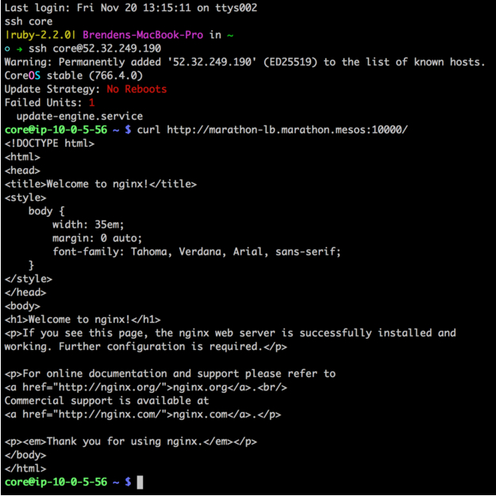

To demonstrate Marathon-LB, you can boot a DC/OS cluster on AWS to run an internal and external load balancer. The external load balancer will be used for routing external HTTP traffic into the cluster, and the internal load balancer will be used for internal service discovery and load balancing. Since we’ll be doing this on AWS, external traffic will first hit an external load balancer configured to expose our "public" agent nodes.

## Prerequisites

*   [A DC/OS cluster][1]
*   [DC/OS and DC/OS CLI][2] are installed.

## Steps

1.  Install Marathon-LB.

        dcos package install marathon-lb

    To check that Marathon-LB is working, [find the IP for your public node][3] and navigate to `http://<public agent ip>:9090/haproxy?stats`. You willl see a statistics report page like this:

    

2.  Set up your internal load balancer. To do this, we must first specify some configuration options for the Marathon-LB package. Create a file called `options.json` with the following contents:

        {
          "marathon-lb":{
            "name":"marathon-lb-internal",
            "haproxy-group":"internal",
            "bind-http-https":false,
            "role":""
          }
        }

    In this options file, we’re changing the name of the app instance and the name of the HAProxy group. The options file also disables the HTTP and HTTPS forwarding on ports 80 and 443 because it is not needed.

    Next, run the install command with the new options:

        dcos package install --options=options.json marathon-lb

3.  Now there are 2 load balancers: an internal load balancer and an external one, which was installed along with Marathon-LB. Launch an external version of NGINX to demonstrate the features. Launch this app on DC/OS by pasting the JSON below into a file called `nginx-external.json`.

        {
          "id": "nginx-external",
          "container": {
            "type": "DOCKER",
            "docker": {
              "image": "nginx:1.7.7",
              "network": "BRIDGE",
              "portMappings": [
                { "hostPort": 0, "containerPort": 80, "servicePort": 10000 }
              ],
              "forcePullImage":true
            }
          },
          "instances": 1,
          "cpus": 0.1,
          "mem": 65,
          "healthChecks": [{
              "protocol": "HTTP",
              "path": "/",
              "portIndex": 0,
              "timeoutSeconds": 10,
              "gracePeriodSeconds": 10,
              "intervalSeconds": 2,
              "maxConsecutiveFailures": 10
          }],
          "labels":{
            "HAPROXY_GROUP":"external"
          }
        }

    Run the following command to add the app:

        dcos marathon app add nginx-external.json

    The application definition includes a special label with the key `HAPROXY_GROUP`. This label tells Marathon-LB whether or not to expose the application. The external Marathon-LB was started with the `--group` parameter set to `external`, which is the default.

4.  Now, launch the internal NGINX.

        {
          "id": "nginx-internal",
          "container": {
            "type": "DOCKER",
            "docker": {
              "image": "nginx:1.7.7",
              "network": "BRIDGE",
              "portMappings": [
                {
                  "hostPort": 0,
                  "containerPort": 80,
                  "servicePort": 10001
                }
              ],
              "forcePullImage": true
            }
          },
          "instances": 1,
          "cpus": 0.1,
          "mem": 65,
          "healthChecks": [
            {
              "protocol": "HTTP",
              "path": "/",
              "portIndex": 0,
              "timeoutSeconds": 10,
              "gracePeriodSeconds": 10,
              "intervalSeconds": 2,
              "maxConsecutiveFailures": 10
            }
          ],
          "labels": {
            "HAPROXY_GROUP": "internal"
          }
        }

    Notice that we’re specifying a servicePort parameter. The servicePort is the port that exposes this service on Marathon-LB. By default, port 10000 through to 10100 are reserved for Marathon-LB services, so you should begin numbering your service ports from 10000.

    Add one more instance of NGINX to be exposed both internally and externally:

        {
          "id": "nginx-everywhere",
          "container": {
            "type": "DOCKER",
            "docker": {
              "image": "nginx:1.7.7",
              "network": "BRIDGE",
              "portMappings": [
                { "hostPort": 0, "containerPort": 80, "servicePort": 10002 }
              ],
              "forcePullImage":true
            }
          },
          "instances": 1,
          "cpus": 0.1,
          "mem": 65,
          "healthChecks": [{
              "protocol": "HTTP",
              "path": "/",
              "portIndex": 0,
              "timeoutSeconds": 10,
              "gracePeriodSeconds": 10,
              "intervalSeconds": 2,
              "maxConsecutiveFailures": 10
          }],
          "labels":{
            "HAPROXY_GROUP":"external,internal"
          }
        }

    Note the servicePort does not overlap with the other NGINX instances.

    Service ports can be defined either by using port mappings (as in the examples above), or with the `ports` parameter in the Marathon app definition.

    To test the configuration, [SSH into one of the instances in the cluster][4] (such as a master), and try

    `curl`-ing the endpoints:

        curl http://marathon-lb.marathon.mesos:10000/
        curl http://marathon-lb-internal.marathon.mesos:10001/
        curl http://marathon-lb.marathon.mesos:10002/
        curl http://marathon-lb-internal.marathon.mesos:10002/

    Each of these should return the NGINX ‘Welcome’ page:

    

## Virtual hosts

An important feature of Marathon-LB is support for virtual hosts. This allows you to route HTTP traffic for multiple hosts (FQDNs) and route requests to the correct endpoint. For example, you could have two distinct web properties, `ilovesteak.com` and `steaknow.com`, with DNS for both pointing to the same LB on the same port, and HAProxy will route traffic to the correct endpoint based on the domain name.

To test the vhost feature, navigate to the AWS console and look for your public ELB. Now, if you navigate to the instances tab, you should see the instances listed as `InService`, like this:

Our ELB is able to route traffic to HAProxy. Next, let’s modify our NGINX app to expose our service. To do this, you’ll need to get the public DNS name for the ELB from the `Description` tab. In this example, my public DNS name is `brenden-j-PublicSl-1LTLKZEH6B2G6-1145355943.us-west-2.elb.amazonaws.com`.

Modify the external NGINX app to look like this:

    {
      "id": "nginx-external",
      "container": {
        "type": "DOCKER",
        "docker": {
          "image": "nginx:1.7.7",
          "network": "BRIDGE",
          "portMappings": [
            { "hostPort": 0, "containerPort": 80, "servicePort": 10000 }
          ],
          "forcePullImage":true
        }
      },
      "instances": 1,
      "cpus": 0.1,
      "mem": 65,
      "healthChecks": [{
          "protocol": "HTTP",
          "path": "/",
          "portIndex": 0,
          "timeoutSeconds": 10,
          "gracePeriodSeconds": 10,
          "intervalSeconds": 2,
          "maxConsecutiveFailures": 10
      }],
      "labels":{
        "HAPROXY_GROUP":"external",
        "HAPROXY_0_VHOST":"brenden-j-publicsl-1ltlkzeh6b2g6-1145355943.us-west-2.elb.amazonaws.com"
      }
    }

We’ve added the label `HAPROXY_0_VHOST`, which tells Marathon-LB to expose NGINX on the external load balancer with a virtual host. The `0` in the label key corresponds to the servicePort index, beginning from 0. If you had multiple servicePort definitions, you would iterate them as 0, 1, 2, and so on. Note that if you _do_ specify a vhost, you don't strictly need to provide a service port—Marathon will assign one for you.

Now, if you navigate to the ELB public DNS address in your browser, you should see the following:

 [1]: /docs/1.7/administration/installing/
 [2]: /docs/1.7/usage/cli/install/
 [3]: /docs/1.7/administration/managing-aws/
 [4]: /docs/1.7/administration/sshcluster/