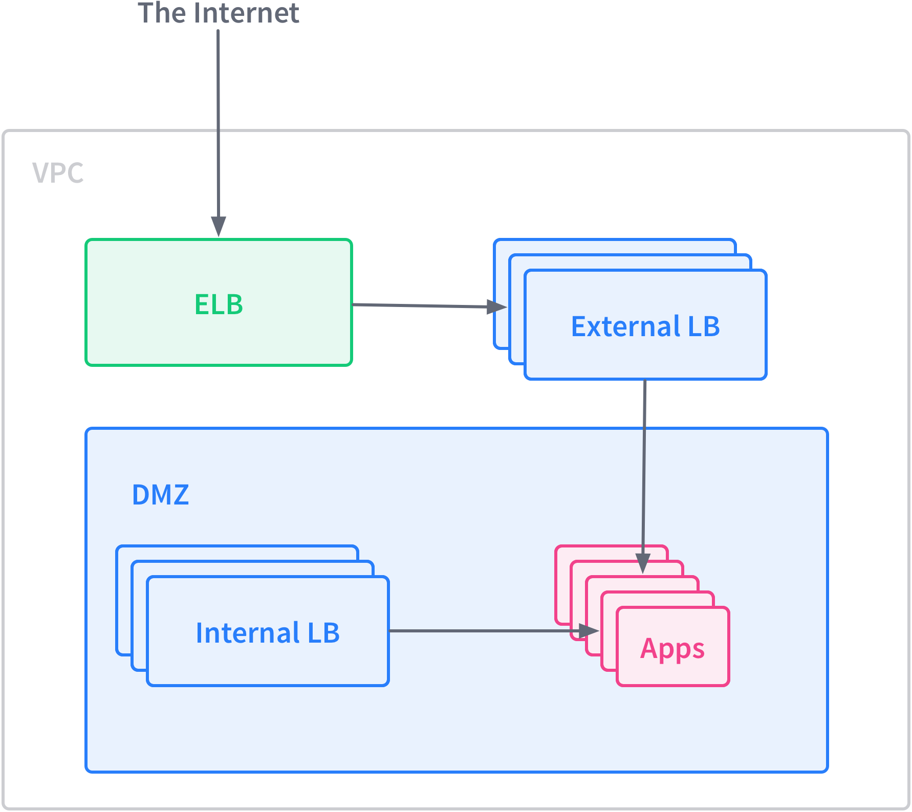

You can use the [marathon-lb-autoscale][1] application to implement request rate-based autoscaling with Marathon. The marathon-lb-autoscale application works with any application that uses TCP traffic and can be routed through HAProxy.

marathon-lb-autoscale collects data from all HAProxy instances to determine the current RPS (requests per second) for your apps. The autoscale controller then attempts to maintain a defined target number of requests per second per service instance. marathon-lb-autoscale makes API calls to Marathon to scale the app.

**Prerequisites**

*   A [running DC/OS cluster][2].
*   A [configured DC/OS CLI][3].
*   A service running on the native Marathon instance.

**Application Parameters**

*   marathon (URL) - The URL for Marathon
*   haproxy (URLs) - A comma-separated list of URLs for HAProxy. If this is a Mesos-DNS A-record, all backends will be polled.
*   interval (float) - The number of seconds (N) between update intervals. The default is 60.
*   samples (integer) - The number of samples to average. The default is 10.
*   cooldown (integer) - The number of additional intervals to wait after making a scale change. The default is 5.
*   target-rps (integer) - The target number of requests per second per app instance. The default is 1000.
*   apps (APPS) - A comma-separated list of `<app>_<service port>` pairs to monitor.
*   threshold-percent (float) - Scaling will occur when the target RPS differs from the current RPS by at least this amount. The default is 0.5.
*   threshold-instances (integer) - Scaling will occur when the target number of instances differs from the actual number by at least this amount. The default is 3.
*   intervals-past-threshold (integer) - An app won't be scaled until it's past it's threshold for this many intervals. The default is 3.

Common options: -h, --help - Show this message

**Run marathon-lb-autoscale on Marathon**

1.  Create a JSON file

        nano marathon-lb-autoscale.json

2.  Paste this into the file. Edit the arguments to your your desired parameters:

        {
          "id": "marathon-lb-autoscale",
          "args":[
            "--marathon", "http://leader.mesos:8080",
            "--haproxy", "http://marathon-lb.marathon.mesos:9090",
            "--apps", "nginx_10000"
          ],
          "cpus": 0.1,
          "mem": 16.0,
          "instances": 1,
          "container": {
            "type": "DOCKER",
            "docker": {
              "image": "mesosphere/marathon-lb-autoscale",
              "network": "HOST",
              "forcePullImage": true
            }
          }
        }

3.  Add the app to Marathon

        dcos marathon app add marathon-lb-autoscale.json

4.  Verify that the app has been added:

        dcos marathon app list

 [1]: https://github.com/mesosphere/marathon-lb-autoscale
 [2]: /docs/1.7/administration/installing/
 [3]: /docs/1.7/usage/cli/install/
