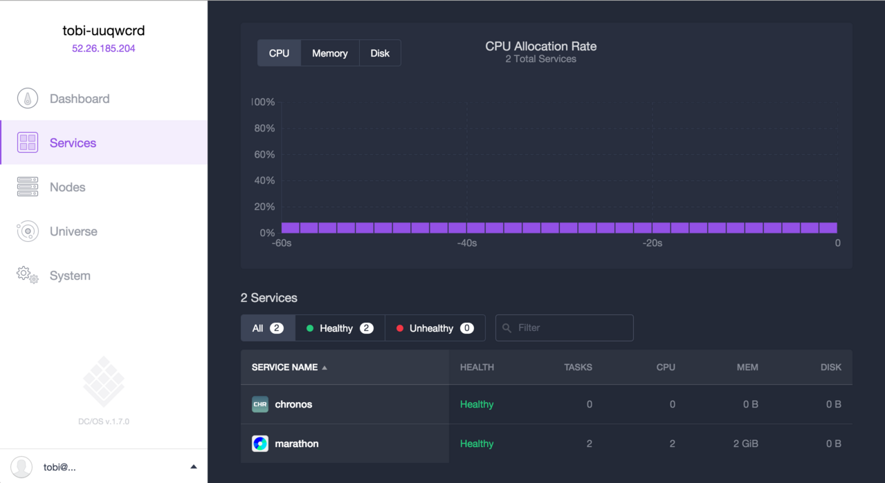
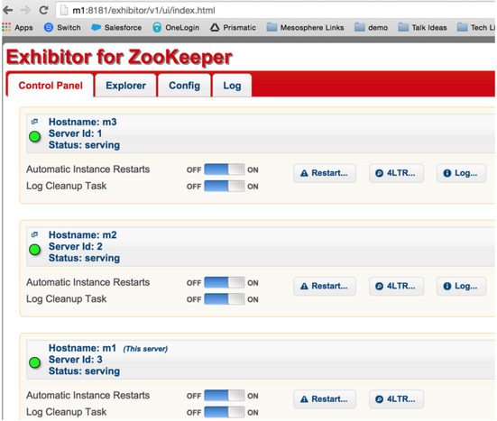
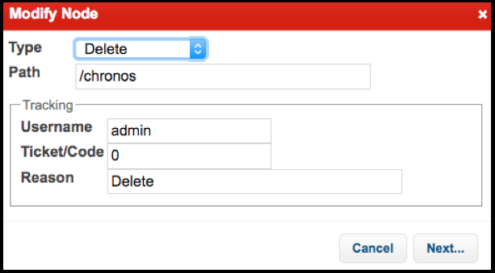

Chronos is the "cron" for your Mesosphere DC/OS. It is a highly-available distributed job scheduler, providing the most robust way to run batch jobs in your datacenter. Chronos schedules jobs across the Mesos cluster and manages dependencies between jobs in an intelligent way.

### Time Estimate

10 Minutes

### Target Audience

- Data Infrastructure Engineers
- Data Scientists
- Devops Engineers

### Table of Contents

- [Installing Chronos on DC/OS][1]
- [Uninstalling Chronos][2]

### Prerequisites

- [DC/OS][5] installed
- [DC/OS CLI][3] installed
- Chronos needs at least 1GB of RAM and 1 CPU core available in the cluster.

# <a name="chronosinstall"></a>Installing Chronos on DC/OS

1.  From the DC/OS CLI, enter this command:

    ```bash
    dcos package install chronos
    ```

    **Tip:** You can specify a JSON configuration file along with the Chronos installation command: `dcos package install chronos --options=<config_file>`. For more information, see the [dcos package section of the CLI command reference][4].

2.  Verify that Chronos is successfully installed

    ### DC/OS Web Interface

    Go to the **Services** tab and verify that Chronos shows up in the list as **Healthy**.

    

    ### DC/OS CLI

    Run this command to view installed services:

    ```bash
    dcos package list
    ```

    You should see Chronos in the output:

    ```bash
    NAME     VERSION  APP               COMMAND  DESCRIPTION
    chronos  2.4.0    /chronos          ---      A fault tolerant job scheduler for Mesos which handles dependencies and ISO8601 based schedules.
    ```

# <a name="uninstall"></a>Uninstalling Chronos

1.  From the DC/OS CLI, enter this command:

    ```bash
    dcos package uninstall chronos
    ```

2.  Open the ZooKeeper Exhibitor web interface at `<hostname>/exhibitor`, where `<hostname>` is the [Mesos Master hostname][5].

    1.  Click on the **Explorer** tab and navigate to the `chronos` folder.

        

    2.  Choose Type **Delete**, enter the required **Username**, **Ticket/Code**, and **Reason** fields, and click **Next**.

        

    3.  Click **OK** to confirm your deletion.

# Appendix: Next Steps

- [Creating a scheduled job][6]

 [1]: #chronosinstall
 [2]: #uninstall
 [3]: /docs/1.7/usage/cli/install/
 [4]: /docs/1.7/usage/cli/command-reference/
 [5]: /docs/1.7/administration/installing/
 [6]: /docs/1.7/usage/tutorials/chronos/creating-a-scheduled-job/
