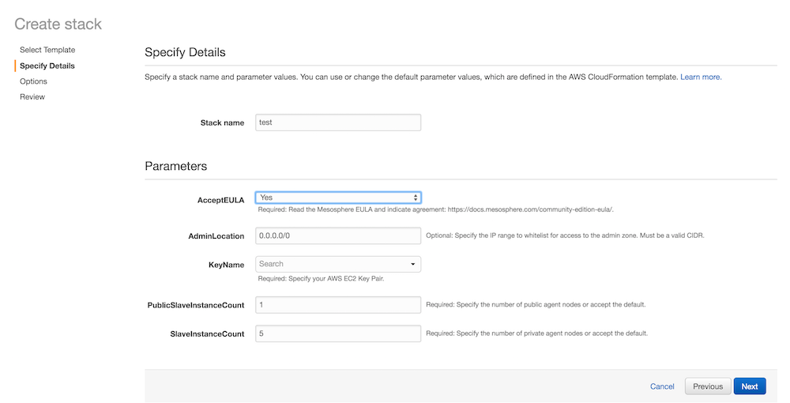

DC/OS agent nodes can be designated as [public](/docs/1.7/overview/concepts/#public) or [private](/docs/1.7/overview/concepts/#private) during [advanced](/docs/1.7/administration/installing/custom/) or [cloud](/docs/1.7/administration/installing/cloud/) installations. Public agent nodes provide public access to your DC/OS applications. By default apps are launched on private agent nodes. To launch an app on a public node, you must create a Marathon app definition with the `"acceptedResourceRoles":["slave_public"]` parameter specified.


1.  Install DC/OS and DC/OS CLI by using the [advanced installation](/docs/1.7/administration/installing/custom/) or [cloud installation](/docs/1.7/administration/installing/cloud/) instructions. You must declare at least one agent node as public.

    For example, with advanced installation you can designate an agent node with this command:

    ```bash
    sudo bash dcos_install.sh slave_public
    ```

    For example, with the AWS cloud installation, you can specify a public agent node with the `PublicSlaveInstanceCount` box:

    

1.  Create a Marathon app definition with the `"acceptedResourceRoles":["slave_public"]` parameter specified. For example:

    ```json
    {
        "id": "/product/service/myApp",
        "container": {
        "type": "DOCKER",
        "docker": {
              "image": "group/image",
              "network": "BRIDGE",
              "portMappings": [
                { "hostPort": 80, "containerPort": 80, "protocol": "tcp"}
              ]
            }
        },
        "acceptedResourceRoles": ["slave_public"],
        "instances": 1,
        "cpus": 0.1,
        "mem": 64
    }
    ```

    For more information about the `acceptedResourceRoles` parameter, see the Marathon REST API [documentation](https://mesosphere.github.io/marathon/docs/rest-api.html).

1.  Add the your app to Marathon by using this command:

    ```bash
    dcos marathon app add myApp.json
    ```

    If this is added successfully, there is no output.

1.  Verify that the app is added:

    ```bash
    dcos marathon app list
    ID      MEM  CPUS  TASKS  HEALTH  DEPLOYMENT  CONTAINER  CMD
    /myApp   64  0.1    0/1    ---      scale       DOCKER   None
    ```

 [1]: /docs/1.7/tutorials/containerized-app/
 [3]: /docs/1.7/administration/installing/
 [4]: /docs/1.7/usage/cli/install/
