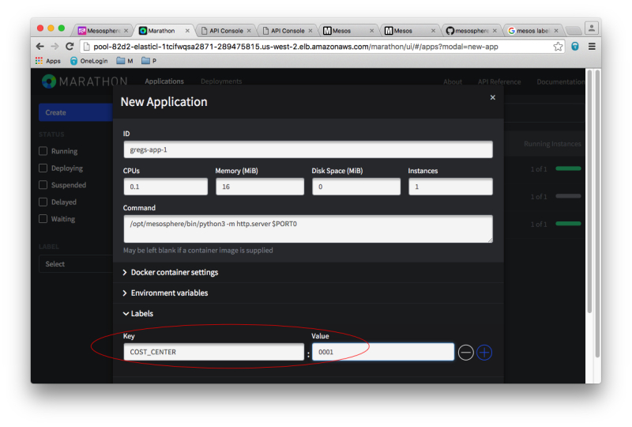
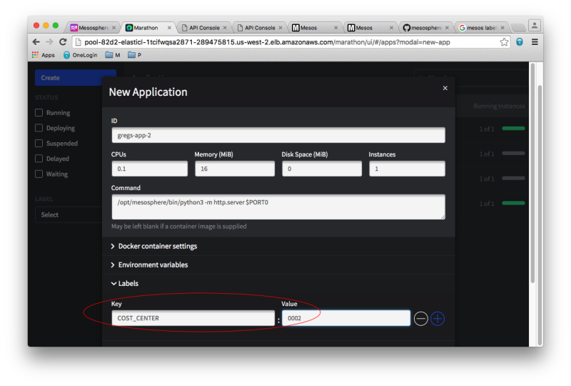
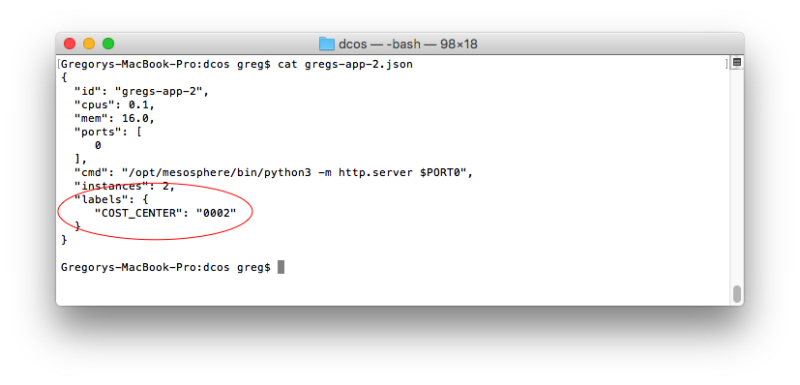
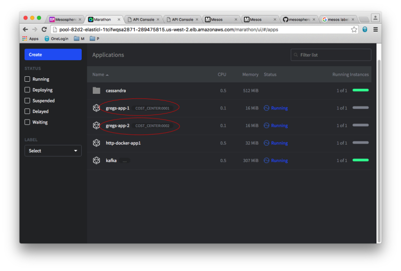
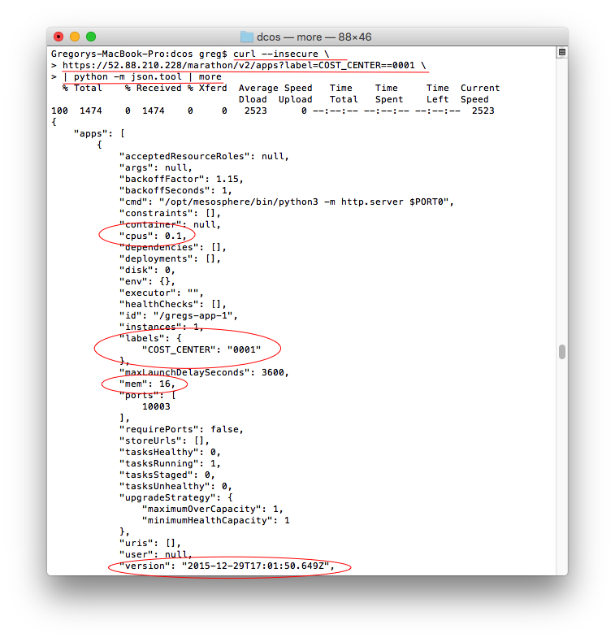

This tutorial illustrates how labels can be defined using the Marathon web interface and HTTP API, and how information pertaining to applications that are running can be queried based on label value criteria.

When you deploy applications or containers in a DC/OS cluster, you can associate a tag or label with your deployed components to track and report usage of the cluster by those components. For example, you may want to assign a cost center identifier or a customer number to a Mesos application and produce a summary report at the end of the month with usage metrics such as the amount of CPU and memory allocated to the applications by cost center or customer.

## Assigning Labels to Applications and Tasks

DC/OS includes a System Marathon and you can deploy your own User Marathon instances; in any case, Marathon is used for deploying and monitoring long-running taskes. You can use the Marathon web interface to deploy applications manually or you can use the DC/OS CLI.



The figure above shows how to use the Marathon web interface to specify a label when launching a container or command line application. For the application named `myapp-1`, you can see that a label named `COST_CENTER` has been defined and set to `0001`. When this application is deployed, it will have that cost center value associated with it and can be queried using the Marathon HTTP API.



The figure above shows a second application being deployed using the Marathon web interface, but this time it has a `COST_CENTER` label set to `0002`. This label and value will be shown in the Marathon web interface and returned by calls to the HTTP API.

You can also specify the label values when you deploy the application using the DC/OS CLI like this:

```bash
dcos marathon app add <my json file>
```

In the following figure you see the JSON format to use with the DC/OS command to deploy an application using Marathon. Just as on the Marathon web interface, you can specify more than one label, but each label can only have one value:



## Displaying Label Information

Now that the applications are deployed and started, you can use the Marathon web interface included with DC/OS to view the two applications running with their associated labels. The figure below shows the applications running with their `COST_CENTER` label values displayed:



You can also use the Marathon HTTP API to query the running applications based on the label value criteria. Figure 5 shows a HTTP request issued to the Marathon HTTP API. The curl program is used in this example to submit the HTTP GET request, but you can use any program that is able to send HTTP GET/PUT/DELETE requests. You can see the HTTP end-point is `https://52.88.210.228/marathon/v2/apps` and the parameters sent along with the HTTP request include the label criteria `?label=COST_CENTER==0001`:



Note that you may also specify multiple label criteria like so: `?label=COST_CENTER==0001,COST_CENTER==0002`

As you can see, the response includes only the applications that have a label `COST_CENTER` defined with a value of `0001`. The resource metrics are included too, such as the number of CPU shares and the amount of memory allocated. At the bottom of the response, you can see the date/time this application was deployed, which can be used to compute the uptime for billing or charge-back purposes.
