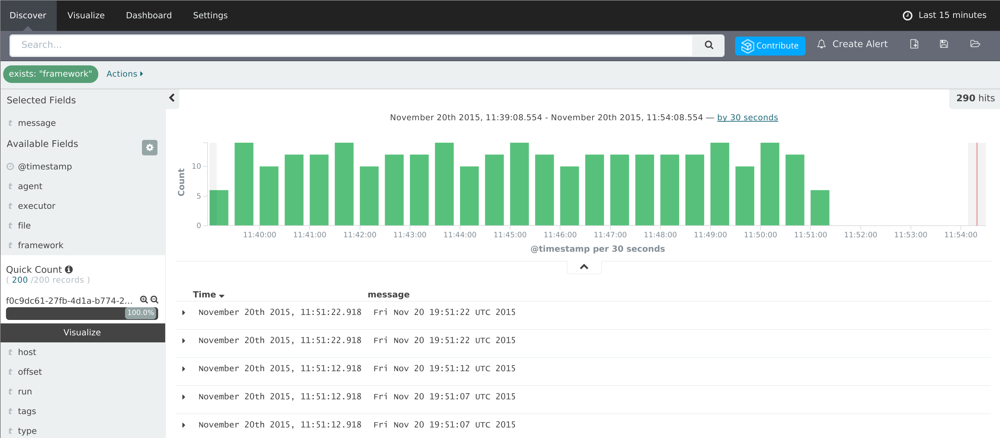
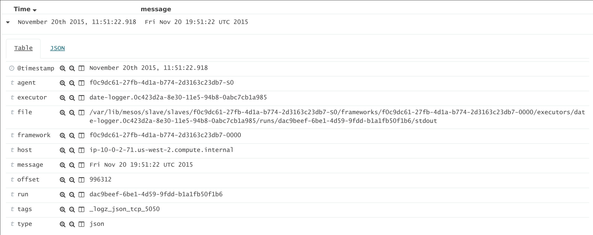
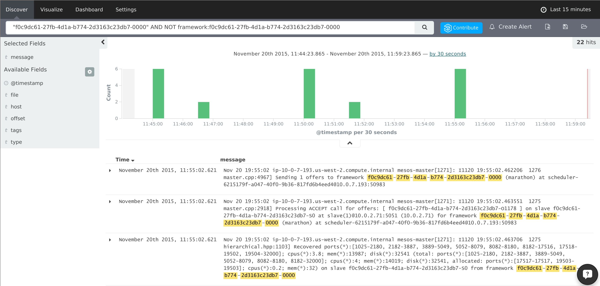

The file system paths of DC/OS task logs contain information such as the agent ID, framework ID, and executor ID. You can use this information to filter the log output for specific tasks, applications, or agents.

**Prerequisite**

*   [An ELK stack that aggregates DC/OS logs][1]

# Usage Example

In the screenshots below, we are using Kibana hosted by [logz.io][2], but your Kibana interface will look similar.

For example, you can type `framework:*` into the Search field. This will show all of the events where the `framework` field is defined:

Click the disclosure triangle next to one of these events to view the details. This will show all of the fields extracted from the task log file path:

Finally, let's search for all of the events that reference the framework ID of the event shown in the screenshot above, but that do not contain the chosen `framework` field. This will show only non-task results:

# Template Examples

Here are some example query templates. Replace the template parameters `$executor1`, `$framework2`, and any others with the actual values from your cluster.

**Important:** Do not change the quotation marks in these examples or the queries will not work. If you create custom queries, be careful with the placement of quotation marks.

*   Logs related to a specific executor `$executor1`, including logs for tasks run from that executor:

        "$executor1"

*   Non-task logs related to a specific executor `$executor1`:

        "$executor1" AND NOT executor:$executor1

*   Logs (including task logs) for a framework `$framework1`, if `$executor1` and `$executor2` are that framework's executors:

        "$framework1" OR "$executor1" OR "$executor2"

*   Non-task logs for a framework `$framework1`, if `$executor1` and `$executor2` are that framework's executors:

        ("$framework1" OR "$executor1" OR "$executor2") AND NOT (framework:$framework1 OR executor:$executor1 OR executor:$executor2)

*   Logs for a framework `$framework1` on a specific agent host `$agent_host1`:

        host:$agent_host1 AND ("$framework1" OR "$executor1" OR "$executor2")

*   Non-task logs for a framework `$framework1` on a specific agent `$agent1` with host `$agent_host1`:

        host:$agent_host1 AND ("$framework1" OR "$executor1" OR "$executor2") AND NOT agent:$agent

 [1]: ../elk/
 [2]: http://logz.io
