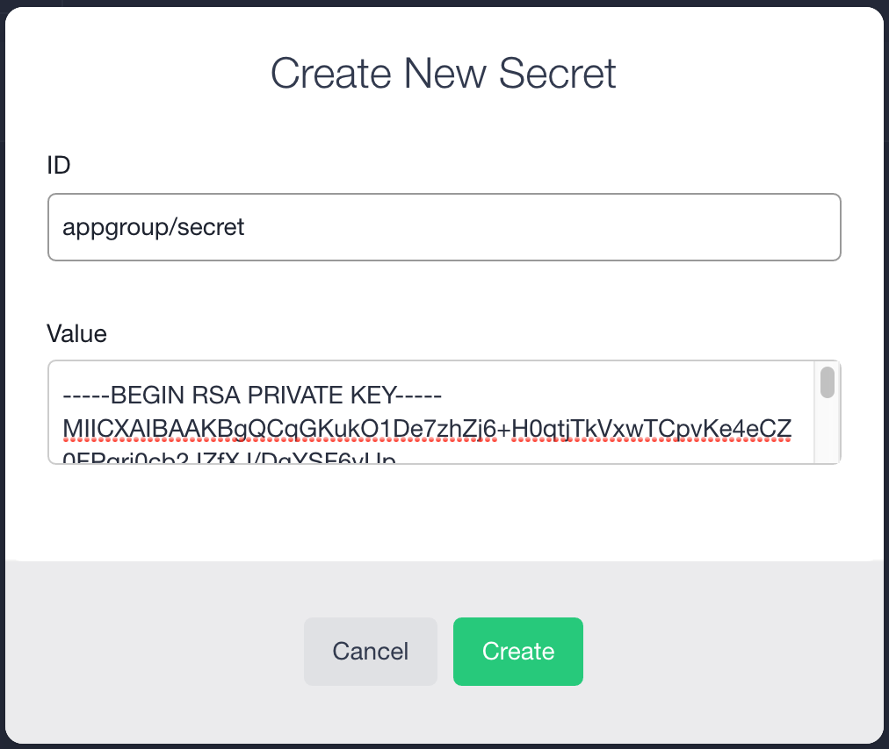

# <a name="secret-paths"></a>About controlling access with secret paths

Each secret must have a name. In addition to a name, you can include a path. Including a path allows you to restrict which services can access the secret. If you just provide a name and no path, all services will have access. The following table provides some examples to show how it works.

<table class="table">
  <tr>
    <th>Secret ID</th>
    <th>Service group path</th>
    <th>Can service access secret?</th>
  </tr>
  <tr>
    <td><code>group/secret</code></td>
    <td><code>/marathon-user/service</code></td>
    <td>No</td>
  </tr>
  <tr>
    <td><code>group/secret</code></td>
    <td><code>/group/hdfs/service</code></td>
    <td>Yes</td>
  </tr>
  <tr>
    <td><code>group/hdfs/secret</code></td>
    <td><code>/group/spark/service</code></td>
    <td>No</td>
  </tr>
</table>
**Note:** Marathon paths begin with `/`, while secret paths do not.


# Creating secrets

## About creating secrets

The permissions needed to create a secret vary by interface. To create a secret using the web interface, the `dcos:superuser` permission is required. Creating a secret using the [DC/OS CLI](/docs/1.8/usage/cli/) or the [Secrets API](/docs/1.8/administration/secrets/secrets-api/) requires only the following.

- **Permission:** <code>dcos:secrets:default:[/<i>path</i>]/<i>name</i></code>
- **Action:** <code>create</code>

The permission must include the name of the secret the user is allowed to create. Each user must have one permission per secret. The secret itself does not need to exist yet.

It can also optionally include a path. Please see the [previous section](#secret-paths) for more information about secret paths.

## Creating secrets via the web interface

1. Log into the DC/OS web interface as a user with the `dcos:superuser` permission.

2. Click to open the **System** -> **Security** -> **Secrets** tab.

3. Click **New Secret**.

4. Provide the name of your secret in the **ID** box.

5. Type or paste the secret into the **Value** box.

6. When you have completed your entries, the secret should look something like the following.

    

7. Click **Create**.


## Creating secrets via the API

This procedure describes how to create a secret called `new-secret` inside the `developer` path.

**Prerequisites:**

- [DC/OS CLI installed](/docs/1.8/usage/cli/install/)

- If your [security mode](/docs/1.8/administration/installing/ent/custom/configuration-parameters/#security) is `permissive` or `strict`, you must follow the steps in [Obtaining and passing the DC/OS certificate in curl requests](/docs/1.8/administration/tls-ssl/get-cert/) before issuing the curl commands in this section. If your [security mode](/docs/1.8/administration/installing/ent/custom/configuration-parameters/#security) is `disabled`, you must delete `--cacert dcos-ca.crt` from the commands before issuing them.

1. Using `dcos auth login` log into the CLI as a user with one of the following permissions.

     - `dcos:superuser`
     - `dcos:secrets:default:/developer/new-secret`: `create` or `full` action

2. Use the following command to create a secret. In this

   ```bash
   curl -X PUT --cacert dcos-ca.crt -H "Authorization: token=$(dcos config show core.dcos_acs_token)" -d '{"value":"very-secret"}' $(dcos config show core.dcos_url)/secrets/v1/secret/default/developer/new-secret -H 'Content-Type: application/json'
   ```

## Creating secrets via the DC/OS CLI

This procedure describes how to create a secret called `new-secret` inside the `developer` path.

**Prerequisite:** You must have the [DC/OS CLI installed](/docs/1.8/usage/cli/install/) and the  [Enterprise DC/OS CLI installed](/docs/1.8/usage/cli/enterprise-cli/#ent-cli-install).

1. Using `dcos auth login` log into the CLI as a user with one of the following permissions.

     - `dcos:superuser`
     - `dcos:secrets:default:/developer/new-secret`: `create` or `full` action

1. Use the following command to create the new secret.

   ```bash
   dcos security secrets create --value=top-secret developer/new-secret
   ```
