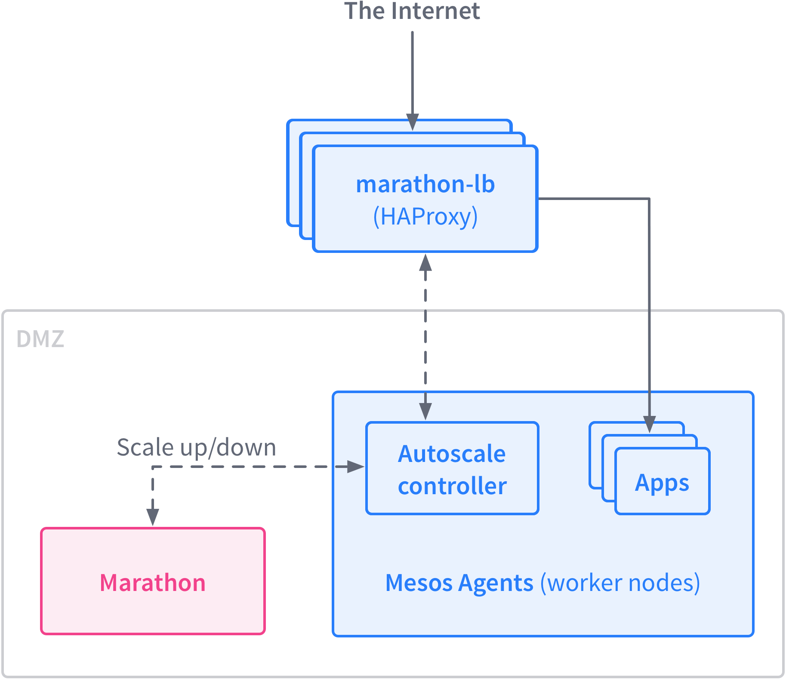
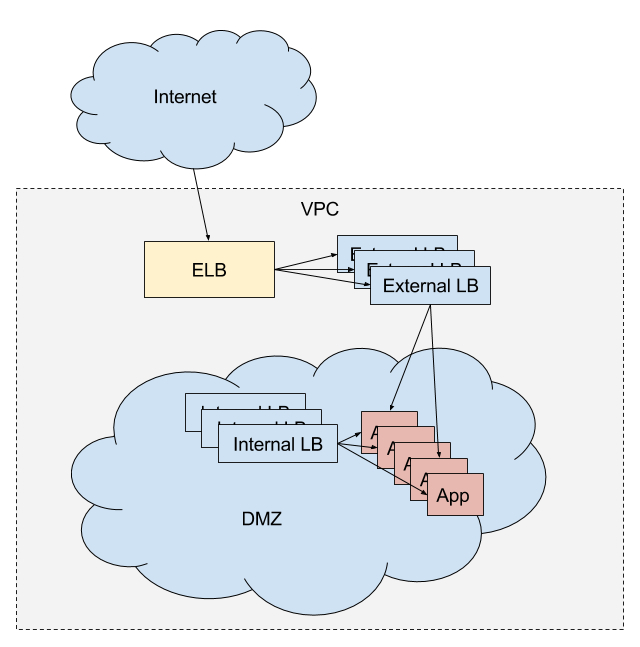

Marathon-LB is based on HAProxy, a rapid proxy and load balancer. HAProxy provides proxying and load balancing for TCP and HTTP based applications, with features such as SSL support, HTTP compression, health checking, Lua scripting and more. Marathon-LB subscribes to Marathon’s event bus and updates the HAProxy configuration in real time.

Up to date documentation for Marathon-LB can be found on the GitHub page.

 * [Marathon-LB GitHub project][1]
 * [Detailed templates documentation][2]

You can can configure Marathon-LB with various topologies. Here are some examples of how you might use Marathon-LB:

* Use Marathon-LB as your edge load balancer and service discovery mechanism. You could run Marathon-LB on public-facing nodes to route ingress traffic. You would use the IP addresses of your public-facing nodes in the A-records for your internal or external DNS records (depending on your use-case).
* Use Marathon-LB as an internal LB and service discovery mechanism, with a separate HA load balancer for routing public traffic in. For example, you may use an external F5 load balancer on-premise, or an Elastic Load Balancer on Amazon Web Services.
* Use Marathon-LB strictly as an internal load balancer and service discovery mechanism.
* You might also want to use a combination of internal and external load balancers, with different services exposed on different load balancers.

Here we discuss Marathon-LB as an edge load balancer and as an internal and external load balancer.

## Marathon-LB as an edge load balancer

## Marathon-LB as an internal and external load balancer

# Next Steps

- [Install](/docs/1.8/usage/service-discovery/marathon-lb/usage/)

[1]: https://github.com/mesosphere/marathon-lb
[2]: https://github.com/mesosphere/marathon-lb/blob/master/Longhelp.md#templates
