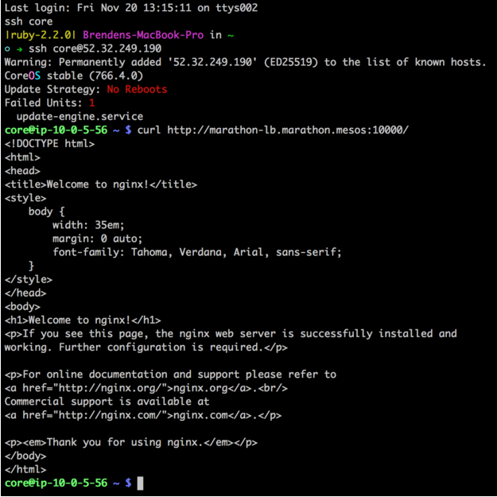

In this tutorial, Marathon-LB is used as an internal and external load balancer. The external load balancer is used to route external HTTP traffic into the cluster, and the internal load balancer is used for internal service discovery and load balancing. Since we’ll be doing this on AWS, external traffic will first hit an external load balancer configured to expose our "public" agent nodes.

## Prerequisites

*   DC/OS installed by using the AWS [cloud templates](/docs/1.8/administration/installing/cloud/aws/) with at least three [private](/docs/1.8/overview/concepts/#private) agent and one [public](/docs/1.8/overview/concepts/#public) agent.
*   DC/OS CLI [installed][2].
*   Marathon-LB [installed](/docs/1.8/usage/service-discovery/marathon-lb/usage/).

## Deploy an external load balancer with Marathon-LB

1.  Verify that Marathon-LB is working. Find the public IP for your [public node](/docs/1.8/administration/locate-public-agent/) and navigate to `<public-agent-IP>:9090/haproxy?stats`. You will see a statistics report page like this:

    


## Deploy an internal load balancer with Marathon-LB
Set up your internal load balancer. To do this, we must first specify some configuration options for the Marathon-LB package. 

1.  Create a file called `marathon-lb-internal.json` with the following contents:

    ```json
    {
      "marathon-lb":{
        "name":"marathon-lb-internal",
        "haproxy-group":"internal",
        "bind-http-https":false,
        "role":""
      }
    }
    ```
    
    In this options file, we’re changing the name of the app instance and the name of the HAProxy group. The options file also disables the HTTP and HTTPS forwarding on ports 80 and 443 because it is not needed.

1.  [Install](/docs/1.8/usage/service-discovery/marathon-lb/usage/) the internal Marathon-LB instance with the custom options specified.

    There are now two Marathon-LB load balancers: 
    
    - Internal (`marathon-lb-internal`) 
    - External (`marathon-lb`) 

## Deploy an external facing NGINX app    
    
1.  Launch an external NGINX app on DC/OS.
 
    1.  Copy the JSON below into a file and name it `nginx-external.json`.

        ```json
        {
          "id": "nginx-external",
          "container": {
            "type": "DOCKER",
            "docker": {
              "image": "nginx:1.7.7",
              "network": "BRIDGE",
              "portMappings": [
                { "hostPort": 0, "containerPort": 80, "servicePort": 10000 }
              ],
              "forcePullImage":true
            }
          },
          "instances": 1,
          "cpus": 0.1,
          "mem": 65,
          "healthChecks": [{
              "protocol": "HTTP",
              "path": "/",
              "portIndex": 0,
              "timeoutSeconds": 10,
              "gracePeriodSeconds": 10,
              "intervalSeconds": 2,
              "maxConsecutiveFailures": 10
          }],
          "labels":{
            "HAPROXY_GROUP":"external"
          }
        }
        ```
        
        The application definition includes the `"HAPROXY_GROUP":"external"` label which instructs Marathon-LB to expose the application. The external Marathon-LB (`marathon-lb`) was deployed with the `--group` parameter set to `external`, which is the default.

    1.  Deploy the external NGINX app on DC/OS using this command:

        ```bash
        dcos marathon app add nginx-external.json
        ```

## Deploy an internal facing NGINX app

4.  Launch an internal NGINX app on DC/OS.

    1.  Copy the JSON below into a file and name it `nginx-internal.json`.
    
        ```json
        {
          "id": "nginx-internal",
          "container": {
            "type": "DOCKER",
            "docker": {
              "image": "nginx:1.7.7",
              "network": "BRIDGE",
              "portMappings": [
                {
                  "hostPort": 0,
                  "containerPort": 80,
                  "servicePort": 10001
                }
              ],
              "forcePullImage": true
            }
          },
          "instances": 1,
          "cpus": 0.1,
          "mem": 65,
          "healthChecks": [
            {
              "protocol": "HTTP",
              "path": "/",
              "portIndex": 0,
              "timeoutSeconds": 10,
              "gracePeriodSeconds": 10,
              "intervalSeconds": 2,
              "maxConsecutiveFailures": 10
            }
          ],
          "labels": {
            "HAPROXY_GROUP": "internal"
          }
        }
        ```

        Note that the app definition specifies the `servicePort` parameter. This parameter exposes this service on Marathon-LB. By default, port 10000 through to 10100 are reserved for Marathon-LB services, so you should begin numbering your service ports from 10000.
        
    1.  Deploy the internal NGINX app on DC/OS using this command:
    
        ```bash
        dcos marathon app add nginx-internal.json
        ```
        
## Deploy an external and internal facing NGINX app

4.  Launch an NGINX everywhere app on DC/OS.

    1.  Copy the JSON below into a file and name it `nginx-everywhere.json`. This instance exposes the app both internally and externally.

        ```json
        {
          "id": "nginx-everywhere",
          "container": {
            "type": "DOCKER",
            "docker": {
              "image": "nginx:1.7.7",
              "network": "BRIDGE",
              "portMappings": [
                { "hostPort": 0, "containerPort": 80, "servicePort": 10002 }
              ],
              "forcePullImage":true
            }
          },
          "instances": 1,
          "cpus": 0.1,
          "mem": 65,
          "healthChecks": [{
              "protocol": "HTTP",
              "path": "/",
              "portIndex": 0,
              "timeoutSeconds": 10,
              "gracePeriodSeconds": 10,
              "intervalSeconds": 2,
              "maxConsecutiveFailures": 10
          }],
          "labels":{
            "HAPROXY_GROUP":"external,internal"
          }
        }
        ```

        Note the `servicePort` is unique and does not overlap with the other NGINX instances. Service ports can be defined either by using port mappings (as in the examples above), or with the `ports` parameter in the Marathon app definition.
        
    1.  Deploy the NGINX everywhere app on DC/OS using this command:
            
        ```bash
        dcos marathon app add nginx-everywhere.json
        ```
        
## Confirm that your apps are deployed and accessible from within cluster

1.  Test the configuration by [SSHing][4] into one of the instances in the cluster (such as a master), and curl the endpoints:

    ```bash
    # Access to external load balancer
    curl http://marathon-lb.marathon.mesos:10000/
    # Access to internal load balancer
    curl http://marathon-lb-internal.marathon.mesos:10001
    # Access to nginx app from external load balancer
    curl http://marathon-lb.marathon.mesos:10002/
    #Access to nginx app from internal load balancer
    curl http://marathon-lb-internal.marathon.mesos:10002/
    ```

    Each of these should return the NGINX ‘Welcome’ page:

    

## Virtual hosts

An important feature of Marathon-LB is support for virtual hosts. This allows you to route HTTP traffic for multiple hosts (FQDNs) and route requests to the correct endpoint. For example, you could have two distinct web properties, `ilovesteak.com` and `steaknow.com`, with DNS for both pointing to the same LB on the same port, and HAProxy will route traffic to the correct endpoint based on the domain name.

To demonstrate the vhost feature:

1.  Find your [public agent IP](/docs/1.8/administration/locate-public-agent/). 

1.  Modify the external NGINX app (`nginx-external.json`) to point to your public agent DNS name. You can modify your app by using the DC/OS CLI or GUI.

    **DC/OS CLI** 
        
    1.  Add the `HAPROXY_0_VHOST` label to your local `nginx-external.json` file. In this example, the public DNS name is `brenden-j-publicsl-1ltlkzeh6b2g6-1145355943.us-west-2.elb.amazonaws.com`.
    
        ```json
        ...
          "labels":{
            "HAPROXY_GROUP":"external",
            "HAPROXY_0_VHOST":"brenden-j-publicsl-1ltlkzeh6b2g6-1145355943.us-west-2.elb.amazonaws.com"
          }
        }
        ```
    
    1.  Run this command to replace the contents of the deployed `nginx-external.json` with your modified local copy:
   
        ```bash
        cat nginx-external.json | dcos marathon app update nginx-external
        ```
   
        You should see output similar to this:
   
        ```bash
        Created deployment 5f3e06ff-e077-48ee-afc0-745f167bc105
        ```
        
    1.  Deploy the modified NGINX external app on DC/OS using this command:
    
        ```bash
        dcos marathon app add nginx-external.json
        ```
       
    **DC/OS GUI**
    
    1.  Navigate to the **Services** > **nginx-external** service.
 
    1.  Select **Edit** > **Labels** > **Add Label**.
    
    1.  Enter `HAPROXY_0_VHOST` for **KEY** and specify your public agent DNS name for **VALUE**
    
        
        
    1.  Select **Deploy**.
    
    The label `HAPROXY_0_VHOST`, instructs Marathon-LB to expose NGINX on the external load balancer with a virtual host. The `0` in the label key corresponds to the servicePort index, beginning from 0. 

    If you had multiple servicePort definitions, you would iterate them as 0, 1, 2, and so on. Note that if you _do_ specify a vhost, you aren't required to provide a service port, because Marathon will assign one by default.
    

1.  Navigate to the public agent in your browser and you should see the following:

    

 [1]: /docs/1.8/administration/installing/
 [2]: /docs/1.8/usage/cli/install/
 [3]: /docs/1.8/administration/locate-public-agent/
 [4]: /docs/1.8/administration/access-node/sshcluster/