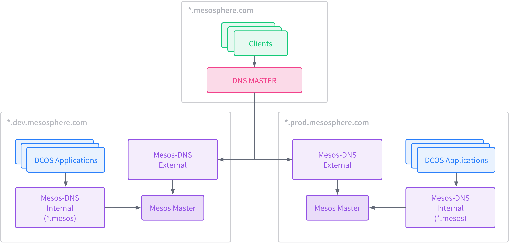

<!-- This source repo for this topic is https://github.com/dcos/dcos-docs -->

<!-- This source repo for this topic is https://github.com/dcos/dcos-docs -->

<!-- This source repo for this topic is https://github.com/dcos/dcos-docs -->

<!-- This source repo for this topic is https://github.com/dcos/dcos-docs -->

<!-- This source repo for this topic is https://github.com/dcos/dcos-docs -->

<!-- This source repo for this topic is https://github.com/dcos/dcos-docs -->

<!-- This source repo for this topic is https://github.com/dcos/dcos-docs -->

<!-- This source repo for this topic is https://github.com/dcos/dcos-docs -->

<!-- This source repo for this topic is https://github.com/dcos/dcos-docs -->

<!-- This source repo for this topic is https://github.com/dcos/dcos-docs -->

<!-- This source repo for this topic is https://github.com/dcos/dcos-docs -->

<!-- This source repo for this topic is https://github.com/dcos/dcos-docs -->

<!-- This source repo for this topic is https://github.com/dcos/dcos-docs -->

DC/OS uses Mesos-DNS for internal service discovery. While the `.mesos` domain can be used to reach services in DC/OS, an additional instance of Mesos-DNS must be running to support the use of custom suffixes. This tutorial outlines the steps for configuring and starting Mesos-DNS on DC/OS and configuring your authoritative DNS appropriately. This tutorial is also useful when configuring DNS for DC/OS clusters in multiple datacenters and environments.

**Prerequisites**

*   A functioning DC/OS cluster.
*   A configurable authoritative DNS server.

## DC/OS Configuration

1.  Create a configuration directory for the new Mesos-DNS instance:

        mkdir /opt/mesos-dns-ext && cd /opt/mesos-dns-ext

2.  Create and edit `/opt/mesos-dns-ext/config.json`:

        {
          "domain": "<domain>",
          "externalon": false,
          "listener": "<listen_ip>",
          "masters": ["<dcos_master1>/mesos","<dcos_master2>/mesos","<dcos_master3>/mesos"],
          "port": 53,
          "recurseon": false,
          "refreshSeconds": 60,
          "resolvers": ["<resolver1>","<resolver2>","<resolver3>"],
          "SOAExpire": 86400,
          "SOAMinttl": 60,
          "SOAMname": "ns1.<domain>",
          "SOARefresh": 60,
          "SOARetry": 600,
          "SOARname": "root.ns1.<domain>",
          "ttl": 60,
          "zk": "zk://zk-1.zk,zk-2.zk,zk-3.zk:2181/mesos"
        }

    <table class="table">
      <tbody>
        <tr>
          <th class="confluenceTh">
            Parameter
          </th>

          <th class="confluenceTh">
            Description
          </th>
        </tr>

        <tr>
          <td>
            domain
          </td>

          <td class="confluenceTd">
            Your custom DNS suffix
          </td>
        </tr>

        <tr>
          <td class="confluenceTd">
            listen_ip
          </td>

          <td class="confluenceTd">
            IP to listen on (default 0.0.0.0)
          </td>
        </tr>

        <tr>
          <td class="confluenceTd">
            dcos_master{1..3}
          </td>

          <td class="confluenceTd">
            IP addresses of DC/OS masters
          </td>
        </tr>

        <tr>
          <td class="confluenceTd">
            resolver{1..3}
          </td>

          <td class="confluenceTd">
            Additional resolvers (at least one required)
          </td>
        </tr>

        <tr>
          <td class="confluenceTd">
            dcos_zookeeper{1..3}
          </td>

          <td class="confluenceTd">
            IP Addresses of ZooKeeper servers
          </td>
        </tr>
      </tbody>
    </table>

3.  Download the latest Mesos-DNS binary and copy it to `/opt/mesos-dns-ext/mesos-dns`: <https://github.com/mesosphere/mesos-dns/releases>.

4.  Create an application definition for Mesos-DNS, `/opt/mesos-dns-ext/mesos-dns-ext.json`:

        {
          "id": "/mesos-dns-ext",
          "cmd": "/opt/mesos-dns-ext/mesos-dns --config=/opt/mesos-dns-ext/config.json",
          "instances": 1,
          "cpus": 1,
          "mem": 1024,
          "disk": 0,
          "executor": "",
          "constraints": [
            [
              "hostname",
              "CLUSTER",
              "<mesos_agent>"
            ]
          ],
          "uris": [],
          "storeUrls": [],
          "ports": [
            53,
            8123
          ]
        }

    <table class="table">
      <tbody>
        <tr>
          <th class="confluenceTh">
            Parameter
          </th>

          <th class="confluenceTh">
            Definition
          </th>
        </tr>
        <tr>
          <td class="confluenceTd">
            mesos_agent
          </td>

          <td class="confluenceTd">
            A specific agent to pin Mesos-DNS to. Since Mesos-DNS will be acting as a delegate, its IP must remain static. For multiple Mesos-DNS instances (and redundancy), the LIKE constraint operator can be used to define hosts using regex. See <a href="https://mesosphere.github.io/marathon/docs/constraints.html" class="external-link" rel="nofollow">https://mesosphere.github.io/marathon/docs/constraints.html</a> for more information. As a best-practice, we also recommend using healthchecks to ensure that Mesos-DNS remains running.
          </td>
        </tr>
      </tbody>
    </table>

5.  Create a new application for Mesos-DNS in Marathon:

        curl -X POST -H 'Content-Type: application/json' -d @mesos-dns-ext.json http://<marathon>:8080/v2/apps

    <table class="table">
      <tbody>
        <tr>
          <th class="confluenceTh">
            Parameter
          </th>

          <th class="confluenceTh">
            Definition
          </th>
        </tr>

        <tr>
          <td class="confluenceTd">
            marathon
          </td>

          <td class="confluenceTd">
            IP/hostname of Marathon leader
          </td>
        </tr>
      </tbody>
    </table>

## DNS Configuration

**Important:** DNS configuration varies from environment-to-environment. These instructions are a guide of how your DNS should be modified.

1.  Add the following A and NS records to your DNS (glue record):

        ns.<domain> IN A <mesos_dns_ext>
        <domain> IN NS ns1.<domain>

    <table class="table">
      <tbody>
        <tr>
          <th class="confluenceTh">
            Parameter
          </th>

          <th class="confluenceTh">
            Definition
          </th>
        </tr>

        <tr>
          <td class="confluenceTd">
            domain
          </td>

          <td class="confluenceTd">
            Your custom DNS suffix
          </td>
        </tr>

        <tr>
          <td class="confluenceTd">
            mesos_dns_ext
          </td>

          <td class="confluenceTd">
            IP Address of the Mesos Agent that Mesos-DNS is running on (<em>see DC/OS Configuration, <a href="#four">Step 4</a>, <mesos_agent></em>).
          </td>
        </tr>
      </tbody>
    </table>

## Example

Here is a datacenter with DC/OS clusters in development and production environments:

