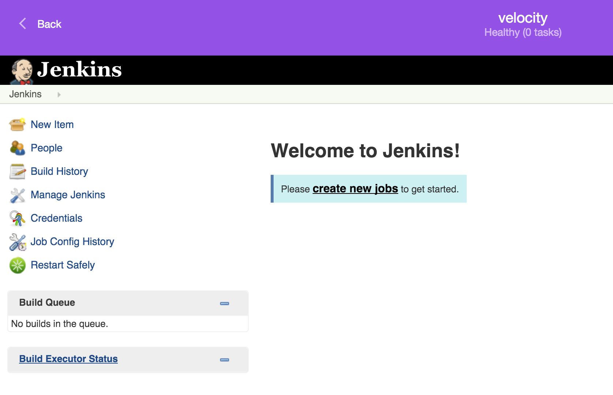

# About Deploying Applications on Marathon

This tutorial shows how to deploy applications on [Marathon][1] using Jenkins for DC/OS. We'll walk you through creating a new Jenkins job, publishing a Docker container on source code changes, and deploying those changes to Marathon based on the [application definition][3] contained in the project’s `marathon.json` file.

**Prerequisite:** 
This tutorial assumes that you have a working Jenkins installation and permission to launch applications on Marathon. Jenkins for DC/OS must be installed as described on the [Jenkins Quickstart](/service-docs/jenkins/quickstart/) page.

# The Example Project

The project used in this tutorial is taken from the [cd-demo][4] repository and runs a Jekyll website inside a Docker container.

The required files for this tutorial are `Dockerfile`, `marathon.json`, and the `site` directory. Copy those items to a new project and push to a new Git repository on the host of your choice.

# Accessing Jenkins for DC/OS

Jenkins for DC/OS can be accessed through the Dashboard or Services navigation menu’s within the [DC/OS web interface](/docs/1.8/usage/webinterface/). 

Click the “Jenkins” service and then "Open Service" to access the Jenkins web interface.

# The Job

We’ll create a new Jenkins job that performs several operations with Docker Hub and then either update or create a Marathon application.

Create a new **Freestyle** job with a name that includes only lowercase letters and hyphens. This name will be used later in the Docker image name and possibly as the Marathon application ID.

# SCM / Git

From the **Example Project** section above, fill in the Git repository URL with the newly created Git repository. This must be accessible to Jenkins and may require adding credentials to the Jenkins instance.

# Build Triggers

Select the **Poll SCM** build trigger with a schedule of: `*/5 * * * *`. This will check the Git repository every five minutes for changes.

# Build Environment

A username and password are required to log in to Docker Hub. To log in securely, the "Build Environment" section of the Job configuration has a “Use secret text(s) or file(s)” option. Select this option and fill in the credentials appropriately. Use `DOCKER_HUB_USERNAME` for "Username Variable" and `DOCKER_HUB_PASSWORD` for "Password Variable".

# Build Steps

The Jenkins job performs these actions:

1.  Log in to Docker Hub.
1.  Build a new Docker image.
1.  Push the new image to Docker Hub.

These actions can either be contained within a single build step or split across many. You can decide which implementation you prefer. The example below contains everything in one step.

To log in to Docker Hub, the job must know the username, password, and email address of the target Docker Hub account. The username and password are provided by the `Credentials` plugin, so that leaves the email address. This can either be hard-coded in the shell script or added as a build parameter and referenced in the script. For this job, the email will be hard-coded.

A published Docker image also requires a namespace. On Docker Hub, this may be the user’s username or an organization of which the user is a member. For this job, the username will be reused as the target namespace.

From the **Add build step** drop-down list, select **Execute Shell** option and populate with the script below. *Note:* Change <ACCOUNT EMAIL>.

## Script:

    #!/bin/bash
    docker login -u ${DOCKER_HUB_USERNAME} -p ${DOCKER_HUB_PASSWORD} -e <ACCOUNT EMAIL>
    
    IMAGE_NAME="${DOCKER_HUB_USERNAME}/${JOB_NAME}:${GIT_COMMIT}"
    docker build -t $IMAGE_NAME .
    docker push $IMAGE_NAME
    

The script above performs steps one to three: log in, build, and push. The fourth and final step is handled by the Marathon Deployment post-build action below.

# Marathon Deployment

Add a Marathon Deployment post-build action.

The Marathon instance within DC/OS can be accessed using the URL `http://leader.mesos/service/marathon`. Fill in the fields appropriately, using Jenkins variables if desired. The Docker Image should be the same as the build step above (`${DOCKER_HUB_USERNAME}/${JOB_NAME}:${GIT_COMMIT}`) to ensure the correct image is used.

## How It Works

The Marathon Deployment post-build action reads the application definition file, by default `marathon.json`, contained within the project’s Git repository. This is a JSON file and must contain a valid [Marathon application definition][3].

The configurable fields in the post-build action will overwrite the content of matching fields from the file. For example, setting the "Application Id" will replace the `id` field in the file. In the configuration above, "Docker Image" is configured and will overwrite the `image` field contained within the [docker field][5].

The final JSON payload is sent to the configured Marathon instance and the application is updated or created.

# Save

Save the job configuration.

# Build It

Click **Build Now** and let the job build.

# Deployment

Upon a successful run in Jenkins, the application will begin deployment on DC/OS. You can visit the DC/OS web interface to monitor progress.

When the **Status** has changed to **Running**, the deployment is complete and you can visit the website.

## Visit Your Site

Visit port `80` on the public DC/OS agent to display a jekyll website.

# Adding a New Post

The content in the `_posts` directory generates a Jekyll website. For this example project, that directory is `site/_posts`. Copy an existing post and create a new one with a more recent date in the filename. I added a post entitled "An Update".

Commit the new post to Git. Shortly after the new commit lands on the master branch, Jenkins will see the change and redeploy to Marathon.

 [1]: https://mesosphere.github.io/marathon/
 [3]: https://mesosphere.github.io/marathon/docs/application-basics.html
 [4]: https://github.com/mesosphere/cd-demo
 [5]: https://mesosphere.github.io/marathon/docs/native-docker.html
