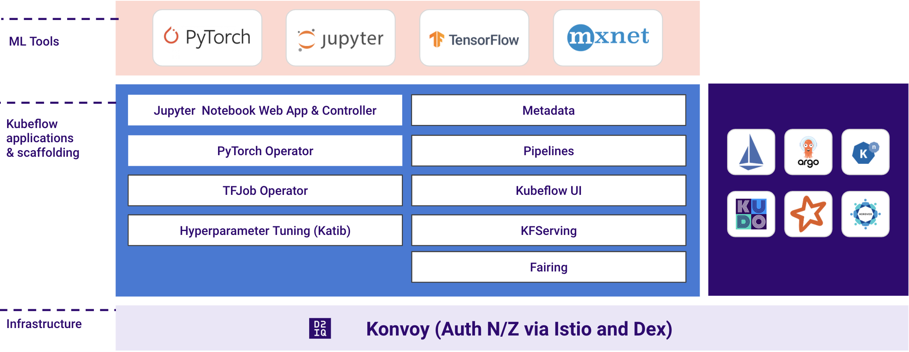

D2KF is a general cloud native, enterprise-grade, and end-to-end ML/AI platform. The product is a set of open
source products, including Kubeflow, with optimized configurations that supports end-to-end machine learning workflows.

D2KF empowers Data Scientists and ML Engineers to run and scale their entire ML stack with much higher velocity on Kubernetes
and Cloud-Native Eco-system.

D2KF natively integrates Horovod - an open source distributed training framework -
to support distributed deep learning across multi-GPU and multi-node clusters. Horovod is compatible with the existing
TensorFlow, PyTorch, MXNet deep learning frameworks and makes distributed Deep Learning super fast and easy.

D2KF is also pre-configured with Apache Spark, providing the ability to tap into large pools of CPUs and
GPUs, on demand.
