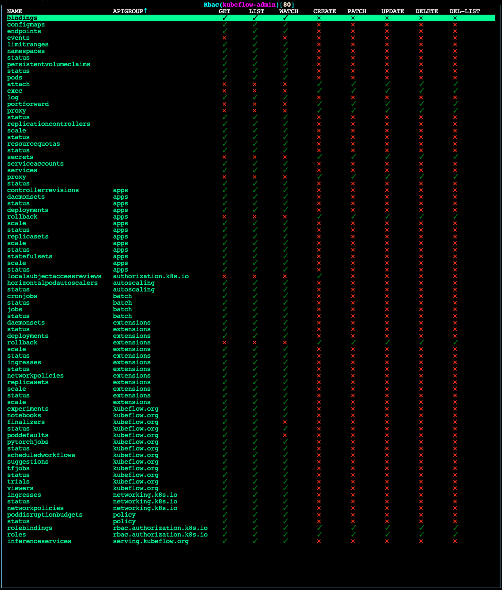
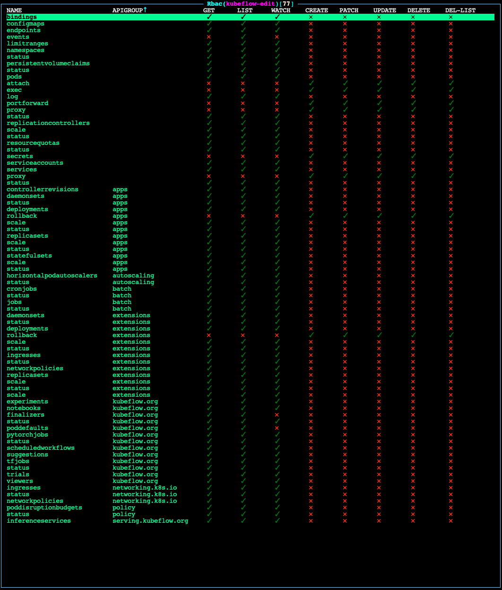
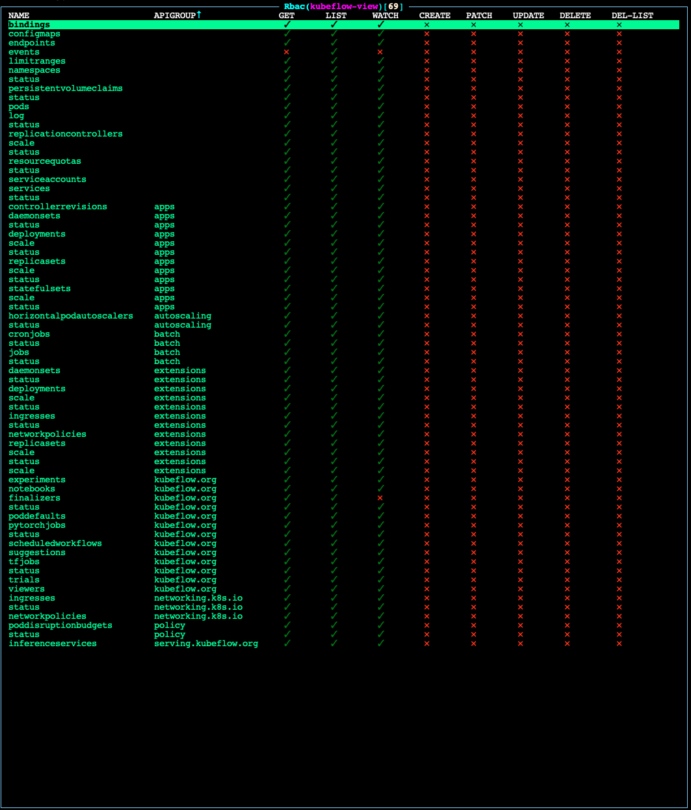

# Manage Kubeflow Users and Permissions

Prerequisites: 
- Administrative access to a properly configured Konvoy cluster via `kubectl`

D2KF comes with a set of predefined Kubernetes `ClusterRoles` designed to simplify the workflow of Kubeflow administrators who want to onboard new team members.

Because a single Kubeflow user needs to interact with Kubernetes resources across both the Kubeflow namespace and their own Kubeflow `Profile` namespace, D2iQ recommends appropriately permissioned `ClusterRole` objects. As with all matters regarding security, we encourage you to thoroughly review permissions set by our predefined `ClusterRoles` in conjunction with your security team.

## Kubeflow Predefined `ClusterRoles`

Predefined `ClusterRoles` for Kubeflow tenants are as follows:

1. `kubeflow-admin` - Appropriate for administrators of the Kubeflow instance.
1. `kubeflow-edit` - Appropriate for data scientists, data engineers, MLOps engineers, or other Kubeflow tenants.
1. `kubeflow-view` - Appropriate for those who should have view-only access to the Kubeflow instance.

For a chart of the permissions granted to each `ClusterRole`, see the [Permissions Charts](#permissions-charts).

## Assigning Permissions to Kubeflow Users

_NB: The following tutorial assumes you have already connected an OIDC provider to your Konvoy cluster via Konvoy's built-in Dex integration. If you have not yet done so, review the documentation [here](https://docs.d2iq.com/ksphere/konvoy/latest/security/external-idps/) before proceeding._

### Adding Permissions for a Kubeflow Administrator     

#### Step 1 - Create the `ClusterRoleBinding` YAML manifest

In your terminal shell, run:

```bash
cat << EOF > add-kubeflow-admin.yaml                                        
apiVersion: rbac.authorization.k8s.io/v1
kind: ClusterRoleBinding
metadata:
  name: "<name of user>"
roleRef:
  apiGroup: rbac.authorization.k8s.io
  kind: ClusterRole
  name: kubeflow-admin
subjects:
- apiGroup: rbac.authorization.k8s.io
  kind: User
  name: "<Email of user>"
EOF

```

#### Step 2 - Edit `add-kubeflow-admin.yaml` with details for the new user

Edit the `metadata.name` to the name of the user you want to add. 

**Note:** This name should be globally unique across your Konvoy cluster, otherwise you may overwrite another user's permissions.

Edit the `subjects.apiGroup.name` to match the email address associated with the user's OIDC account.


#### Step 3 - Apply `add-kubeflow-admin.yaml` to your Konvoy cluster

In your terminal shell, run:

`kubectl apply -f add-kubeflow-admin.yaml` 

Your output should look similar to this:

```bash
kubectl apply -f add-kubeflow-admin.yaml                              

clusterrolebinding.rbac.authorization.k8s.io/<name of user> created
```

### Adding Permissions for a Kubeflow User

#### Step 1 - Create the `ClusterRoleBinding` YAML manifest

In your terminal shell, run:

```bash
cat << EOF > add-kubeflow-user.yaml                                        
apiVersion: rbac.authorization.k8s.io/v1
kind: ClusterRoleBinding
metadata:
  name: "<name of user>"
roleRef:
  apiGroup: rbac.authorization.k8s.io
  kind: ClusterRole
  name: kubeflow-edit
subjects:
- apiGroup: rbac.authorization.k8s.io
  kind: User
  name: "<Email of user>"
EOF

```

#### Step 2 - Edit `add-kubeflow-user.yaml` with details for the new user

Edit the `metadata.name` to the name of the user you want to add. 

**Note:** This name should be globally unique across your Konvoy cluster, otherwise you may overwrite another user's permissions.

Edit `subjects.apiGroup.name` to match the email address associated with the user's OIDC account.


#### Step 3 - Apply `add-kubeflow-user.yaml` to your Konvoy cluster

In your terminal shell, run: 

`kubectl apply -f add-kubeflow-user.yaml` 

Your output should look similar to this:

```bash
kubectl apply -f add-kubeflow-user.yaml                              

clusterrolebinding.rbac.authorization.k8s.io/<name of user> created
```

# Permissions Charts

## `kubeflow-admin` permissions



## `kubeflow-edit` permissions



## `kubeflow-view` permissions


