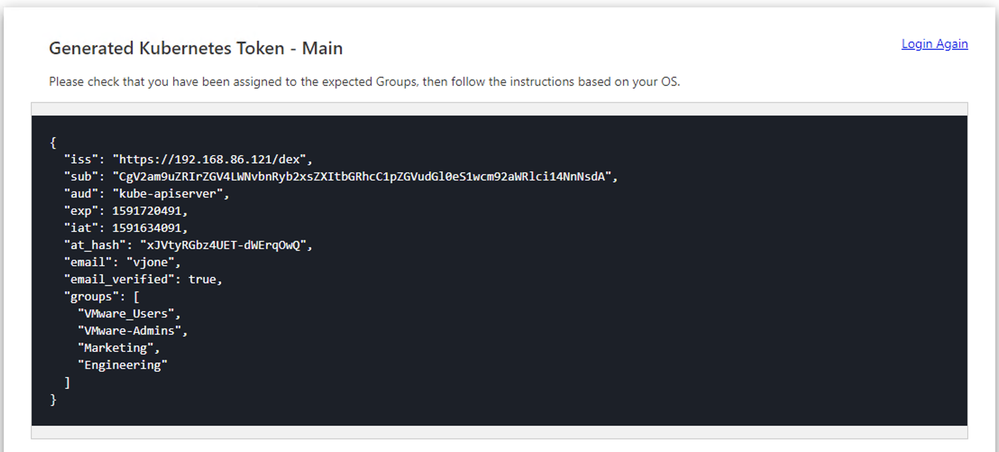

Generating a kubectl token is typically the way end users access Konvoy and Kubernetes. Most end users interact with Kubernetes from a command line perspective. Generating a kubectl token is also a great way to confirm and help troubleshoot your LDAP access. You can determine if specific values are returned by the external identity provider. The following procedure shows how to  generate a kubectl token. 

## Before you begin 

You need certain software configurations and settings before you start this procedure. This procedure requires the following items and configurations:

- Konvoy version 1.4.2 and above [installed](../../../../konvoy/1.5/install) and running.

- Kommander version 1.0 and above [installed](../../install) and running.

- [Configured LDAP identity provider](../setup-ldap).

Follow this procedure to create your kubectl token.

1. Go to the Kommander operations portal in your web browser.

1. Select the **Generate Kubectl Token** button. 

1. Select the Konvoy cluster you want to authenticate against. **Main** is the cluster where Kommander is maintained.

1. Select the **LDAP Log in** option. This name is based on the **Name** field used when configuring the identity provider.

1. Enter **LDAP username** and **password**. LDAP returned values and instructions should be displayed. Ensure that the Groups for your account are displayed. See the figure below for similar output.

    

## Related Information

- [Connect your LDAP directory to Konvoy using the CLI](https://docs.d2iq.com/ksphere/konvoy/1.4/security/external-idps/howto-dex-ldap-connector/)  

- [Configure your LDAP directory using the CLI](https://docs.d2iq.com/ksphere/konvoy/1.4/security/external-idps/rbac/)
- [Connect and configure your LDAP directory to Konvoy using Kommander](./setup-ldap)

