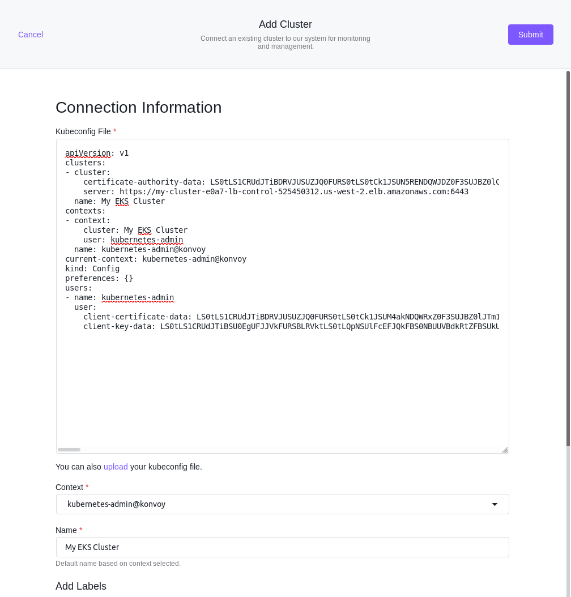

## Attach Kubernetes Cluster

Using the **Add Cluster** option, you can attach an already existing cluster, or an existing Konvoy cluster, directly to Kommander. You can access the multi-cluster management and monitoring benefits Kommander provides while keeping your existing cluster on its current provider and infrastructure.

Selecting the **Connect Cluster** option displays the **Connection Information** dialog box. This dialog box accepts a kubeconfig file, that you can paste, or upload into the field. In the **Conext** select list, you can select the intended context or change the display name provided with the config. You can add labels to classify your cluster.



To enable Single Sign-On (SSO), for accessing the Kubernetes API across connected clusters, with Kommander administrator credentials, a Certificate Authority(CA) must be created as a secret, first. The following script creates a CA including the CA certificate and a private key. The kubectl command then creates this CA using the current context under the name kubernetes-root-ca into the namespace cert-manager which is created if it does not already exist.

```bash
#!/usr/bin/env bash

set -euo pipefail

KEY_SIZE=4096
PRIV_KEY_FILE=root-ca-private-key.pem
CA_CERT_FILE=root-ca-certificate.pem

if [ ! -f $PRIV_KEY_FILE ]; then
    openssl genrsa -out $PRIV_KEY_FILE $KEY_SIZE
fi

if [ ! -f $CA_CERT_FILE ]; then
    openssl req -x509 -new -nodes -key $PRIV_KEY_FILE -sha256 -days 1825 -out $CA_CERT_FILE
fi

kubectl create namespace cert-manager || true

cat <<EOF | kubectl apply -f -
---
apiVersion: v1
kind: Secret
metadata:
  name: kubernetes-root-ca
  namespace: cert-manager
type: kubernetes.io/tls
data:
  tls.crt: $(base64 -w0 < ${CA_CERT_FILE})
  tls.key: $(base64 -w0 < ${PRIV_KEY_FILE})
EOF
```

After the CA secret has been created successfully, a custom kubeconfig can be retrieved by visiting the `/token` endpoint on the Kommander cluster domain. Selecting the attached cluster name displays the instructions to assemble a kubeconfig for accessing its Kubernetes API.

## Attaching Kubernetes Cluster Using a New Service Account

When connecting an existing cluster to Kommander a separate special service account should be created to keep that access specific and isolated to Kommander.

To get started, ensure you have [kubectl](https://kubernetes.io/docs/tasks/tools/install-kubectl/) set up and configured with [ClusterAdmin](https://kubernetes.io/docs/concepts/cluster-administration/cluster-administration-overview/) for the cluster you intend to connect to Konvoy.

First create the necessary service account:

```shell
kubectl -n kube-system create serviceaccount kommander-cluster-admin
```

Next configure the new service account for cluster admin permissions:

```shell
cat << EOF | kubectl apply -f -
apiVersion: rbac.authorization.k8s.io/v1beta1
kind: ClusterRoleBinding
metadata:
  name: kommander-cluster-admin
roleRef:
  apiGroup: rbac.authorization.k8s.io
  kind: ClusterRole
  name: cluster-admin
subjects:
- kind: ServiceAccount
  name: kommander-cluster-admin
  namespace: kube-system
EOF
```

Next use some variables to populate the new kubeconfig file for this service account.

```shell
export USER_TOKEN_NAME=$(kubectl -n kube-system get serviceaccount kommander-cluster-admin -o=jsonpath='{.secrets[0].name}')
export USER_TOKEN_VALUE=$(kubectl -n kube-system get secret/${USER_TOKEN_NAME} -o=go-template='{{.data.token}}' | base64 --decode)
export CURRENT_CONTEXT=$(kubectl config current-context)
export CLUSTER_CA=$(kubectl config view --raw -o=go-template='{{range .clusters}}{{if eq .name "'''${CURRENT_CONTEXT}'''"}}{{ index .cluster "certificate-authority-data" }}{{end}}{{ end }}')
export CLUSTER_SERVER=$(kubectl config view --raw -o=go-template='{{range .clusters}}{{if eq .name "'''${CURRENT_CONTEXT}'''"}}{{ .cluster.server }}{{end}}{{ end }}')
```

Now you can generate the kubeconfig file with these values:

```shell
cat << EOF > kommander-cluster-admin-config
apiVersion: v1
kind: Config
current-context: ${CURRENT_CONTEXT}
contexts:
- name: ${CURRENT_CONTEXT}
  context:
    cluster: ${CURRENT_CONTEXT}
    user: kommander-cluster-admin
    namespace: kube-system
clusters:
- name: ${CURRENT_CONTEXT}
  cluster:
    certificate-authority-data: ${CLUSTER_CA}
    server: ${CLUSTER_SERVER}
users:
- name: kommander-cluster-admin
  user:
    token: ${USER_TOKEN_VALUE}
EOF
```

This produces a file in your current working directory called `kommander-cluster-admin-config`. The contents of this file can uploaded to Kommander to import the cluster using the dedicated service account.

Before importing this configuration, verify the configuration is functional by running the following command:

```shell
kubectl --kubeconfig $(pwd)/kommander-cluster-admin-config get all --all-namespaces
```
