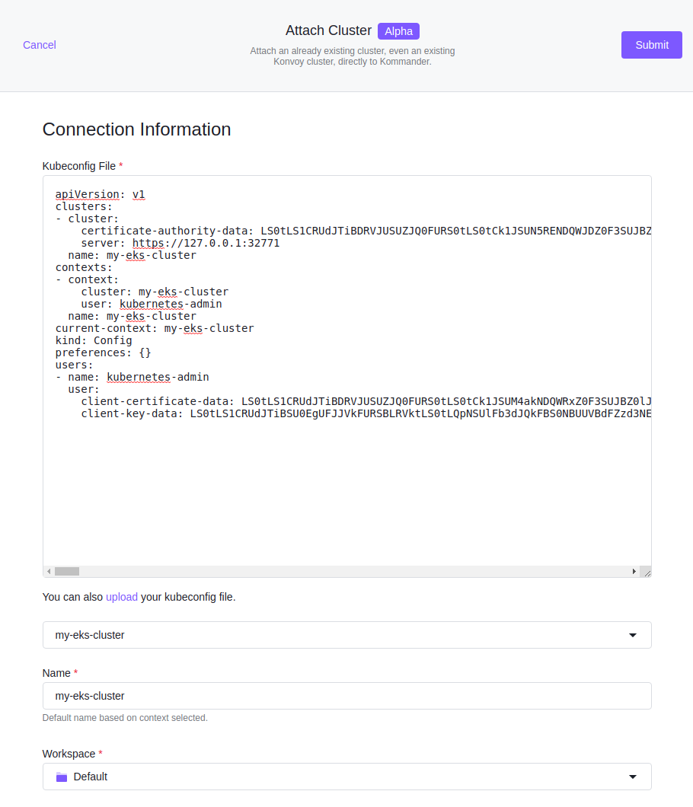

## Attach Kubernetes Cluster

Using the **Add Cluster** option, you can attach an already existing cluster, or an existing Konvoy cluster, directly to Kommander. You can access the multi-cluster management and monitoring benefits Kommander provides while keeping your existing cluster on its current provider and infrastructure.

Selecting the **Connect Cluster** option displays the **Connection Information** dialog box. This dialog box accepts a kubeconfig file, that you can paste, or upload into the field. In the **Conext** select list, you can select the intended context or change the display name provided with the config. You can add labels to classify your cluster.



To enable Single Sign-On (SSO) for accessing the Kubernetes API across connected clusters with the Kommander administrator credentials, a Certificate Authority must be posted as a secret to the API server first. The following script creates a Certificate Authority (CA) including the CA certificate and a private key. The `kubectl` command then posts this CA using the current context under the name `kubernetes-root-ca` into the namespace `cert-manager` which is created if it does not already exist.

```bash
#!/usr/bin/env bash

set -euo pipefail

KEY_SIZE=4096
PRIV_KEY_FILE=root-ca-private-key.pem
CA_CERT_FILE=root-ca-certificate.pem

if [ ! -f $PRIV_KEY_FILE ]; then
    openssl genrsa -out $PRIV_KEY_FILE $KEY_SIZE
fi

if [ ! -f $CA_CERT_FILE ]; then
    openssl req -x509 -new -nodes -key $PRIV_KEY_FILE -sha256 -days 1825 -out $CA_CERT_FILE
fi

kubectl create namespace cert-manager || true

cat <<EOF | kubectl apply -f -
---
apiVersion: v1
kind: Secret
metadata:
  name: kubernetes-root-ca
  namespace: cert-manager
type: kubernetes.io/tls
data:
  tls.crt: $(base64 -w0 < ${CA_CERT_FILE})
  tls.key: $(base64 -w0 < ${PRIV_KEY_FILE})
EOF
```

After the CA secret has been posted successfully, a custom kubeconfig can be retrieved shortly by visiting the `/token` endpoint on the Kommander cluster domain. Selecting the attached cluster name displays the instructions to assemble a kubeconfig for accessing its Kubernetes API.
