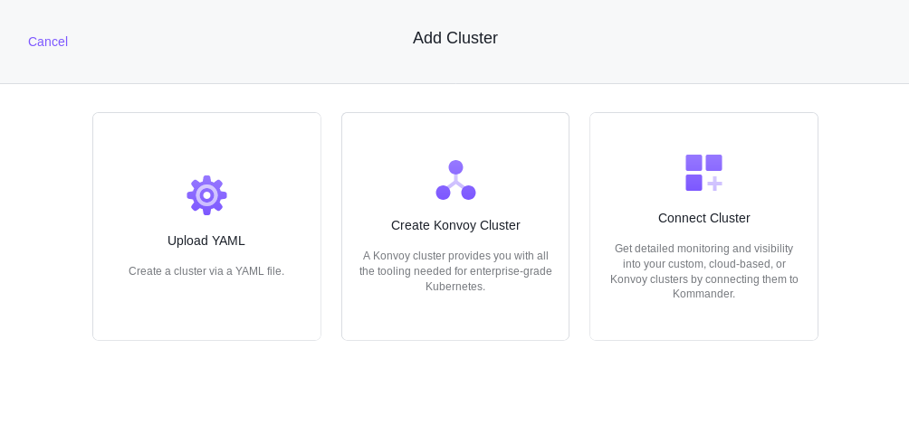

## Prerequisites

Configured [AWS Cloud Provider](/ksphere/kommander/latest/operations/cloud-providers/#configuring-an-aws-cloud-provider)

## Simplified Cluster Creation on AWS

From the **Add Cluster** menu, select the **Create Konvoy Cluster** and provide some basic cluster details:

- **Workspace**: The workspace where this cluster belongs.
- **Kubernetes Version**: The initial version of Kubernetes to install on the cluster.
- **Name**: A display name for referencing the cluster.

Now select the preconfigured [AWS Cloud Provider](/ksphere/kommander/latest/operations/cloud-providers/#configuring-an-aws-cloud-provider) to display the remaining options specific to AWS.

- **Region**: Select the datacenter region to reveal selectable Availability Zones.
- **Availability Zones**: Indicates the availability zones to use for cluster provisioning.
- **Configure Node Pools**: Specify pools of nodes, their size, and quantity. The default suggests a control plane pool containing 3 m5.xlarge nodes and a worker pool containing 4 m5.2xlarge nodes. You can also specify labels, node taints, and subnet ID's as part of each pool.
- **Add Cloud Provider Tags**: Specify tags to be set on all resources created in your cloud provider for this cluster. You can add up to 10 tags in this form. Different cloud providers have varying restrictions on their tags. See the [AWS Tags User Guide][aws_tags] for more information about using tags in AWS.
- **Add Labels**: By default, your cluster has suggested labels that reflect the cloud provider provisioning. For example, your AWS cluster may be labelled with the datacenter region and `provider: aws`. Cluster labels are matched to the selectors created for projects. Changing a cluster label may add or remove the cluster from projects.

[aws_tags]: https://docs.aws.amazon.com/AWSEC2/latest/UserGuide/Using_Tags.html

Select the **Continue** button to begin provisioning the Konvoy cluster.

