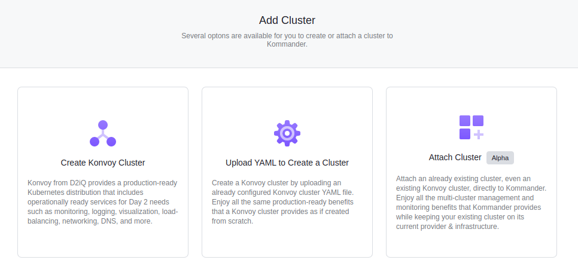

## Prerequisites

Configured [Azure Cloud Provider](/ksphere/kommander/latest/operations/cloud-providers/#configuring-an-azure-cloud-provider)

## Simplified Cluster Creation on Azure

From the **Add Cluster** menu, select the **Create Konvoy Cluster** and provide some basic cluster details:

- **Workspace**: The workspace where this cluster belongs.
- **Kubernetes Version**: The initial version of Kubernetes to install on the cluster.
- **Name**: A display name for referencing the cluster.

Now select the preconfigured [Azure Cloud Provider](/ksphere/kommander/latest/operations/cloud-providers/#configuring-an-azure-cloud-provider) to display the remaining options specific to Azure.

- **Region**: Select the datacenter region to reveal selectable Availability Zones. [Azure maintains multiple datacenters per region](azure-regions) to provide redundancy and availability.
- **Resource Group**: The name of a new or existing resource group where the Azure cluster resources will be assigned. If you leave this blank, a new resource group will be automatically generated.
- **VNet Name**: A new or existing virtual network name in which to create this cluster. If this VNet already exists, it must belong to the resource group defined above.
- **VNet Route Table**: A new or existing route table name. If this route table already exists, it must belong to the VNet defined above.
- **Configure Node Pools**: Specify pools of nodes, their size, and quantity. The suggested default is a control plane pool containing 3 Standard_DS3_v2 nodes and a worker pool containing 6 Standard_DS3_v2 nodes. You can also specify labels, node taints, and subnet ID's as part of each pool.
- **Add Cloud Provider Tags**: Specify tags on all resources created in your cloud provider for this cluster. You can add up to 10 tags in this form. Different cloud providers have varying restrictions on their tags. See the [Azure Tags User Guide][azure_tags] for more information about using tags in Azure.
- **Add Labels**: By default, your cluster has some suggested labels that reflect the cloud provider provisioning. For example, in Azure your cluster may be labelled with the datacenter region as well as `provider: azure`. Cluster labels are matched to the selectors created for projects. Changing a cluster label may add or remove the cluster from projects.

[azure-regions]: https://azure.microsoft.com/en-us/global-infrastructure/regions/
