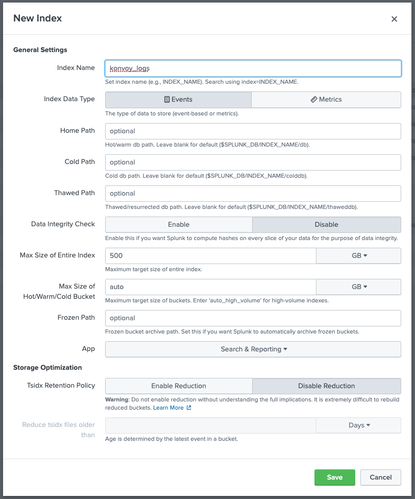
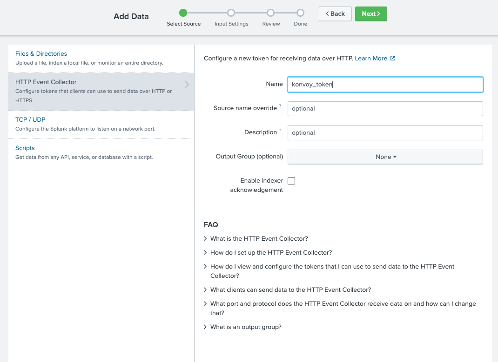
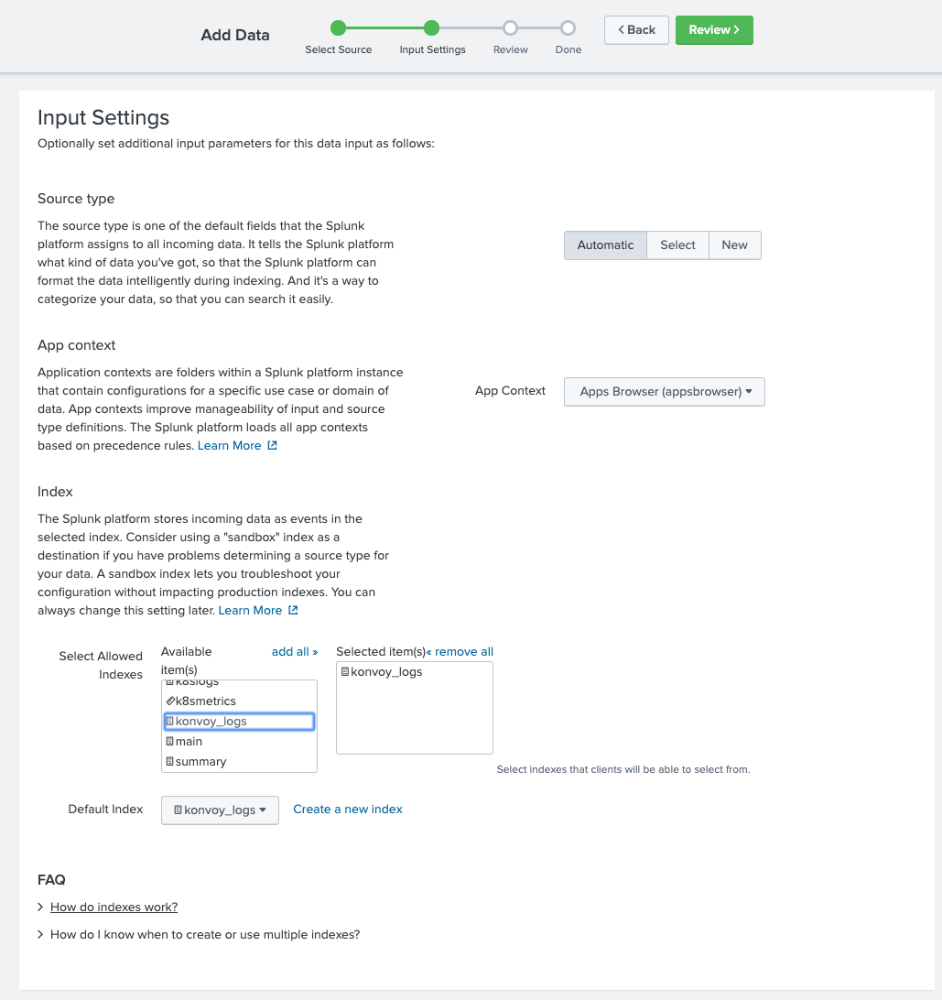

Many organizations have standardized on Splunk for logging operations. This procedure describes how to integrate a Splunk configuration with a Konvoy cluster.

## Splunk Prerequisites

Before your begin, you need the following information specific to your Splunk configuration:

    - IP address and port of the Splunk Enterprise container.

## Create an index for the Konvoy Cluster

Use the Splunk console to create an index into the kubernetes logs. Go to **Settings -> Indexes**. Enter information to create a new index. Select the **Save** button to save your index settings.

<p class="message--note"><strong>NOTE: </strong>You must create an index for each Konvoy cluster.</p>



<p class="message--note"><strong>NOTE: </strong>Your Splunk environment may have different settings and naming conventions for creating an index. The figure above is presented as an example.</p>

## Create a new HTTP Event Collector

Go to **Settings -> Data Inputs**. Select **+Add New** for HTTP Event Collector. Enter information to create a new HTTP Event Collector. Select the **Next** button.



In the **Input Settings** dialog box, select the name of the recently created index to associate that index with this HTTP Event Collector.



<p class="message--note"><strong>NOTE: </strong>Your Splunk environment may have different settings and naming conventions for creating an HTTP Event Collector. The figure above is presented as an example.</p>

## Disable default Konvoy cluster monitoring

In your `config.yaml`, for each Konvoy cluster, edit the add-ons section and disable the Elastic Search Components:

    ```yaml
        - name: elasticsearch
          enabled: false
        - name: elasticsearch-curator
          enabled: false
        - name: elasticsearchexporter
          enabled: false
        - name: kibana
          enabled: false
    ```

## Configure Fluentbit to send logs to Splunk

In your `cluster.yaml` file, for each Konvoy cluster, edit the Fluentbit section. Add the supplied host IP address, port and HTTP Event Collector token of your Splunk configuration.

    ```yaml
        - name: fluentbit
          enabled: true
          values: |
            # add value for splunk
            backend:
              splunk:
                host: 192.168.10.6
                port: 8088
                token: "4be74a2b-7a29-4f60-a72f-6a36685310c9"
                send_raw: "off"
                tls: "off"
                tls_verify: "off"
                tls_debug: 1
                message_key: "kubernetes"
              type: splunk

    ```

Start your Konvoy cluster. Konvoy starts and uses your updated configuration.

## Check the Fluentbit pod for health

Ensure the Fluentbit pods are running successfully.

    ```shell
    kubectl get pods -n kubeaddons |grep fluent

    fluentbit-kubeaddons-fluent-bit-cbbgj                             1/1     Running       0          23m
    fluentbit-kubeaddons-fluent-bit-cln4p                             1/1     Running       0          20m
    fluentbit-kubeaddons-fluent-bit-fqffj                             1/1     Running       0          4s
    fluentbit-kubeaddons-fluent-bit-pxb7w                             1/1     Running       0          22m
    fluentbit-kubeaddons-fluent-bit-tnhgd                             1/1     Running       0          19s
    fluentbit-kubeaddons-fluent-bit-z8fbp                             1/1     Running       0          4m27s
    ```

## Examine the logs for the Fluentbit container

    ```shell
    kubectl logs -n kubeaddons fluentbit-kubeaddons-fluent-bit-fqffj

    Fluent Bit v1.3.2
    Copyright (C) Treasure Data

    [2020/02/28 00:35:58] [ info] [storage] initializing...
    [2020/02/28 00:35:58] [ info] [storage] in-memory
    [2020/02/28 00:35:58] [ info] [storage] normal synchronization mode, checksum disabled, max_chunks_up=128
    [2020/02/28 00:35:58] [ info] [engine] started (pid=1)
    [2020/02/28 00:35:58] [ info] [filter_kube] https=1 host=kubernetes.default.svc port=443
    [2020/02/28 00:35:58] [ info] [filter_kube] local POD info OK
    [2020/02/28 00:35:58] [ info] [filter_kube] testing connectivity with API server...
    [2020/02/28 00:35:58] [ info] [filter_kube] API server connectivity OK
    [2020/02/28 00:35:58] [ info] [http_server] listen iface=0.0.0.0 tcp_port=2020
    [2020/02/28 00:35:58] [ info] [sp] stream processor started
    ```

## Access your Konvoy logs from Splunk

Go to the Splunk user console to do a search. Use the index name you associated with your HTTP Event Collector. Enter the search string:

    ```shell
    index=“konvoy_logs” *
    ```


When this integration is complete your Konvoy logs display in your Splunk console.

## References

Splunk Operator Github:
[https://splunk.github.io/splunk-operator/](https://splunk.github.io/splunk-operator/)

Fluentbit Docs:
[https://fluentbit.io/documentation/0.13/output/splunk.html](https://fluentbit.io/documentation/0.13/output/splunk.html)
