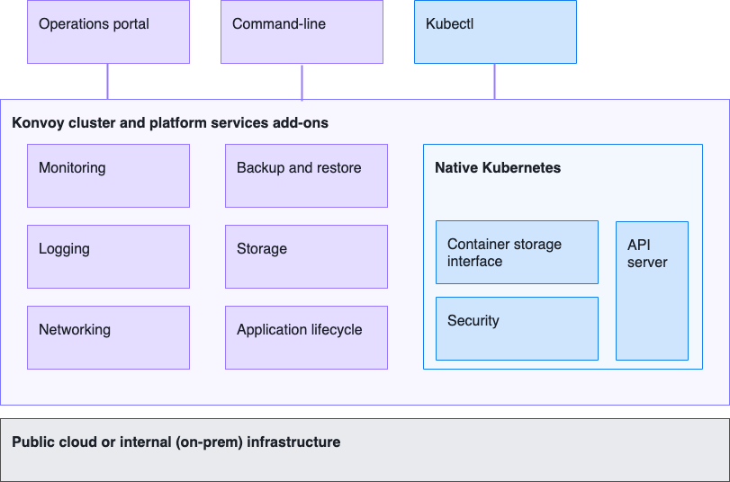

Kubernetes provides the foundation of a Konvoy cluster.
Because of this fundamental relationship, you should be familiar with a few key concepts and terms.
The topics in this section provide a brief overview of the native Kubernetes architecture, the core components of the Konvoy cluster, and a simplified view of the Konvoy architecture and the operational workflow for a Konvoy cluster.

The following diagram provides a simplified architectural overview to help you visualize the key components of the cluster:

## Master components for the Kubernetes control plane

The native Kubernetes cluster consists of **master components** that provide the cluster’s **control plane** and **worker nodes** that run users' containers and maintain the runtime environment.

The master components in your cluster manage activities that affect the cluster as a whole.
For example, master components handle scheduling and changes to workload requirements in response to cluster events.

Technically, you can deploy master components on any machine in the cluster.
By default, however, master components are only deployed on the machines you designate as control plane servers.

The master components in a native Kubernetes cluster include the following:

- `kube-apiserver` exposes the Kubernetes application programming interface (API) and provides a web-based front-end for the Kubernetes control plane.
- `etcd` provides a key value store that you can use to store all Kubernetes cluster data.
- `kube-scheduler` monitors the cluster to detect newly-created pods that have no node assigned, and selects a node for those pods to run on.
- `kube-controller-manager` manages the collection of individual controller processes as a single binary.

The controllers include:

- A node controller that keeps track of node status and responds if nodes go down.
- A replication controller that maintains the correct number of pods for every replication controller object in the system.
- An endpoints controller that populates endpoints.
- A service account and token controller that creates default accounts and access tokens for new service namespaces.
- `cloud-controller-manager` runs controllers that interact with the underlying cloud providers.

For more information about any of the master components or Kubernetes control plane, see the [Kubernetes][kubedoc] documentation.

## Worker nodes

Worker nodes maintain running pods and provide the runtime environment for the native Kubernetes cluster.
Each work node includes the following key components:

- The `kubelet` agent runs on each node in the cluster to ensure that the containers created by Kubernetes for a pod are running  and in a healthy state.
- The `kube-proxy` serves as a network proxy that runs on each node in the cluster to enforce network routing and connection forwarding rules.
- The Kubernetes container runtime manages any supported type of container, such as Docker or `containerd`, that runs on the cluster.

## Platform service add-ons

The native Kubernetes cluster supports a set of **addons**.
Addons use Kubernetes resources to implement specific cluster-level features.
Because they provide cluster-level features, addons are defined in the `kube-system` namespace.

Konvoy supplements the native Kubernetes cluster by providing a predefined and preconfigured set of addons.
Because this predefined set of addons provide critical features for managing a Kubernetes cluster in a production environment, the default set of addons are identified as Konvoy **platform services** and are a key part of delivering an **opinionated Kubernetes** solution.
<!--
## Basic operational workflow
-->
[kubedoc]:https://kubernetes.io/docs/concepts/overview/components/
