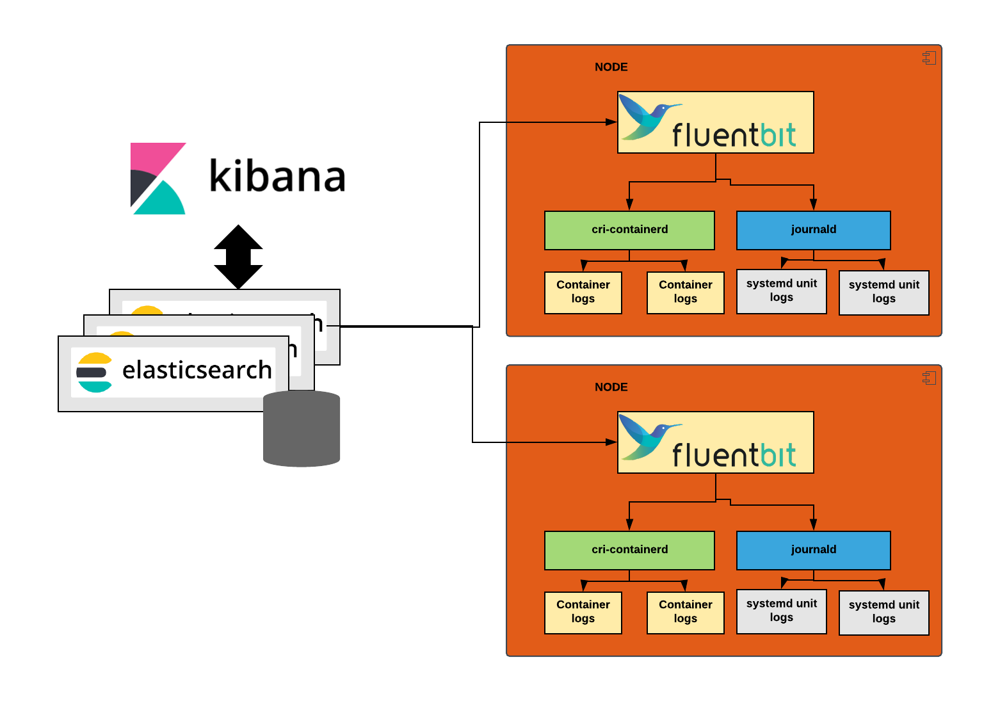

<!-- markdownlint-disable MD004 MD007 MD025 MD030 -->

Konvoy ships with a pre-configured logging stack that allows you to collect and visualize the cluster logs over time.
The primary components of the Konvoy logging stack include the following platform service addons:

* Fluent Bit
* Elasticsearch
* Kibana

In addition to these platform services, logging relies on other software and system facilities.
For example, the container runtime, `journald` facility, and systemd configuration are used to collect logs and messages from all the machines in the cluster.

The following diagram illustrates how different components of the logging stack provide information about the Konvoy cluster.



Figure 1 - Logging stack component

# Accessing cluster logs

The Elasticsearch, Fluent Bit, and Kibana (EFK) stack aggregates logs from nodes and applications running inside your Konvoy cluster.

Once the logging stack is deployed and running on the cluster, the components work together to perform the following tasks:

* Fluent Bit aggregates logs from all nodes, and pods into Elasticsearch.
  Additionally Fluent Bit also tags these logs with structured metadata like pod name, instance name, and so forth, so that it can be searched more efficiently.
* Elasticsearch stores all the these logs.
* Kibana provides centralized access to the logged data through a web-based interface that enables you to create dashboards and graphs for visualizing the aggregated data.

In addition to the logging stack of platform services, Konvoy relies on the container runtime and `journald` system facilities to collect logs.
For example, the `journald` facility provides a systemd daemon that collects all the logs that are generated by the running systemd units.
To ensure that all logs are available for filtering and searching in Elasticsearch, Fluent Bit is configured to fetch these logs from `journald` and from the container runtime.

## Enable the platform service addons for logging

To enable the logging stack, you need to enable Elasticsearch, Fluent Bit, and Kibana in the in the `cluster.yaml` file. For example:

```yaml
- name: elasticsearch
  enabled: true
- name: kibana
  enabled: true
- name: fluentbit
  enabled: true  
```

To access to Kibana web console, you can browse to the landing page and then search for the Kibana dashboard, e.g. `https://<CLUSTER_URL>/ops/portal/kibana`.

# Adding storage space for Elasticsearch

When defining the requirements of a Konvoy cluster, you can specify the capacity and resource requirements of Elasticsearch by modifying settings in the `cluster.yaml` definition to your desire, as shown below.
You can use the settings in the `cluster.yaml` file to change the size of the volume where the data is stored, the resource requirements, or both.

```yaml
- name: elasticsearch
  enabled: true
  values: |
    client:
      heapSize: 1024m
      resources:
        limits:
          cpu: 1000m
          memory: 2048Mi
        requests:
          cpu: 500m
          memory: 1536Mi
    master:
      heapSize: 4096m
      resources:
        limits:
          cpu: 2000m
          memory: 8192Mi
        requests:
          cpu: 2000m
          memory: 4096Mi
    data:
      replicas: 6
      heapSize: 8192m
      resources:
      persistence:
        enabled: true
        accessMode: ReadWriteOnce
        name: data
        size: "100Gi"
      resources:
        limits:
          cpu: 4000m
          memory: 16384Mi
        requests:
          cpu: 3000m
          memory: 15000Mi
```

# Configuring custom Kibana dashboards

Initially, Konvoy does not ship any custom Kibana dashboard, but customers can configure Kibana to use a custom dashboard by modifying the `cluster.yaml` file:

```yaml
- name: kibana
  enabled: true
  values: |
    dashboardImport:
      enabled: true
      dashboards:
        k8s: https://raw.githubusercontent.com/monotek/kibana-dashboards/master/k8s-fluentd-elasticsearch.json
```

Another option to import custom Kibana dashboards can be to use the Kibana web console:

1. Go to Kibana
1. Click on Management
1. Click on Saved Objects
1. Click on the Import button
1. Browse the exported file
1. You will then be prompted: "If any of the objects already exist, do you want to automatically overwrite them?" and you will be given the following options:
    * No, prompt me for each one
    * Yes, overwrite all

<p class="message--note"><strong>NOTE: </strong> If any visualization or dashboard did not import, the issue is most likely a field that is referenced in the visualization but not indexed. Make sure that you are shipping the correct logs and that the Kibana mapping is refreshed.</p>

# Configuring elasticsearch curator addon for log maintenance

Logs, if let to run without log maintenance, would fill up the disk space. For this purpose, Konvoy (version > 1.3.0) has elasticsearch curator as an addon. Curator is a cronjob that periodically garbage collects the indices which are older than the configured time.

Customer can enable curator addon with default configuration by modifying the `cluster.yaml` file:

```yaml
- name: elasticsearch-curator
  enabled: true
```

The default configuration would run curator job every day at mid-night and would garbage collect all the indices which are older than 30 days. Customer can configure both the cronjob schedule and the number of days by modifying the `cluster.yaml` file:

```yaml
- name: elasticsearch-curator
  enabled: true
  values: |
    cronjob:
        # At 12:00 am every day
        schedule: "0 0 * * *"

    configMaps:
      action_file_yml: |-
          ---
          actions:
            1:
              action: delete_indices
              description: "Clean up ES by deleting indices older than 30 days"
              options:
                timeout_override:
                continue_if_exception: False
                disable_action: False
                ignore_empty_list: True
              filters:
              - filtertype: pattern
                kind: prefix
                value: kubernetes_cluster-
              - filtertype: age
                source: name
                direction: older
                timestring: '%Y.%m.%d'
                unit: days
                unit_count: 30
```
