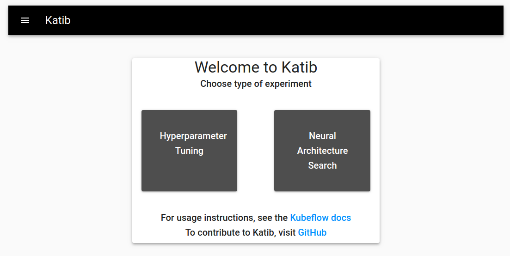
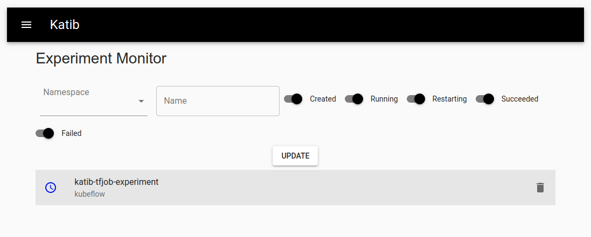
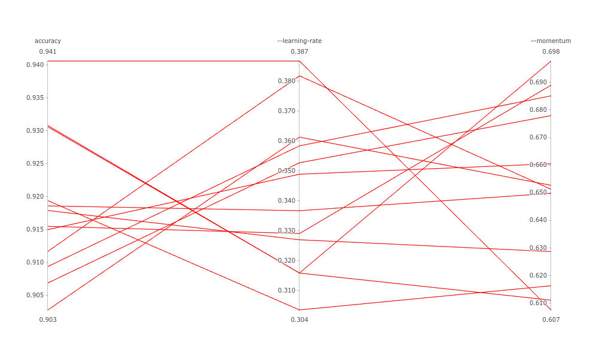

<p class="message--note"><strong>NOTE: </strong>All tutorials are available in Jupyter Notebook format. To download
the tutorials run `curl -L https://downloads.mesosphere.io/kudo-kubeflow/d2iq-tutorials-1.0.1-0.3.1.tar.gz | tar xz`
from a Jupyter Notebook Terminal running in your KUDO Kubeflow installation.
</p>

<p class="message--warning"><strong>WARNING: </strong>Please note that these notebook tutorials have been built for and
tested on D2iQ's KUDO for Kubeflow. Without the requisite Kubernetes operators and custom Docker images, these notebook
will likely not work.</p>
# Hyperparameter Tuning with Katib

## Introduction

Hyperparameter tuning is the process of optimizing a model's hyperparameter values in order to maximize the predictive quality of the model.
Examples of such hyperparameters are the learning rate, neural architecture depth (layers) and width (nodes), epochs, batch size, dropout rate, and activation functions.
These are the parameters that are set prior to training; unlike the model parameters (weights and biases), these do not change during the process of training the model.

[Katib](https://github.com/kubeflow/katib) automates the process of hyperparameter tuning by running a pre-configured number of training jobs (known as **trials**) in parallel.
Each trial evaluates a different set of hyperparameter configurations.
Within each **experiment** it automatically adjusts the hyperparameters to find their optimal values with regard to the objective function, which is typically the model's metric (e.g. accuracy, AUC, F1, precision).
An experiment therefore consists of an objective, a search space for the hyperparameters, and a [search algorithm](https://github.com/kubeflow/katib#hyperparameter-tuning).
At the end of the experiment, Katib outputs the optimized values, which are also known as **suggestions**.

<div style="color: #31708f; background-color: #d9edf7; border-color: #bce8f1; padding: 15px; margin-top: 10px; margin-bottom: 10px; border: 1px solid transparent; border-radius: 4px;">
    <b>Three Data Sets</b><br>Whereas it is common to have training and test data sets in traditional (supervised) machine learning, in deep learning (esp. when combined with hyperparameter tuning), it is recommended to have a three-way split: training, validation (a.k.a. as development), and test. 
    The training data set is, as always, to learn parameters (weights and biases) from data. 
    The test data set is also known as the hold-out set and its sole purpose is to check the model's hypothesis of parameter values in terms of how well it generalizes to data it has never come across.
    The point of the validation data set is to cross-validate the model and tweak the hyperparameters. 
    Since information from this data set is used to adjust the model, it is not an objective test of the model's generalizability. 
    It is not unlike a <a href=\"https://www.linkedin.com/posts/activity-6424581736302284800-Kdas\">teacher checking up on students</a>:
    <ul>
      <li style="color: #31708f;">The training data set is the text book to learn the theory from</li>
      <li style="color: #31708f;">The validation data set comprises the exercises to practice the theory</li>
      <li style="color: #31708f;">The test data set is exam to assess the degree of learning vs lookup</li>
    </ul>
</div>

### What You'll Learn
This notebook shows how you can create and configure an `Experiment` for both `TensorFlow` and `PyTorch` training jobs.
In terms of Kubernetes, such an experiment is a custom resource handled by the Katib operator.

### What You'll Need
A Docker image with either a [TensorFlow](../training/tensorflow) or [PyTorch](../training/pytorch) model that accepts hyperparameters as arguments.
Please click on the links to see such models.

That's it, so let's get started!

## How to Specify Hyperparameters in Your Models
In order for Katib to be able to tweak hyperparameters it needs to know what these are called in the model.
Beyond that, the model must specify these hyperparameters either as regular (command line) parameters or as environment variables.
Since the model needs to be containerized, any command line parameters or environment variables must to be passed to the container that holds your model.
By far the most common and also the recommended way is to use command line parameters that are captured with [`argparse`](https://docs.python.org/3/library/argparse.html) or similar; the trainer (function) then uses their values internally.

## How to Expose Model Metrics as Objective Functions
By default, Katib collects metrics from the standard output of a job container by using a sidecar container.
In order to make the metrics available to Katib, they must be logged to [stdout](https://www.kubeflow.org/docs/components/hyperparameter-tuning/experiment/#metrics-collector) in the `key=value` format.
The job output will be redirected to `/var/log/katib/metrics.log` file.
This means that the objective function (for Katib) must match the metric's `key` in the models output.
It's therefore possible to define custom model metrics for your use case.

<div style="color: #31708f; background-color: #d9edf7; border-color: #bce8f1; padding: 15px; margin-top: 10px; margin-bottom: 10px; border: 1px solid transparent; border-radius: 4px;">
    <b>Sidecars</b><br>
    In the sidecar (a.k.a. sidekick or decomposition) pattern, if you are not already familiar with it, a secondary (sidecar) container is attached to the primary workload inside a pod in Kubernetes. In many cases, pods run a single container, but peripheral services, such as networking services, monitoring, and logging, are required in all applications and services. With sidecars there is no need to re-implement basic but secondary tasks in each service or application. The sidecar has the same lifecycle as the primary application and it has access to the same resources. The sidecar is, however, isolated from the main container, which means it does not have to be implemented in the same technology. This means it can easily be reused across various workloads.<br><br>
    Katib does not care whether you use TensorFlow, PyTorch, MXNet, or any other framework for that matter. All it needs to do its job is a (parameterized) trainer container and the logs to grab the model's metrics from.
</div>

## How to Create Experiments
Before we proceed, let's set up a few basic definitions that we can re-use.
Note that you typically use (YAML) resource definitions for Kubernetes from the command line, but we shall show you how to do everything from a notebook, so that you do not have to exit your favourite environment at all!
Of course, if you are more familiar or comfortable with `kubectl` and the command line, feel free to use a local CLI or the embedded terminals from the Jupyter Lab launch screen.


```python
TF_EXPERIMENT_FILE = "katib-tfjob-experiment.yaml"
PYTORCH_EXPERIMENT_FILE = "katib-pytorchjob-experiment.yaml"
```

We also want to capture output from a cell with [`%%capture`](https://ipython.readthedocs.io/en/stable/interactive/magics.html#cellmagic-capture) that usually looks like `some-resource created`.
To that end, let's define a helper function:


```python
import re

from IPython.utils.capture import CapturedIO


def get_experiment(captured_io: CapturedIO) -> str:
    """
    Gets a Katib experiment's resource name from `kubectl apply -f <configuration.yaml>`.
    
    :param str captured_io: Output captured by using `%%capture` cell magic
    :return: Name of the hyperparameter tuning experiment
    :rtype: str
    :raises Exception: if the experiment could not be created
    """
    out = captured_io.stdout
    matches = re.search(r"^(.+)\s+created", out)
    if matches is not None:
        return matches.group(1)
    else:
        raise Exception(f"Cannot get experiment as its creation failed: {out}")
```

### TensorFlow: a TFJob Experiment

The `TFJob` definition for this example is based on the [MNIST with TensorFlow](../training/tensorflow) notebook.
To refresh our memory, the model accepts several arguments:
- `--batch-size`
- `--buffer-size`
- `--epochs`
- `--steps`
- `--learning-rate`
- `--momentum`

For our experiment, we want to focus on the learning rate and momentum of the [SGD algorithm](https://www.tensorflow.org/api_docs/python/tf/keras/optimizers/SGD).
You can add the other hyperparameters in a similar manner.
Please note that [discrete values (e.g. epochs) and categorical values (e.g. optimization algorithms)](https://www.kubeflow.org/docs/reference/katib/v1alpha3/katib/#feasiblespace) are supported, too.

The following YAML file describes an `Experiment` object:


```python
%%writefile $TF_EXPERIMENT_FILE
apiVersion: "kubeflow.org/v1alpha3"
kind: Experiment
metadata:
  name: katib-tfjob-experiment
spec:
  parallelTrialCount: 3
  maxTrialCount: 12
  maxFailedTrialCount: 3
  objective:
    type: maximize
    goal: 0.99
    objectiveMetricName: accuracy
  algorithm:
    algorithmName: random
  parameters:
    - name: --learning-rate
      parameterType: double
      feasibleSpace:
        min: "0.3"
        max: "0.4"
    - name: --momentum
      parameterType: double
      feasibleSpace:
        min: "0.6"
        max: "0.7"
  trialTemplate:
    goTemplate:
        rawTemplate: |-
          apiVersion: "kubeflow.org/v1"
          kind: TFJob
          metadata:
            name: {{.Trial}}
            namespace: {{.NameSpace}}
          spec:
           tfReplicaSpecs:
            Worker:
              replicas: 2
              restartPolicy: OnFailure
              template:
                metadata:
                  annotations:
                    sidecar.istio.io/inject: "false"
                spec:
                  containers:
                    - name: tensorflow
                      # modify this property if you would like to use a custom image
                      image: mesosphere/kubeflow:mnist-tensorflow-2.2-1.0.1-0.3.1
                      imagePullPolicy: Always
                      args:
                        {{- with .HyperParameters}}
                        {{- range .}}
                        - "{{.Name}}"
                        - "{{.Value}}"
                        {{- end}}
                        {{- end}}
                      # Comment out these resources when using only CPUs
                      resources:
                        limits:
                          nvidia.com/gpu: 1
```

    Writing katib-tfjob-experiment.yaml


Please note that the Docker image that contains the model has to be set for the `trialTemplate` configuration.
This experiment will create 12 trials with different sets of hyperparameter values passed to each training job.
It uses a random search to maximize the accuracy on the test data set.

A comment has been added where you can change the Docker image.
The one listed should work, but you may want to try it with your own container registry.

<div style="color: #8a6d3b; background-color: #fcf8e3; border-color: #faebcc; padding: 15px; margin-top: 10px; margin-bottom: 10px; border: 1px solid transparent; border-radius: 4px;">
As we have said before, performing hyperparameter tuning on data that is split two ways only is not ideal. For our demonstration purposes it suffices, as we do not check the accuracy of the tuned model on a separate hold-out data set. If you wanted to do that yourself, you could do it as follows:
<ul>
  <li style="color: #8a6d3b;">Split the data three ways</li>
  <li style="color: #8a6d3b;">Evaluate the model on both the validation and test data sets</li>
  <li style="color: #8a6d3b;">Add the model evaluation metric for the test data set as an entry in <code>additionalMetricNames</code>, which may contain multiple metrics of interest</li>
  <li style="color: #8a6d3b;">Let Katib find the best hyperparameter values based on the validation data set (i.e. <code>objectiveMetricName</code>)</li>
  <li style="color: #8a6d3b;">Extract the corresponding model evaluation metric for the test data set from the results</li>
</ul>
</div>

The `Experiment` specification has the following sections to configure experiments:
- `spec.parameters` contains the list of hyperparameters that are used to tune the model
- `spec.objective` defines the metric to optimize
- `spec.algorithm` defines which search algorithm to use for the tuning process

There are many more configuration options, but they are too numerous to go through here.
Please have a look at the [official documentation](https://www.kubeflow.org/docs/reference/katib/v1alpha3/katib/) for more details.

### PyTorch: a PyTorchJob experiment

We shall repeat the procedure for a `PyTorchJob`.
This example is based on the [MNIST with PyTorch](../training/pytorch) notebook.
It accepts the following parameters relevant to training the model:
- `--batch-size`
- `--epochs`
- `--lr` (i.e. the learning rate)
- `--gamma`

For our experiment we wish to find the optimal learning rate in the range of [0.1, 0.7] with regard to the accuracy on the test data set.
This is logged as `accuracy=<value>`, as can be seen in the original notebook for distributed training.
We run up to 12 trials with three such trials in parallel.
Again, we use a random search.


```python
%%writefile $PYTORCH_EXPERIMENT_FILE
apiVersion: "kubeflow.org/v1alpha3"
kind: Experiment
metadata:
  name: katib-pytorchjob-experiment
spec:
  parallelTrialCount: 3
  maxTrialCount: 12
  maxFailedTrialCount: 3
  objective:
    type: maximize
    goal: 0.99
    objectiveMetricName: accuracy
  algorithm:
    algorithmName: random
  parameters:
    - name: --lr
      parameterType: double
      feasibleSpace:
        min: "0.1"
        max: "0.7"
  trialTemplate:
    goTemplate:
        rawTemplate: |-
          apiVersion: "kubeflow.org/v1"
          kind: PyTorchJob
          metadata:
            name: {{.Trial}}
            namespace: {{.NameSpace}}
          spec:
           pytorchReplicaSpecs:
            Master:
              replicas: 1
              restartPolicy: OnFailure
              template:
                metadata:
                  annotations:
                    sidecar.istio.io/inject: "false"
                spec:
                  containers:
                    - name: pytorch
                      # modify this property if you would like to use a custom image
                      image: mesosphere/kubeflow:mnist-pytorch-1.0.1-0.3.1
                      imagePullPolicy: Always
                      args:
                        {{- with .HyperParameters}}
                        {{- range .}}
                        - "{{.Name}}"
                        - "{{.Value}}"
                        {{- end}}
                        {{- end}}
                      # Comment out these resources when using only CPUs
                      resources:
                        limits:
                          nvidia.com/gpu: 1
            Worker:
              replicas: 2
              restartPolicy: OnFailure
              template:
                metadata:
                  annotations:
                    sidecar.istio.io/inject: "false"
                spec:
                  containers:
                    - name: pytorch
                      # modify this property if you would like to use a custom image
                      image: mesosphere/kubeflow:mnist-pytorch-1.0.1-0.3.1
                      imagePullPolicy: Always
                      args:
                        {{- with .HyperParameters}}
                        {{- range .}}
                        - "{{.Name}}"
                        - "{{.Value}}"
                        {{- end}}
                        {{- end}}
                      # Comment out these resources when using only CPUs
                      resources:
                        limits:
                          nvidia.com/gpu: 1
```

    Writing katib-pytorchjob-experiment.yaml


Please note the subtle differences in the `trialTemplate`: the `kind` is either [`TFJob`](https://www.kubeflow.org/docs/components/training/tftraining/) or [`PyTorchJob`](https://www.kubeflow.org/docs/components/training/pytorch/) and the Docker images are obviously different.

## How to Run and Monitor Experiments
Now we have specified our experiments, let's run them!
You can either execute these commands on your local machine with `kubectl` or you can run them from the notebook.
If you do run these locally, you cannot rely on cell magic, so you have to manually copy-paste the experiment name wherever you see `$EXPERIMENT`.
If you intend to run the following command locally, you have to set the user namespace for all subsequent commands:

```
kubectl config set-context --current --namespace=<insert-namespace>
```

Please change the namespace to whatever has been set up by your administrator.

To submit our experiment, we execute:


```python
%%capture kubectl_output --no-stderr
! kubectl apply -f $PYTORCH_EXPERIMENT_FILE
```

The cell magic grabs the output of the `kubectl` command and stores it in an object named `kubectl_output`.
From there we can use the utility function we defined earlier:


```python
EXPERIMENT = get_experiment(kubectl_output)
```

To see the status, we can then run:


```python
! kubectl describe $EXPERIMENT
```

To get the list of created trials, use the following command:


```python
! kubectl get trials.kubeflow.org -l experiment=katib-pytorchjob-experiment
```

    NAME                                   TYPE      STATUS   AGE
    katib-pytorchjob-experiment-62b9lr7k   Created   True     2s
    katib-pytorchjob-experiment-qcl4jkc6   Created   True     2s
    katib-pytorchjob-experiment-vnzgj7q6   Created   True     2s


After the experiment is completed, use `describe` to get the best trial results:


```python
! kubectl describe $EXPERIMENT
```

The relevant section of the output looks like this:
    
```yaml
Name:         katib-pytorchjob-experiment
...
Status:
  ...
  Current Optimal Trial:
    Best Trial Name:  katib-pytorchjob-experiment-jv4sc9q7
    Observation:
      Metrics:
        Name:   accuracy
        Value:  0.9902
    Parameter Assignments:
      Name:    --lr
      Value:   0.5512569257804198
  ...
  Trials:            6
  Trials Succeeded:  6
...
```

## Katib UI

So far, we have seen how to create and submit experiments via the command line or from within Jupyter notebooks.
Katib provides a user interface, which allows you to create, configure, and monitor experiments in a browser.
The Katib UI can be launched from Kubeflow's central dashboard.
Just click on "Katib" in the navigation menu on the left of the dashboard.



To access the experiment monitor, go to Menu &rarr; HP &rarr; Monitor in the hamburger menu next to "Katib" (black navigation bar at the top).



To see detailed information, such as trial results, metrics, and a plot, click on the experiment itself.




```python

```
