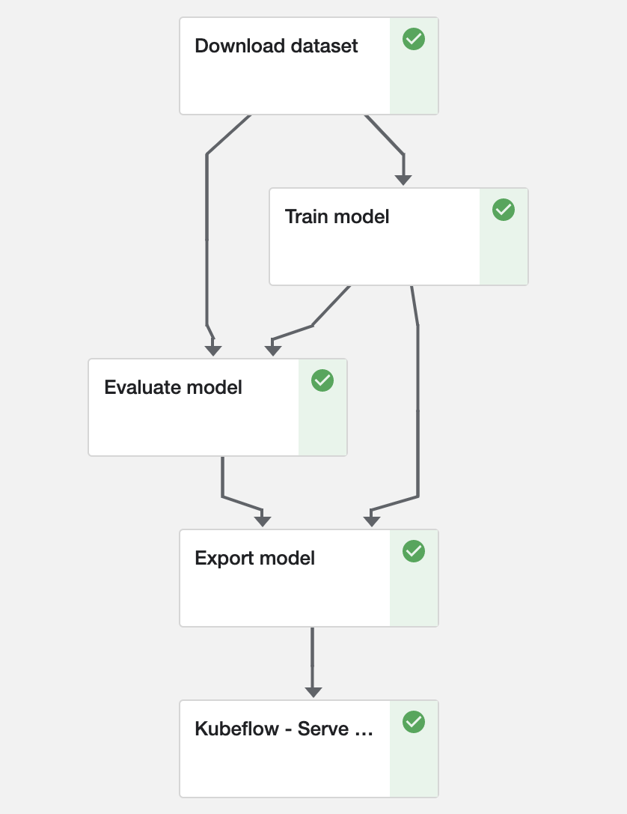

<p class="message--note"><strong>NOTE: </strong>All tutorials in Jupyter Notebook format are available for
<a href="https://downloads.mesosphere.io/kudo-kubeflow/d2iq-tutorials-1.0.1-0.5.0.tar.gz">download</a>. You can either
download them to a local computer and upload to the running Jupyter Notebook or run
<code>wget -O - https://downloads.mesosphere.io/kudo-kubeflow/d2iq-tutorials-1.0.1-0.5.0.tar.gz | tar xz</code>
from a Jupyter Notebook Terminal running in your KUDO for Kubeflow installation.
</p>
<p class="message--note"><strong>NOTE: </strong>Please note that these notebook tutorials have been built for and
tested on D2iQ's KUDO for Kubeflow. Without the requisite Kubernetes operators and custom Docker images, these notebook
will likely not work.</p>


# Kubeflow Pipelines: from Training to Serving

## Introduction
With [Kubeflow Pipelines](https://www.kubeflow.org/docs/pipelines/) you can build entire workflows that automate the steps involved in going from training a machine learning model to actually serving an optimized version of it.
These steps can be triggered automatically by a CI/CD workflow or on demand from a command line or notebook.

Kubeflow Pipelines (`kfp`) comes with a user interface for managing and tracking experiments, jobs, and runs.
A pipeline is a description of a machine learning workflow, replete with all inputs and outputs.
In Kubeflow Pipelines, an **experiment** is a [workspace](../metadata) where you can _experiment with_ different configuration of your pipelines.
Experiments are a way to organize runs of jobs into logical groups.
A **run** is simply a single execution (instance) of a pipeline.
Kubeflow Pipelines also supports recurring runs, which is a repeatable run of a pipeline.
Based on a so-called **run trigger** an instance of a pipeline with its run configuration is periodically started.
As of now, [run triggers](https://www.kubeflow.org/docs/pipelines/overview/concepts/run-trigger/) are time-based (i.e. not event-based).

In the UI, there is a pictorial representation of the runtime execution of a pipeline.
This **graph** consists of one or more steps (i.e. nodes).
Each step
The directed edges (arrows) show the parent/child relationship: A &rarr; B means that B depends on A; B cannot start until A has successfully completed.

A **component** performs a single step in the pipeline (e.g. data ingestion, data preprocessing, data transformation, model training, hyperparameter tuning).
It is analogous to a function: it has a name, (metadata) parameters and return values (interface), and a body (implementation).
It must therefore be self-contained.
Each component must be packaged as a Docker image.
Please note that components are independently executed: they do not share the same process and cannot share in-memory data.

### What You'll Learn
This notebook trains a simple (MNIST) model in TensorFlow and serves it with [KFServing](https://www.kubeflow.org/docs/components/serving/kfserving/), which is a serverless inference server.
What this means is that you do not have to worry about which machines it runs on, networking, autoscaling, health checks, and what have you.
Instead, you can focus on what matters to you: the model and a REST API you can call for predictions.
If you are familiar with Kubernetes, you can even do [out-of-the-box canary deployments](https://github.com/kubeflow/kfserving/tree/master/docs/samples/tensorflow), in which a percentage of traffic is directed to the 'canary (in the coal mine)' with the latest model to ensure it functions properly before completely rolling out any (potentially problematic) updates.

If you prefer to use a more sophisticated model or a PyTorch-based one, you can check out the relevant notebooks: [MNIST with TensorFlow](../training/tensorflow) or [MNIST with PyTorch](../training/pytorch).

KFServing reads the model file from [MinIO](https://min.io/), an open-source S3-compliant object storage tool, which is already included with your Kubeflow installation.

We also use MinIO to provide the input data set to the pipeline. This way it can run without a connection to the Internet.

### What You'll Need
This notebook.

## Prerequisites
Let's make sure Kubeflow Pipelines is available:


```python
! pip show kfp
```

    Name: kfp
    Version: 0.5.0
    Summary: KubeFlow Pipelines SDK
    Home-page: UNKNOWN
    Author: google
    Author-email: None
    License: UNKNOWN
    Location: /opt/conda/lib/python3.7/site-packages
    Requires: Deprecated, PyYAML, requests-toolbelt, cloudpickle, kubernetes, strip-hints, google-cloud-storage, google-auth, argo-models, click, tabulate, kfp-server-api, jsonschema
    Required-by: 


## How to Configure Credentials
In order for KFServing to access MinIO, the credentials must be added to the default service account.

<div style="color: #31708f; background-color: #d9edf7; border-color: #bce8f1; padding: 15px; margin-top: 10px; margin-bottom: 10px; border: 1px solid transparent; border-radius: 4px;">
    KFServing is imported as a pipeline component (<code>ContainerOp</code>) in this notebook.
    Consequently, it does not allow configuration of custom service accounts.
</div>


```python
%%writefile minio_secret.yaml
apiVersion: v1
kind: Secret
metadata:
  name: minio-s3-secret
  annotations:
     serving.kubeflow.org/s3-endpoint: minio-service.kubeflow:9000
     serving.kubeflow.org/s3-usehttps: "0" # Default: 1. Must be 0 when testing with MinIO!
type: Opaque
data:
  awsAccessKeyID: bWluaW8=
  awsSecretAccessKey: bWluaW8xMjM=
---
apiVersion: v1
kind: ServiceAccount
metadata:
  name: default
secrets:
  - name: minio-s3-secret
```

    Writing minio_secret.yaml


```python
! kubectl apply -f minio_secret.yaml
```

    secret/minio-s3-secret created
    serviceaccount/default configured


### Copy input data set into MinIO using its CLI

First, we configure credentials for `mc`, the MinIO command line client.
We then use it to create a bucket, upload the dataset to it, and set access policy so that the pipeline can download it from MinIO.


```python
! mc alias set minio http://minio-service.kubeflow:9000 minio minio123
```

```python
! mc mb minio/tutorial
```

```python
! tar --dereference -czf datasets.tar.gz ./datasets
! mc cp datasets.tar.gz minio/tutorial/datasets.tar.gz
! mc policy set download minio/tutorial
```

## How to Implement Kubeflow Pipelines Components
As we said before, components are self-contained pieces of code: Python functions.

<div style="color: #8a6d3b; background-color: #fcf8e3; border-color: #faebcc; padding: 15px; margin-top: 10px; margin-bottom: 10px; border: 1px solid transparent; border-radius: 4px;">
    The function must be completely self-contained.
    No code (incl. imports) can be defined outside of the body itself.
    All imports <a href="https://www.kubeflow.org/docs/pipelines/sdk/lightweight-python-components/">must be included</a> in the function body itself!
    Imported packages must be available in the base image.<br><br>
    Why? Because each component will be packaged as a Docker image.
    The base image must therefore contain all dependencies.
    Any dependencies you install manually in the notebook are invisible to the Python function once it's inside the image.
    The function itself becomes the entrypoint of the image, which is why all auxiliary functions must be defined inside the function.
    That does cause some unfortunate duplication, but it also means you do not have to worry about the mechanism of packaging, as we shall see below.
</div>

For our pipeline, we shall define four components:
- Download the MNIST data set
- Train the TensorFlow model
- Evaluate the trained model
- Export the trained model
- Serve the trained model

We also need the current Kubernetes namespace, which we can dynamically grab using [Kubeflow Fairing](../fairing).


```python
from typing import NamedTuple

import kfp
import kfp.components as components
import kfp.dsl as dsl
import kubeflow.fairing.utils

from kfp.components import InputPath, OutputPath

NAMESPACE = kubeflow.fairing.utils.get_current_k8s_namespace()
```

Function arguments specified with `InputPath` and `OutputPath` are the key to defining dependencies.
For now, it suffices to think of them as the input and output of each step.
How we can define dependencies is explained in the [next section](#How-to-Combine-the-Components-into-a-Pipeline).

### Component 1: Download the MNIST Data Set


```python
def download_dataset(data_dir: OutputPath(str)):
    """Download the MNIST data set to the KFP volume to share it among all steps"""
    import urllib.request
    import tarfile
    import os

    if not os.path.exists(data_dir):
        os.makedirs(data_dir)

    url = "http://minio-service.kubeflow:9000/tutorial/datasets.tar.gz"
    stream = urllib.request.urlopen(url)
    tar = tarfile.open(fileobj=stream, mode="r|gz")
    tar.extractall(path=data_dir)
```

### Component 2: Train the Model
For both the training and evaluation we must divide the integer-valued pixel values by 255 to scale all values into the [0, 1] (floating-point) range.
This function must be copied into both component functions (cf. `normalize_image`).

If you wish to learn more about the model code, please have a look at the [MNIST with TensorFlow](../training) notebook.


```python
def train_model(data_dir: InputPath(str), model_dir: OutputPath(str)):
    """Trains a single-layer CNN for 5 epochs using a pre-downloaded dataset.
    Once trained, the model is persisted to `model_dir`."""

    import os
    import tensorflow as tf
    import tensorflow_datasets as tfds

    def normalize_image(image, label):
        """Normalizes images: `uint8` -> `float32`"""
        return tf.cast(image, tf.float32) / 255.0, label

    model = tf.keras.models.Sequential(
        [
            tf.keras.layers.Flatten(input_shape=(28, 28, 1)),
            tf.keras.layers.Dense(128, activation="relu"),
            tf.keras.layers.Dense(10, activation="softmax"),
        ]
    )
    model.compile(
        loss="sparse_categorical_crossentropy",
        optimizer=tf.keras.optimizers.Adam(0.001),
        metrics=["accuracy"],
    )

    print(model.summary())
    ds_train, ds_info = tfds.load(
        "mnist",
        split="train",
        shuffle_files=True,
        as_supervised=True,
        with_info=True,
        download=False,
        data_dir=f"{data_dir}/datasets",
    )

    # See: https://www.tensorflow.org/datasets/keras_example#build_training_pipeline
    ds_train = ds_train.map(
        normalize_image, num_parallel_calls=tf.data.experimental.AUTOTUNE
    )
    ds_train = ds_train.cache()
    ds_train = ds_train.shuffle(ds_info.splits["train"].num_examples)
    ds_train = ds_train.batch(128)
    ds_train = ds_train.prefetch(tf.data.experimental.AUTOTUNE)

    model.fit(
        ds_train,
        epochs=5,
    )

    model.save(model_dir)
    print(f"Model saved {model_dir}")
    print(os.listdir(model_dir))
```

### Component 3: Evaluate the Model
With the following Python function the model is evaluated.
The metrics [metadata](https://www.kubeflow.org/docs/pipelines/sdk/pipelines-metrics/) (loss and accuracy) is available to the Kubeflow Pipelines UI.
Metadata can automatically be visualized with output viewer(s).
Please go [here](https://www.kubeflow.org/docs/pipelines/sdk/output-viewer/) to see how to do that.


```python
def evaluate_model(
    data_dir: InputPath(str), model_dir: InputPath(str), metrics_path: OutputPath(str)
) -> NamedTuple("EvaluationOutput", [("mlpipeline_metrics", "Metrics")]):
    """Loads a saved model from file and uses a pre-downloaded dataset for evaluation.
    Model metrics are persisted to `/mlpipeline-metrics.json` for Kubeflow Pipelines
    metadata."""

    import json
    import tensorflow as tf
    import tensorflow_datasets as tfds
    from collections import namedtuple

    def normalize_image(image, label):
        return tf.cast(image, tf.float32) / 255.0, label

    ds_test, ds_info = tfds.load(
        "mnist",
        split="test",
        shuffle_files=True,
        as_supervised=True,
        with_info=True,
        download=False,
        data_dir=f"{data_dir}/datasets",
    )

    # See: https://www.tensorflow.org/datasets/keras_example#build_training_pipeline
    ds_test = ds_test.map(
        normalize_image, num_parallel_calls=tf.data.experimental.AUTOTUNE
    )
    ds_test = ds_test.batch(128)
    ds_test = ds_test.cache()
    ds_test = ds_test.prefetch(tf.data.experimental.AUTOTUNE)

    model = tf.keras.models.load_model(model_dir)
    (loss, accuracy) = model.evaluate(ds_test)

    metrics = {
        "metrics": [
            {"name": "loss", "numberValue": str(loss), "format": "PERCENTAGE"},
            {"name": "accuracy", "numberValue": str(accuracy), "format": "PERCENTAGE"},
        ]
    }

    with open(metrics_path, "w") as f:
        json.dump(metrics, f)

    out_tuple = namedtuple("EvaluationOutput", ["mlpipeline_metrics"])

    return out_tuple(json.dumps(metrics))
```

### Component 4: Export the Model


```python
def export_model(
    model_dir: InputPath(str),
    metrics: InputPath(str),
    export_bucket: str,
    model_name: str,
    model_version: int,
):
    import os
    import boto3
    from botocore.client import Config

    s3 = boto3.client(
        "s3",
        endpoint_url="http://minio-service.kubeflow:9000",
        aws_access_key_id="minio",
        aws_secret_access_key="minio123",
        config=Config(signature_version="s3v4"),
    )

    # Create export bucket if it does not yet exist
    response = s3.list_buckets()
    export_bucket_exists = False

    for bucket in response["Buckets"]:
        if bucket["Name"] == export_bucket:
            export_bucket_exists = True

    if not export_bucket_exists:
        s3.create_bucket(ACL="public-read-write", Bucket=export_bucket)

    # Save model files to S3
    for root, dirs, files in os.walk(model_dir):
        for filename in files:
            local_path = os.path.join(root, filename)
            s3_path = os.path.relpath(local_path, model_dir)

            s3.upload_file(
                local_path,
                export_bucket,
                f"{model_name}/{model_version}/{s3_path}",
                ExtraArgs={"ACL": "public-read"},
            )

    response = s3.list_objects(Bucket=export_bucket)
    print(f"All objects in {export_bucket}:")
    for file in response["Contents"]:
        print("{}/{}".format(export_bucket, file["Key"]))
```

### Component 5: Serve the Model

Kubeflow Pipelines comes with [a pre-defined KFServing component](https://raw.githubusercontent.com/kubeflow/pipelines/f21e0fe726f8aec86165beca061f64fa730e0ac7/components/kubeflow/kfserving/component.yaml) which can be imported from GitHub repo and reused across the pipelines without
the need to define it every time. We include a copy with the tutorial to make it work in an air-gapped environment.
Here's what the import looks like:


```python
kfserving = components.load_component_from_file("kfserving-component.yaml")
```

## How to Combine the Components into a Pipeline
Note that up to this point we have not yet used the Kubeflow Pipelines SDK!

With our four components (i.e. self-contained functions) defined, we can wire up the dependencies with Kubeflow Pipelines.

The call [`components.func_to_container_op(f, base_image=img)(*args)`](https://www.kubeflow.org/docs/pipelines/sdk/sdk-overview/) has the following ingredients:
- `f` is the Python function that defines a component
- `img` is the base (Docker) image used to package the function
- `*args` lists the arguments to `f`

What the `*args` mean is best explained by going forward through the graph:
- `downloadOp` is the very first step and has no dependencies; it therefore has no `InputPath`.
  Its output (i.e. `OutputPath`) is stored in `data_dir`.
- `trainOp` needs the data downloaded from `downloadOp` and its signature lists `data_dir` (input) and `model_dir` (output).
  So, it _depends on_ `downloadOp.output` (i.e. the previous step's output) and stores its own outputs in `model_dir`, which can be used by another step.
  `downloadOp` is the parent of `trainOp`, as required.
- `evaluateOp`'s function takes three arguments: `data_dir` (i.e. `downloadOp.output`), `model_dir` (i.e. `trainOp.output`), and `metrics_path`, which is where the function stores its evaluation metrics.
  That way, `evaluateOp` can only run after the successful completion of both `downloadOp` and `trainOp`.
- `exportOp` runs the function `export_model`, which accepts five parameters: `model_dir`, `metrics`, `export_bucket`, `model_name`, and `model_version`.
  From where do we get the `model_dir`?
  It is nothing but `trainOp.output`.
  Similarly, `metrics` is `evaluateOp.output`.
  The remaining three arguments are regular Python arguments that are static for the pipeline: they do not depend on any step's output being available.
  Hence, they are defined without using `InputPath`.
- `kfservingOp` is loaded from the external component and its order of execution should be specified explicitly by using `kfservingOp.after(evaluateOp)` function which assigns `exportOp` as a parent.


```python
def train_and_serve(
    data_dir: str,
    model_dir: str,
    export_bucket: str,
    model_name: str,
    model_version: int,
):
    # For GPU support, please add the "-gpu" suffix to the base image
    BASE_IMAGE = "mesosphere/kubeflow:1.0.1-0.5.0-tensorflow-2.2.0"

    downloadOp = components.func_to_container_op(
        download_dataset, base_image=BASE_IMAGE
    )()

    trainOp = components.func_to_container_op(train_model, base_image=BASE_IMAGE)(
        downloadOp.output
    )

    evaluateOp = components.func_to_container_op(evaluate_model, base_image=BASE_IMAGE)(
        downloadOp.output, trainOp.output
    )

    exportOp = components.func_to_container_op(export_model, base_image=BASE_IMAGE)(
        trainOp.output, evaluateOp.output, export_bucket, model_name, model_version
    )

    kfservingOp = kfserving(
        action="apply",
        default_model_uri=f"s3://{export_bucket}/{model_name}",
        model_name="mnist",
        namespace=NAMESPACE,
        framework="tensorflow",
    )

    kfservingOp.after(exportOp)
```

Just in case it isn't obvious: this will build the Docker images for you.
Each image is based on `BASE_IMAGE` and includes the Python functions as executable files.
Each component _can_ use a different base image though.
This may come in handy if you want to have reusable components for automatic data and/or model analysis (e.g. to investigate bias).

Note that you did not have to use [Kubeflow Fairing](../fairing) or `docker build` locally at all!

<div style="color: #31708f; background-color: #d9edf7; border-color: #bce8f1; padding: 15px; margin-top: 10px; margin-bottom: 10px; border: 1px solid transparent; border-radius: 4px;">
    Remember when we said all dependencies have to be included in the base image?
    Well, that was not quite accurate.
    It's a good idea to have everything included and tested before you define and use your pipeline components to make sure that there are not dependency conflicts.
    There is, however, a way to add <a href="https://kubeflow-pipelines.readthedocs.io/en/latest/source/kfp.components.html#kfp.components.func_to_container_op">packages (<code>packages_to_install</code>) and additional code to execute <em>before</em> the function code (<code>extra_code</code>)</a>.
</div>

Is that it?
Not quite!

We still have to define the pipeline itself.
Our `train_and_serve` function defines dependencies but we must use the KFP domain-specific language (DSL) to register the pipeline with its four components:


```python
# See: https://github.com/kubeflow/kfserving/blob/master/docs/DEVELOPER_GUIDE.md#troubleshooting
def op_transformer(op):
    op.add_pod_annotation(name="sidecar.istio.io/inject", value="false")
    return op


@dsl.pipeline(
    name="End-to-End MNIST Pipeline",
    description="A sample pipeline to demonstrate multi-step model training, evaluation, export, and serving",
)
def mnist_pipeline(
    model_dir: str = "/train/model",
    data_dir: str = "/train/data",
    export_bucket: str = "mnist",
    model_name: str = "mnist",
    model_version: int = 1,
):
    train_and_serve(
        data_dir=data_dir,
        model_dir=model_dir,
        export_bucket=export_bucket,
        model_name=model_name,
        model_version=model_version,
    )
    dsl.get_pipeline_conf().add_op_transformer(op_transformer)
```

With that in place, let's submit the pipeline directly from our notebook:


```python
pipeline_func = mnist_pipeline
run_name = pipeline_func.__name__ + " run"
experiment_name = "End-to-End MNIST Pipeline"

arguments = {
    "model_dir": "/train/model",
    "data_dir": "/train/data",
    "export_bucket": "mnist",
    "model_name": "mnist",
    "model_version": "1",
}

client = kfp.Client()
run_result = client.create_run_from_pipeline_func(
    pipeline_func,
    experiment_name=experiment_name,
    run_name=run_name,
    arguments=arguments,
)
```

    [I 200512 09:16:17 _client:267] Creating experiment End-to-End MNIST Pipeline.


Experiment link <a href="/pipeline/#/experiments/details/" target="_blank" >here</a>


Run link <a href="/pipeline/#/runs/details/" target="_blank" >here</a>


The graph will look like this:



If there are any issues with our pipeline definition, this is where they would flare up.
So, until you submit it, you won't know if your pipeline definition is correct.

<div style="color: #31708f; background-color: #d9edf7; border-color: #bce8f1; padding: 15px; margin-top: 10px; margin-bottom: 10px; border: 1px solid transparent; border-radius: 4px;">
    We have so far claimed that Kubeflow Pipelines is for automation of multi-step (ad hoc) workflows and usage in CI/CD.
    You may have wondered why that is.
    After all, it is possible to set up <a href="https://www.kubeflow.org/docs/pipelines/overview/concepts/run/">recurring runs</a> of pipelines.
    The reason is that these pipeline steps are one-offs.
    Even though you can parameterize each step, including the ones that kick off an entire pipeline, there is no orchestration of workflows.
    Stated differently, if a step fails, there is no mechanism for automatic retries.
    Nor is there any support for marking success: if the step is scheduled to be run again, it will be run again, whether or not the previous execution was successful, obviating any subsequent runs (except in cases where it may be warranted).
    Kubeflow Pipelines allows <a href="https://www.kubeflow.org/docs/pipelines/reference/api/kubeflow-pipeline-api-spec/#operation--apis-v1beta1-runs--run_id--retry-post">retries</a> but it is not configurable out of the box.
    If you want Airflow- or Luigi-like behaviour for dependency management of workflows, Kubeflow Pipelines is not the tool.
</div>

## How to Predict with the Inference Server
The simplest way to check that our inference server is up and running is to check it with `curl` ( pre-installed on the cluster).

To do so, let's define a few helper functions for plotting and displaying images:


```python
import matplotlib.pyplot as plt


def display_image(x_test, image_index):
    plt.imshow(x_test[image_index].reshape(28, 28), cmap="binary")


def predict_number(model, x_test, image_index):
    pred = model.predict(x_test[image_index : image_index + 1])
    print(pred.argmax())
```


```python
import numpy as np

with np.load("datasets/mnist.npz", allow_pickle=True) as f:
    x_test = (
        f["x_test"] / 255.0
    )  # We must transform the data in the same way as before!

image_index = 1005

display_image(x_test, image_index)
```


The inference server expects a JSON payload:


```python
import codecs, json

tf_serving_req = {"instances": x_test[image_index : image_index + 1].tolist()}

with open("input.json", "w") as json_file:
    json.dump(tf_serving_req, json_file)
```


```python
model = "mnist"
url = f"http://{model}.{NAMESPACE}.svc.cluster.local/v1/models/{model}:predict"

! curl -L $url -d@input.json
```

    {
        "predictions": [[1.11036842e-08, 4.35403172e-06, 1.09569112e-06, 0.000589079165, 0.000111500791, 6.01926843e-07, 2.57320867e-08, 0.000129002059, 7.77488458e-05, 0.999086499]
        ]
    }

The probabilities for each class (0-9) are shown in the `predictions` response.
The model believes the image shows a "9", which indeed it does!

For more details on the URL, please check out this [example](https://github.com/kubeflow/kfserving/tree/master/docs/samples/tensorflow#run-a-prediction).
