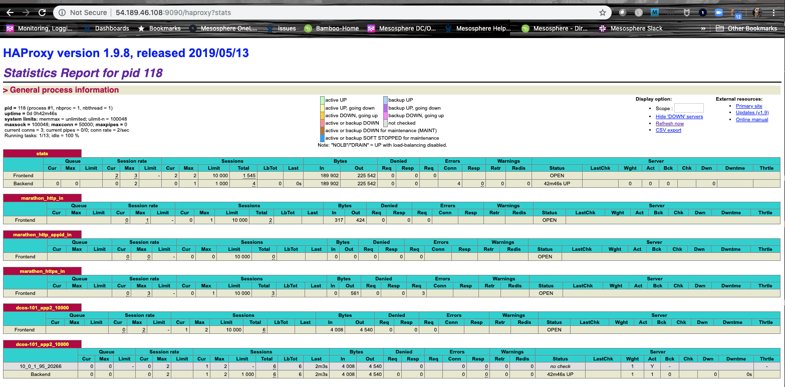

概念上，负载均衡器提供用于将客户端请求分配到应用程序的网络通信层。负载均衡器在群集网络环境中尤为重要，因为它们决定了应用程序的哪个实例应该响应内部或外部服务请求。通过 DC/OS 群集，您会有几种通过负载均衡器分配服务请求的选项：

- 您可以使用已命名 [虚拟 IP 地址](/mesosphere/dcos/1.13/networking/load-balancing-vips/) 以及本地分布式第 4 层负载均衡服务 `dcos-l4lb`（之前称为 Minuteman）。

- 如果所有已部署的应用程序都使用 Marathon 应用程序定义，那么您可以使用 [HAProxy]开源负载均衡服务的 [Marathon-LB](/mesosphere/dcos/services/marathon-lb/) 执行。

- 您可以使用 [Edge-LB](/mesosphere/dcos/services/edge-lb/) 第 7 层代理和负载均衡服务来分配 DC/OS Enterprise 群集的入站访问请求。

- 您可以将外部硬件或云提供商负载均衡服务（例如，[AWS 弹性负载均衡器 (ELB)] (https://aws.amazon.com/elasticloadbalancing/) 与 Marathon-LB 或 Edge-LB 结合使用）用于入站请求的多层路由。

您已经在之前的教程中了解了其中两个负载均衡选项，了解了 [服务发现](../ service-discovery /) 和使用 Marathon-LB [在公共代理节点上公开应用程序](../ native- app /)。因为这是管理集群操作的关键任务，所以本教程提供了一个更详细的示例，说明如何为您已部署的简单应用程序配置负载均衡。

# 开始之前
在开始本教程前，您应验证以下内容：
- 您可以通过至少一个管理节点和三个代理节点来访问运行中的 [DC/OS 群集](../start-here/)。
- 您可以访问安装了 [DC/OS CLI](../cli/) 的计算机。
- 您拥有在群集中部署和运行的 [app2](../native-app/) 示例应用程序。
- 您拥有在群集中部署和运行的 [Marathon-LB]((../native-app/))。

# 学习目的
完成本教程，您将学习到：

- 如何将您的应用程序扩展到多个实例。

- 应用程序被扩展后，内部和外部服务如何选择使用哪个实例。

# 添加应用程序实例
1. 通过运行以下命令，将 app2 示例应用程序扩展到两个实例：

```bash
dcos marathon app update /dcos-101/app2 instances=2
```

# 通过 Marathon-LB 的负载均衡
1. 打开 Web 浏览器并导航到 URL，以检查是否可以使用公共代理节点 IP 地址和端口 10000 来访问该应用程序。

    例如，导航至类似于以下内容的 URL：`http://<public-node>:10000`。

1. 反复导航至应用程序，以查看由 app2 的不同实例所服务的请求。

1. 通过类似于以下内容的 URL 访问 HAProxy `stats` 端点以检查 Marathon-LB 统计信息：`http://<public-node>:9090/haproxy?stats`。

    

# 通过虚拟 IP 地址的负载均衡
1. 通过运行以下命令，打开终端，使用 shell (SSH) 连接到领导管理节点：

    ```bash
    dcos node ssh --master-proxy --leader
    ```

1. 通过运行以下命令，使用 cURL 从应用程序获取原始 HTML 输出：

    ```bash
    curl dcos-101app2.marathon.l4lb.thisdcos.directory:10000
    ```

1. 重复上一步以查看不同实例所服务的请求。

# 删除额外的应用程序实例
1. 通过运行以下命令，将 app2 示例应用程序减少到一个实例：

  ```bash
  dcos marathon app update /dcos-101/app2 instances=1
  ```

# 后续步骤
您已使用 Marathon-LB 和虚拟 IP 地址对应用程序的两个不同实例进行负载均衡请求。

# 相关主题
选择负载均衡机制时，请考虑这些功能和优点。

- [Marathon-LB](/mesosphere/dcos/services/marathon-lb/) 是一个第 7 层负载均衡器，主要用于从防火墙外部或通过单独的硬件或公共云负载均衡器进入群集的“外部”或“北-南”请求。

    其核心功能基于 HAProxy 负载均衡器，让您能够在 Marathon 应用程序定义中定义配置覆盖。Marathon-LB 也使用 Marathon 事件总线来实时更新其配置。作为第 7 层负载均衡器，它支持基于会话的功能，如 HTTP 粘滞会话和零停机部署。

- [已命名虚拟 IP 地址](/mesosphere/dcos/1.13/networking/load-balancing-vips/) 为 **内部** 或 **东-西** TCP 流量提供第 4 层负载均衡。由于虚拟 IP 地址与内核紧密集成，它们提供负载均衡的 IP 地址，可以在群集中的任何位置使用。
