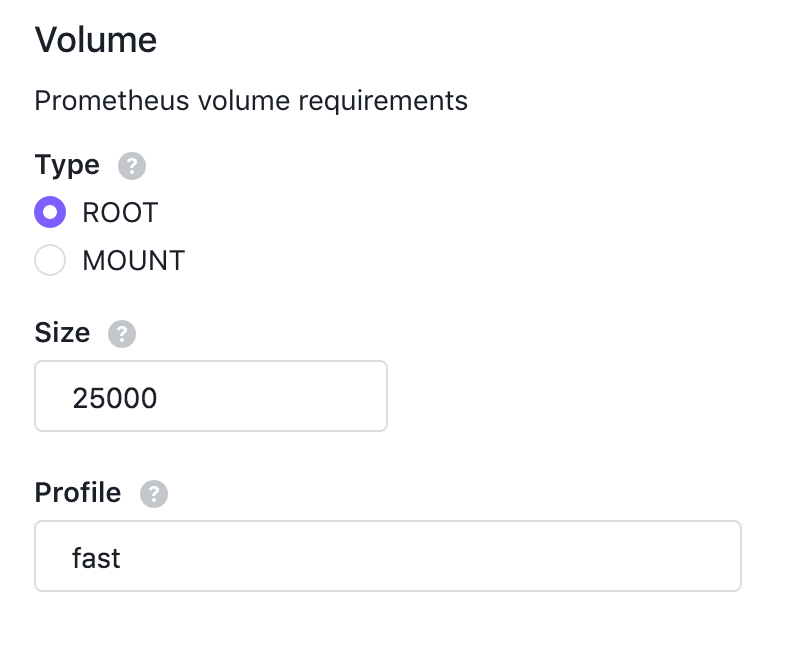

# Configuring Prometheus Storage

## Storage Retention

You can configure the storage retention (default: 15d) of Prometheus by setting the package options like the following during package install.

```json
{
  "prometheus": {
    "storage_tsdb_retention": "30d"
  }
}
```

The above configuration will tell Prometheus to remove old data after 30 days.
Refer to this [document](https://prometheus.io/docs/prometheus/latest/storage/#operational-aspects) for more details about storage retention.

## DSS Volume

You can configure Prometheus to use a dedicated volume provided by the [DC/OS Storage Service](/services/storage/latest/) (DSS).

At least one volume must be available for Prometheus to use.
For more information on creating volumes, see the [DC/OS Storage Service](/services/storage/latest/cli-references/dcos-storage-volume/dcos-storage-volume-create) documentation.

When configuring Prometheus, select `MOUNT` for its volume `type`, choose the minimum `size` for the volume in MB, and enter the `profile` for the volume.
For more information on volume profiles, see the [DC/OS Storage Service](/services/storage/latest/cli-references/dcos-storage-profile/) documentation.

The following configuration will deploy Prometheus to a volume with a profile of `fast` that is 25 GB or larger.
If there is no such volume available, Prometheus will fail to deploy.

```json
{
  "prometheus": {
    "volume": {
      "type": "MOUNT",
      "size": 25000,
      "profile": "fast"
    }
  }
}
```


