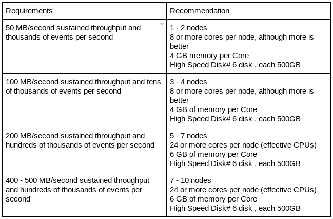

## Hardware Sizing Recommendations

The following image shows the recommended hardware for a DC/OS {{model.techName }} production installation:

Figure 1. Hardware sizing recommendations for DC/OS {{model.techName }}

## Disk Recommendations

DC/OS {{model.techName }} performs best when using disks with fast read and write patterns.

We recommend the following:

- Always prefer locally-attached storage. Remote storage adds points of failure, add latency/overhead to block requests and are more complicated to troubleshoot.  
- For better performance, use solid-state disks vs. spinning disks, or allocate more memory to cache more data, reducing the use of disks.
