Although DC/OS {{ model.techName }} supports the offload-node feature of {{ model.techName }}, we do not recommend using this feature because DC/OS does not support scaling down.

<strong>WARNING: </strong>After offloading, even if you delete the node, it will not be removed from the cluster. If you run cluster view in the {{ model.techName }} UI, the node will not be displayed, <strong>but it is still running and will consume DC/OS resources</strong>.

To offload a node:

1. Go to **Cluster**.

    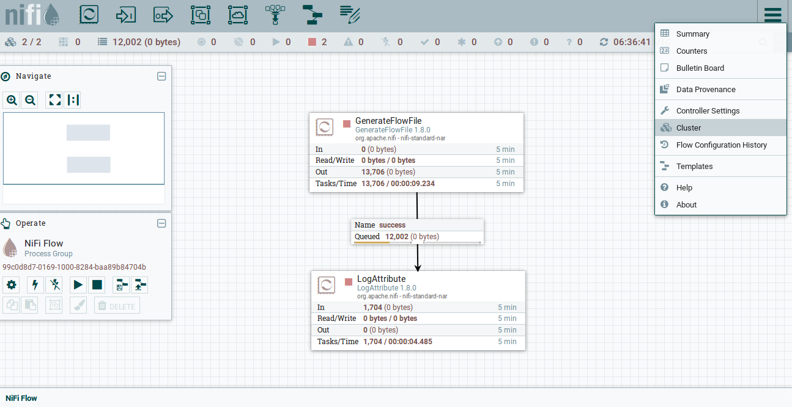

    Figure 1 - Cluster option in {{ model.techName }} UI

    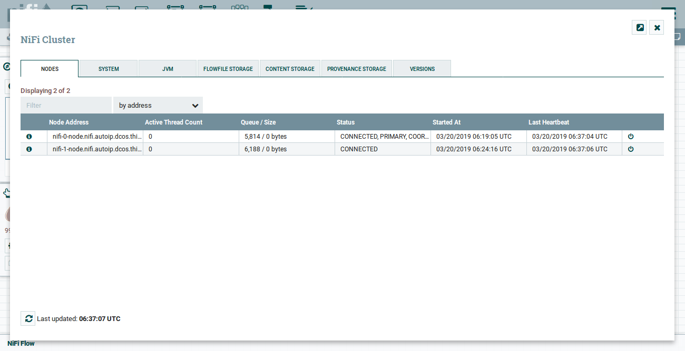

    Figure 2 - Cluster view in {{ model.techName }} UI
    
1. Disconnect node you want to offload:
    
    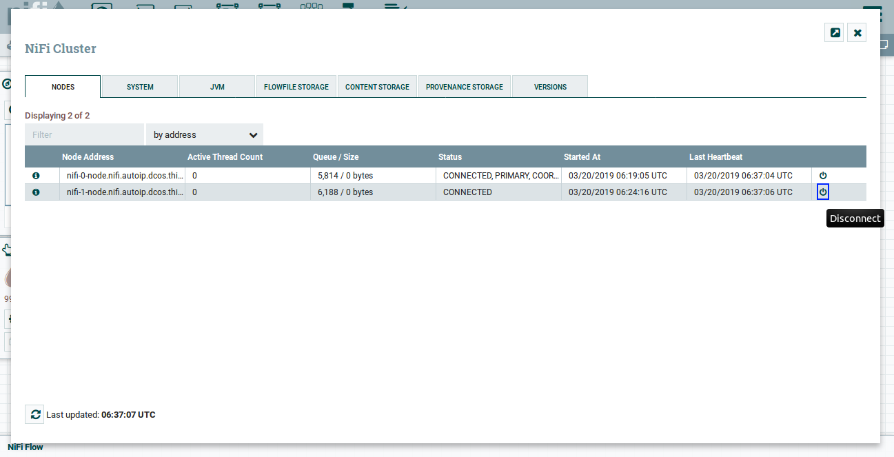
    
    Figure 3 - Disconnect node through {{ model.techName }} UI
    
    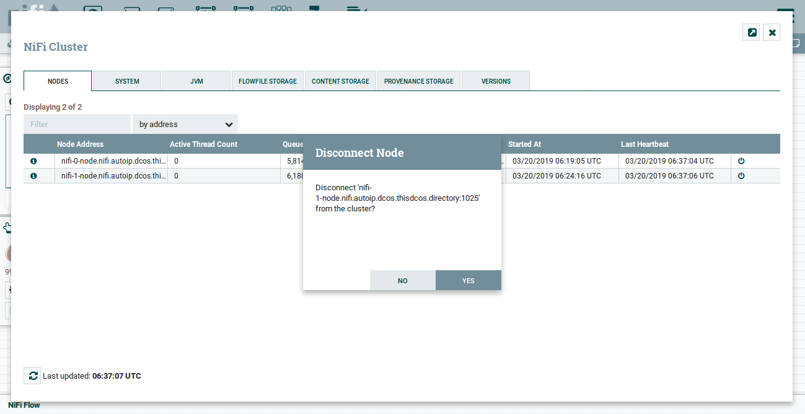

    Figure 4 - Disconnect node confirmation {{ model.techName }} UI

    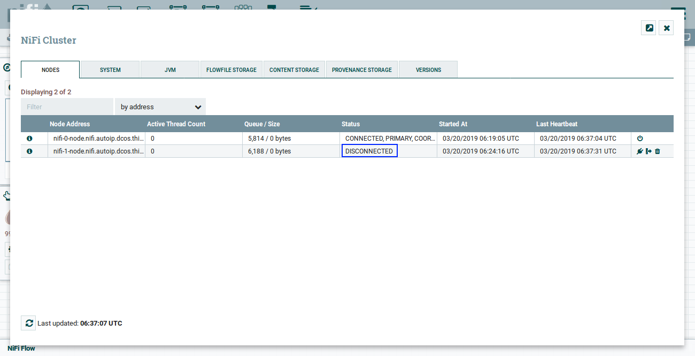

    Figure 5 - Disconnected node in {{ model.techName }} UI

1. Select `Offload`.

    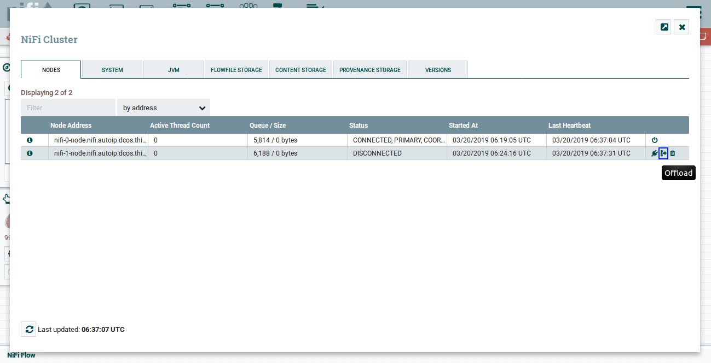

    Figure 6 - Offload node in {{ model.techName }} UI
    
    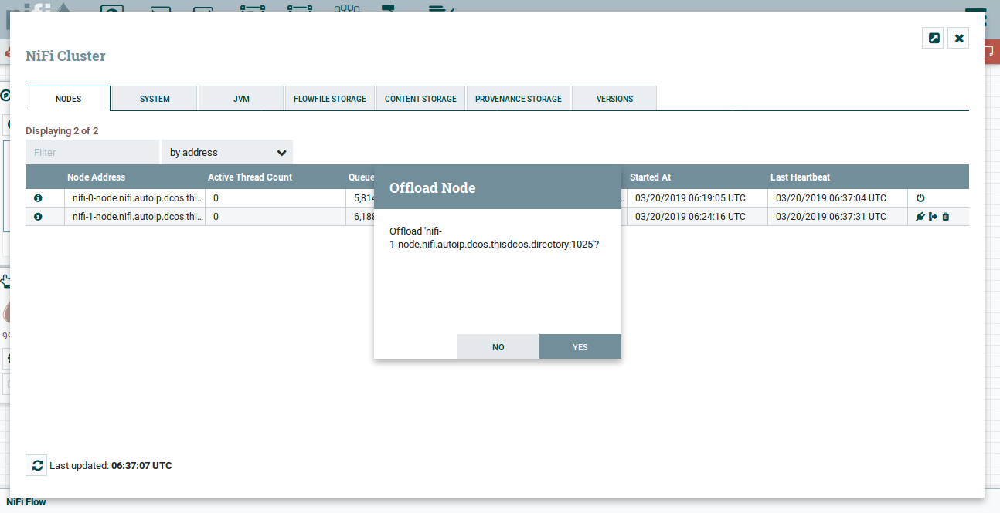

    Figure 7 - Offload node cofirmation in {{ model.techName }} UI

    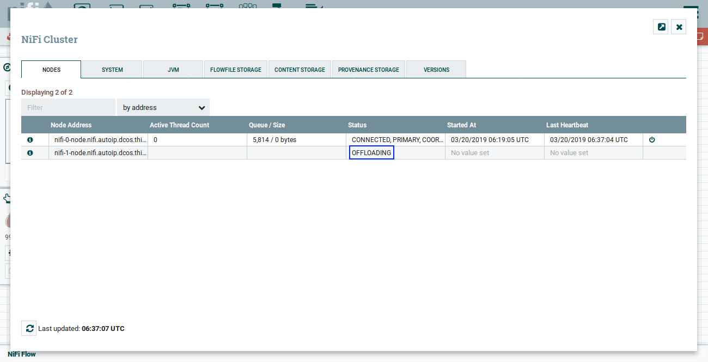

    Figure 8 - Offloading node in {{ model.techName }} UI

    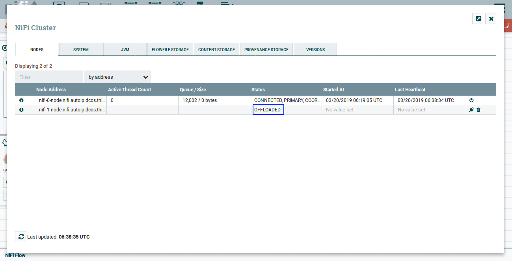

    Figure 9 - Offloaded node in {{ model.techName }} UI

1. Delete `offloaded` node.

    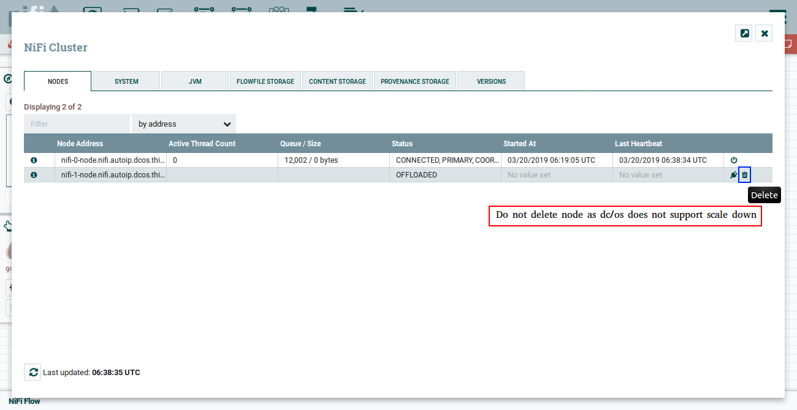

    Figure 10 - Delete offloaded node option in {{ model.techName }} UI

    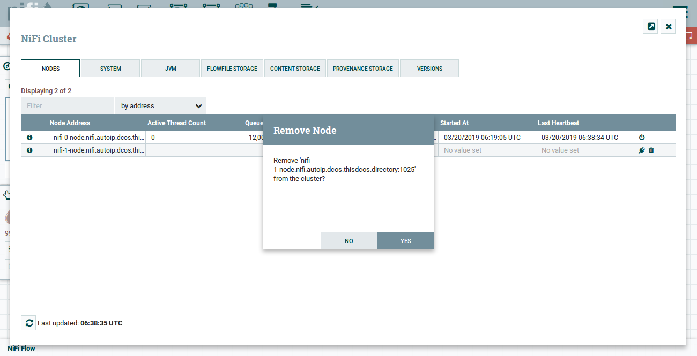

    Figure 11 - Delete offloaded node confirmation in {{ model.techName }} UI
    