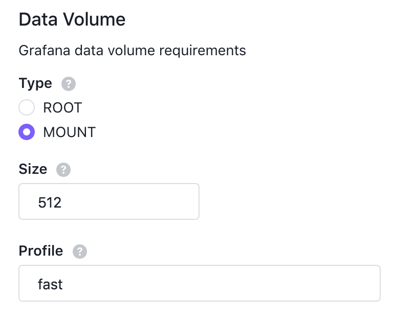

# Configuring Grafana Storage

## DSS Volume

You can configure Grafana to use a dedicated volume provided by the [DC/OS Storage Service](https://docs.mesosphere.com/services/beta-storage/0.5.3-beta/) (DSS).

At least one volume must be available for Grafana to use.
For more information on creating volumes, see the [DC/OS Storage Service](https://docs.mesosphere.com/services/beta-storage/0.5.3-beta/cli-references/dcos-storage-volume/dcos-storage-volume-create) documentation.

When configuring Grafana, select `MOUNT` for its volume `type`, choose the minimum `size` for the volume in MB, and enter the `profile` for the volume.
For more information on volume profiles, see the [DC/OS Storage Service](https://docs.mesosphere.com/services/beta-storage/0.5.3-beta/cli-references/dcos-storage-profile/) documentation.

The following configuration will deploy Grafana to a volume with a profile of `fast` that is 512 MB or larger.
If there is no such volume available, Grafana will fail to deploy.

```json
{
  "grafana": {
    "data_volume": {
      "type": "MOUNT",
      "size": 512,
      "profile": "fast"
    }
  }
}
```


