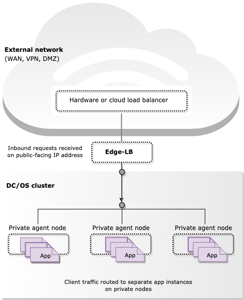

Conceptually, a load balancer provides a network layer that distributes client requests to applications. In its simplest form, you can envision load balancing represented like this:

Edge-LB provides a proxy and load balancing orchestration layer to help you distribute traffic for services that run on DC/OS Enterprise clusters. As a highly available and fault tolerant service, Edge-LB presents a scalable solution for handling layer-7 application-level network communication, capable of receiving requests from outside of the firewall, establishing a secure communication channel, and directing the inbound requests securely to services inside of the DC/OS cluster.

The following diagram provides a simplified overview of Edge-LB load balancing.

As the diagram suggests, Edge-LB provides an inbound entry point for internet-facing layer-7 traffic needing access to the DC/OS cluster. This inbound entry point, often referred to as the ingress, exposes TCP, HTTP, and HTTPS routes from outside the cluster to services running on nodes within the cluster. The details of how traffic is routed from externally-reachable URLs to services within the cluster is controlled by the rules you configure for Edge-LB.

# Key benefits Edge-LB provides
Some of the key benefits of deploying Edge-LB as a gateway to your cluster include:

- Load balancing for application-level (layer-7) TCP, HTTP,  and HTTPS-based traffic needing access to the DC/OS cluster.

- Load balancing for both stateful and stateless workloads associated with the services running on the DC/OS cluster, including services deployed using other frameworks such as Cassandra, Kafka, and Spark, and custom applications.

- Secure communication through encrypted SSL certificates from external clients to the edge of the cluster, to application containers, or to individual application instances.

- Logging and health checking related to load balancing operations to ensure traffic is routed to appropriate available Edge-LB instances.

- Compliance with the Container Network Interface (CNI) standards enable you deploy Edge-LB on CNI-based networks and decouple load balancing from the transport layer underneath.

- API support for scripted operations or automation.

# Using Edge-LB with other load balancers
There is no restriction of using Edge-LB with other load balancers as well. You can achieve high availability by placing a hardware or public cloud load balancer in front of Edge-LB for routing internet-facing traffic into the cluster. For example, you can use an external F5 load balancer on-premise, or an Elastic load balancer (ELB) on Amazon Web Services. 

The following diagram illustrates a high-availability load balancer configuration with an external hardware load balancer placed in front of Edge-LB:

Using an external load balancer in conjunction with Edge-LB is optional, but can improve the overall fault tolerance for the DC/OS cluster.
