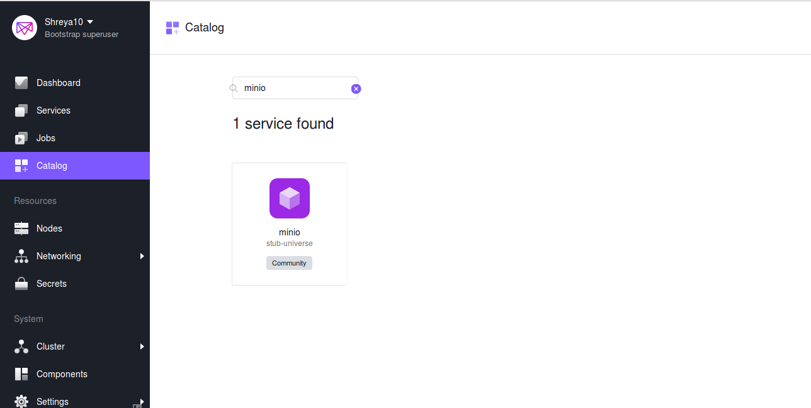
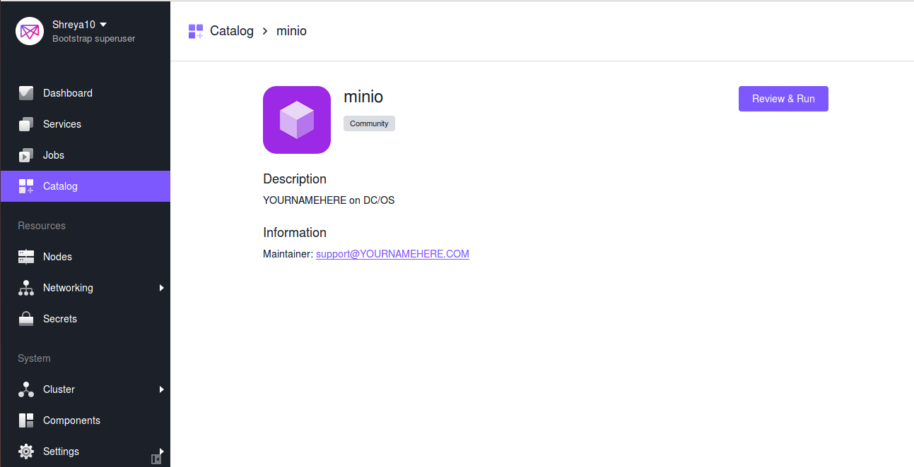
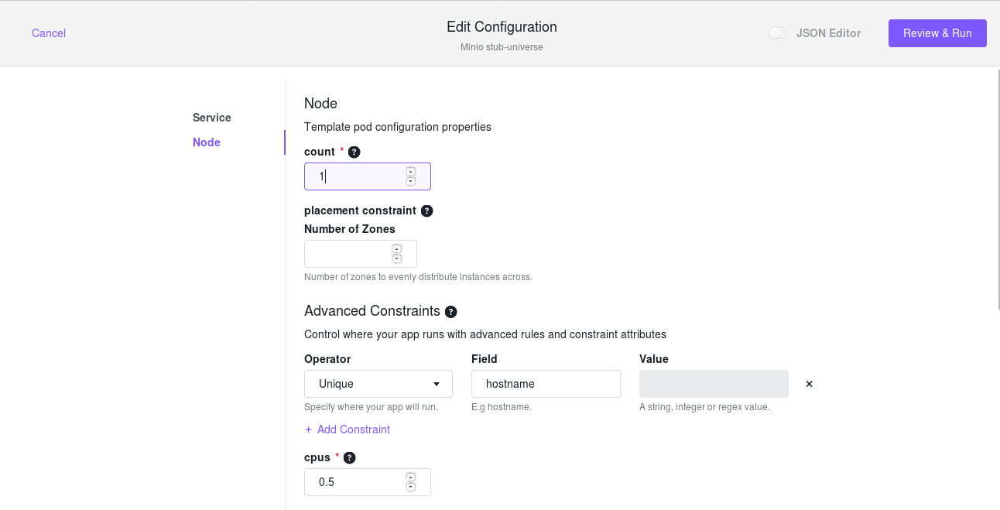
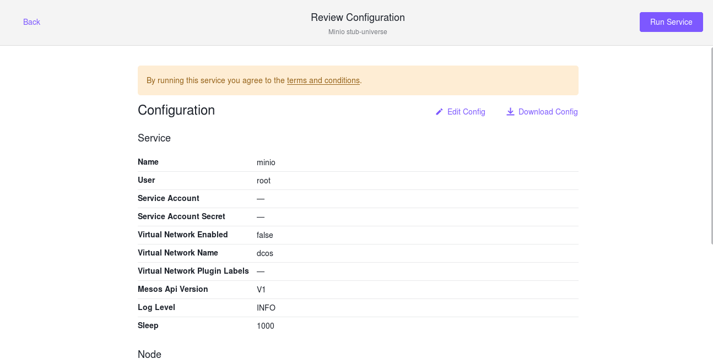
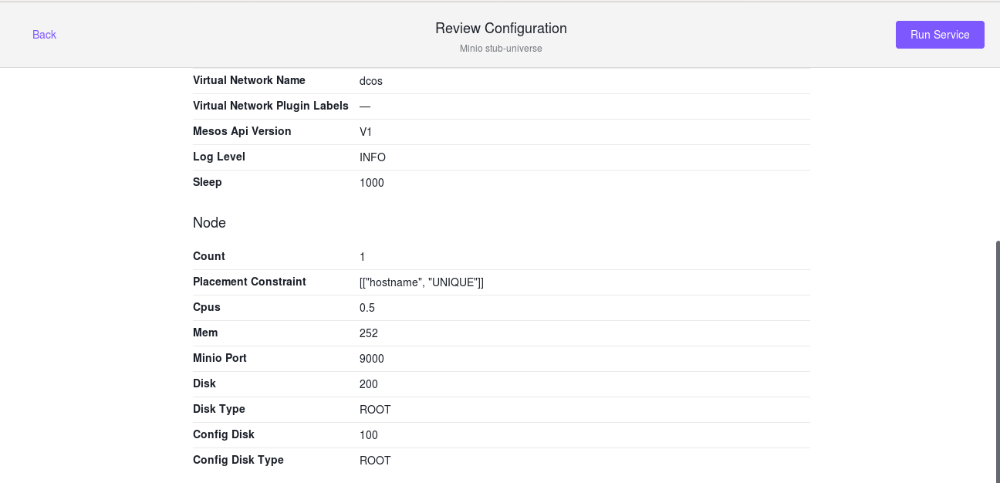
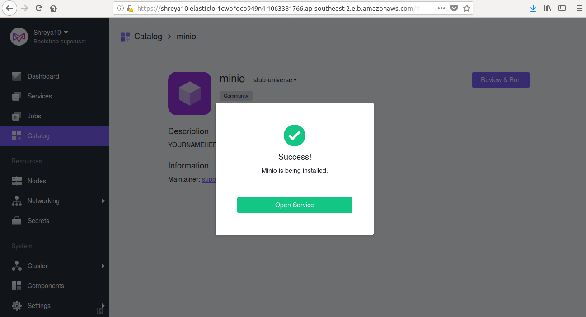
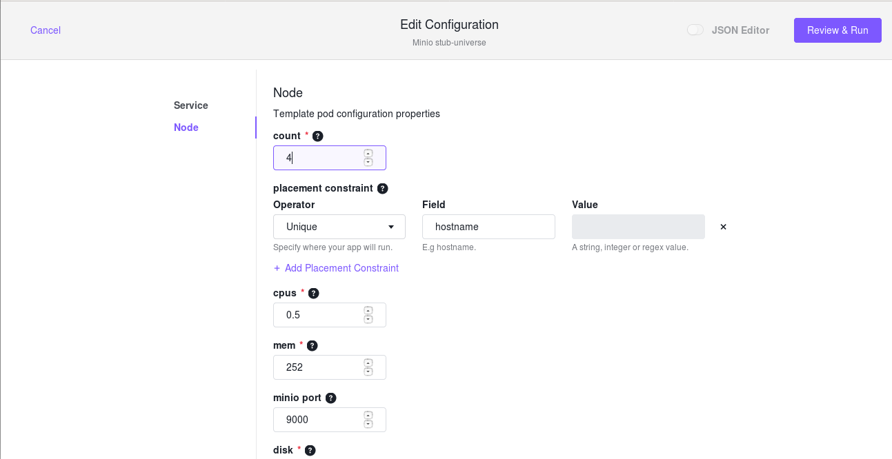
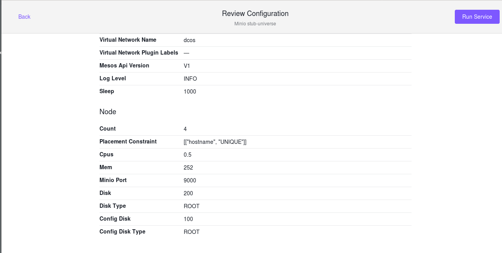

 DCOS Minio is available in the Universe and can be installed by using either the web interface or the DC/OS CLI.

The default DC/OS Minio Service installation provides reasonable defaults for trying out the service, but that may not be sufficient for production use. You may require different configurations depending on the context of the deployment.

## Prerequisites
   
- If you are using Enterprise DC/OS, you may [need to provision a service account](https://docs.mesosphere.com/1.10/security/ent/service-auth/custom-service-auth/) before installing DC/OS Prometheus Service. Only someone with `superuser` permission can create the service account.
  - `strict` [security mode](https://docs.mesosphere.com/1.10/security/ent/service-auth/custom-service-auth/) requires a service account.
  - In `permissive` security mode a service account is optional.
  - `disabled` security mode does not require a service account.
- For Standalone Minio:
    Your cluster must have 1 private nodes.
- For Distributed Minio:
    Your Cluster must have at least 4 private nodes.    
    
# Installing from the DC/OS CLI

To start a basic test cluster of Minio, run the following command on the DC/OS CLI. Enterprise DC/OS users must follow additional instructions.

   ```shell
   dcos package install minio 
   ```
   
This command creates a new instance with the default name minio.Two instances cannot share the same name, so installing additional instances beyond the default instance requires customizing the name at install time for each additional instance.However, the application cannot be installed as foldered installation.

## Installing from the DC/OS Web Interface

Note:  Alternatively, you can install Minio from the DC/OS web interface by clicking on Deploy after selecting the app from Catalog.

## Service Discovery
Each Service Discovery requires parameters to be passed for thier respective SD, Minio DC\OS mesos offers following service discovery mechanism : 

1. Mesos-DNS:

All tasks launched in DC/OS receive a DNS address. It is of the form:

```shell
<task-name>.<framework-name>.autoip.dcos.thisdcos.directory
   ```
 
Important: As with resource sets, only a single process at point in time may use a given prefix. A complete service definition would have a deploy plan that ensures this.

## Virtual Networks

DC/OS Minio supports deployment on virtual networks on DC/OS, allowing each container (task) to have its own IP address and not use port resources on the agent machines. This can be specified by passing the following configuration during installation:

   ```shell
   {
       "service": {
           "virtual_network_enabled": true
       }
   }
   ```
Note: Once the service is deployed on a virtual network, it cannot be updated to use the host network.

 
## Minio Installation on Single Node

For development purposes, you may wish to install Minio on a local DC/OS cluster. For this, you can use dcos-docker.

1.  Installing from the DC/OS CLI:

To start a basic Minio installation on single node, run the following command on the DC/OS CLI :

   ```shell
   dcos package install minio 
   ```
2. Installing from the DC/OS web Interface:

You can install Minio from the DC/OS web interface by clicking on Run service after selecting the app from Catalog.

Below are the steps to be followed :

  [](../service/Image_Shortcut.png)
  
  [](../service/Review_Run.png)
  
  [](../service/Service_Configuration.png)
  
  [](../service/Review_Configuration_1.png)
  
  [](../service/Review_Configuration_2.png)
  
  [](../service/Success.png)
  
## Minio Installation on Distributed Nodes

1.  Installing from the DC/OS CLI:

To start a basic Minio installation on single node, run the following command on the DC/OS CLI :

   ```shell
   dcos package install minio 
   ```
2. Installing from the DC/OS web Interface:

You can install Minio from the DC/OS web interface by clicking on Run service after selecting the app from Catalog.

Below are the steps to be followed :


  [](../service/Image_Shortcut.png)
  
  [](../service/Review_Run.png)
  
   [](../service/Edit_Configuration.png)
   
   [](../service/Review_Configuration_1.png)
  
   [](../service/Review_config_3.png) 
   
   [](../service/Success.png)
   

## Placement Constraints

Placement constraints allow you to customize where a service is deployed in the DC/OS cluster. Depending on the service, some or all components may be configurable using Marathon operators (reference). For example, [["hostname", "UNIQUE"]] ensures that at most one pod instance is deployed per agent.

A common task is to specify a list of whitelisted systems to deploy to. To achieve this, use the following syntax for the placement constraint:
   ```shell
   [["hostname", "LIKE", "10.0.0.159|10.0.1.202|10.0.3.3"]]
  ```
You must include spare capacity in this list, so that if one of the whitelisted systems goes down, there is still enough room to repair your service (via pod replace) without requiring that system.

**Example**

In order to define placement constraints as part of an install or update of a service they should be provided as a JSON encoded string. For example one can define a placement constraint in an options file as follows:

   ```shell
   cat options.json
   {
       "hello": {
       "placement": "[[\"hostname\", \"UNIQUE\"]]"
       }
   }
   ```
