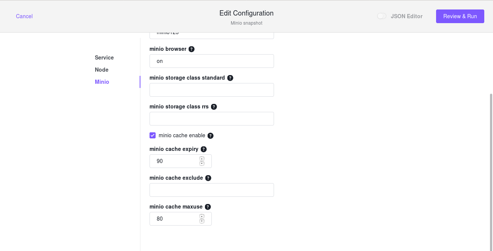
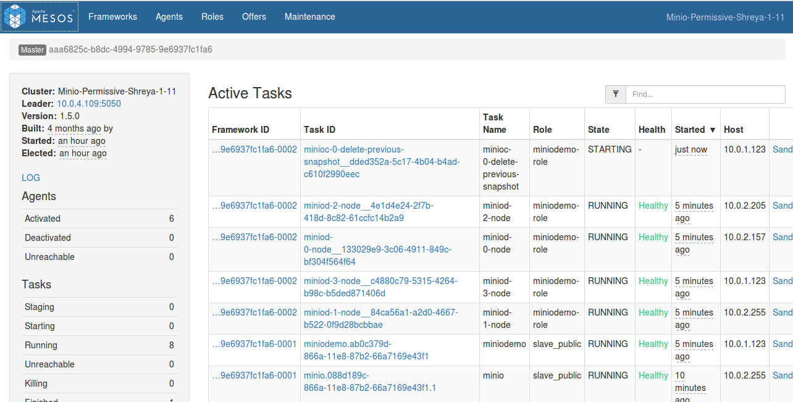
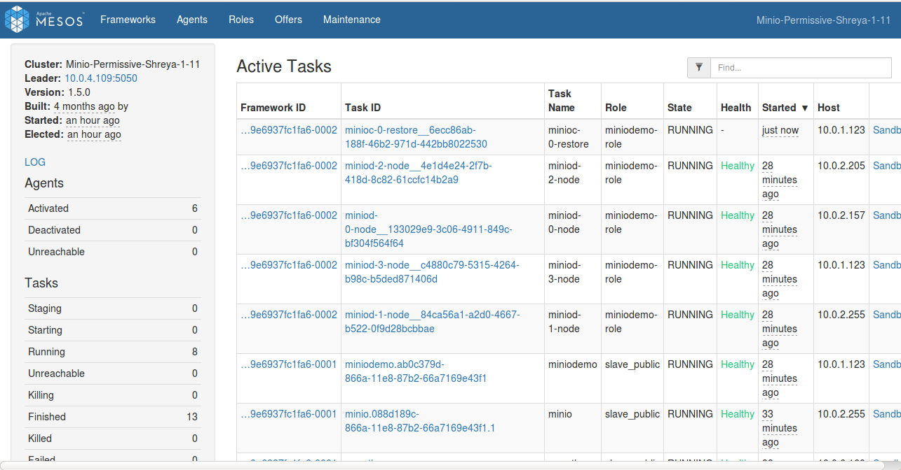
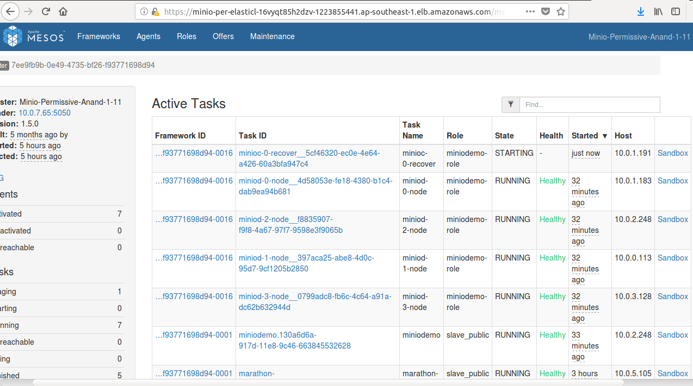

# Updating Configuration

You can make changes to the DC/OS Minio Service after it has been launched. Configuration management is handled by the Scheduler process, which in turn handles Minio deployment itself.

After you make a change, the scheduler will be restarted, and it will automatically deploy any detected changes to the service, one node at a time. For example, a given change will first be applied to `minio-0`, then `minio-1`, and so on.

Nodes are configured with a "Readiness check" to ensure that the underlying service appears to be in a healthy state before continuing with applying a given change to the next node in the sequence.

Some changes, such as decreasing the number of nodes or changing volume requirements, are not supported after initial deployment. See [Limitations](../limitations/index.md).

The instructions below describe how to update the configuration for a running DC/OS Minio Service.

### Enterprise DC/OS 1.10

Enterprise DC/OS 1.10 introduces a convenient command line option that allows for easier updates to a service's configuration, as well as allowing users to inspect the status of an update, to pause and resume updates, and to restart or complete steps if necessary.

#### Prerequisites

+ Enterprise DC/OS 1.10 or later.
+ Service with 1.5.0 version.
+ [The DC/OS CLI](https://docs.mesosphere.com/latest/cli/install/) installed and available.
+ The service's subcommand available and installed on your local machine.
  + You can install just the subcommand CLI by running `dcos package install --cli --yes minio`.
  + If you are running an earlier version of the subcommand CLI that does not have the `update` command, uninstall it and reinstall your CLI, using these commands:

    ```shell
    dcos package uninstall --cli minio
    dcos package install --cli minio
     ```
#### Preparing configuration

If you installed DC/OS Minio Service with Enterprise DC/OS 1.10, you can fetch the full configuration of a service (including any default values that were applied during installation). For example:

```shell
dcos minio describe > options.json
```
Make any configuration changes to the `options.json` file.

If you installed DC/OS Minio Service with an earlier version of DC/OS, this configuration will not have been persisted by the the DC/OS package manager. You can instead use the `options.json` file that was used when [installing the service](https://github.com/Mohini6649/dcos-docs-site/blob/minio_service_guide/pages/services/minio/0.1.0-25/install/index.md).

**Caution:** You must specify all configuration values in the `options.json` file when performing a configuration update. Any unspecified values revert to the default values specified by the DC/OS Minio Service. See the "Recreating `options.json`" section below for information on recovering these values.

##### Recreating `options.json` (optional)

If the `options.json` file from the last service installation or update is not available, you must manually recreate it using the following steps.

First, you will fetch the default application's environment, current application's environment, and the actual minio that maps config values to the environment:

1. Ensure you have `[jq](https://stedolan.github.io/jq/)` installed.
2. Set the service name that you're using, for example:
	```shell
	SERVICE_NAME=minio
	```
3. Get the version of the package that is currently installed:
	```shell
	PACKAGE_VERSION=$(dcos package list | grep $SERVICE_NAME | awk '{print $2}')
	```
4. Fetch and save the environment variables that have been set for the service:
	```shell
	dcos marathon app show $SERVICE_NAME | jq .env > current_env.json
	```
5. To identify those values that are custom, get the default environment variables for this version of the service:
	```shell
	dcos package describe --package-version=$PACKAGE_VERSION --render --app $SERVICE_NAME | jq .env > default_env.json
	```
6. Get the entire application `minio`:
	```shell
	dcos package describe $SERVICE_NAME --app > marathon.json.mustache
	```
Now that you have these files, you can recreate the `options.json`.

1. Use JQ and `diff` to compare the two files:
	```shell
	diff <(jq -S . default_env.json) <(jq -S . current_env.json)
	```
2. Compare these values to the values contained in the `env` section in application `minio`:
	```shell
	less marathon.json.mustache
	```
3. Use the variable names (e.g. `{{service.name}}`) to create a new `options.json` file as described in [Initial service configuration](#initial-service-configuration).

#### Starting the update

To begin, initiate an update using the DC/OS CLI, passing in the updated `options.json` file:

```shell
dcos minio update start --options=options.json
```
You will receive an acknowledgement message. The DC/OS package manager will restart the Scheduler in Marathon.

See [Advanced update actions](#advanced-update-actions) for commands you can use to inspect and manipulate an update after it has started.

To see a full listing of available options, run `dcos package describe --config minio` in the CLI, or browse the DC/OS Minio Service install dialog in the DC/OS Dashboard.

<a name="resizing-a-node"></a>
### Resizing a node

The CPU and Memory requirements of each node can be increased or decreased as follows:
- CPU: ` "node": {"cpus": <CPU Value>}`
- Memory (in MB): `"node": {"mem": 4096}`

**Caution:** Volume requirements (type and/or size) cannot be changed after initial deployment.

<a name="updating-placement-constraints"></a>
### Updating placement constraints

Placement constraints may be updated after initial deployment using the following procedure. See [Service Settings](#service-settings) above for more information on placement constraints.

Assume the following deployment of our nodes:

- Placement constraint of: `hostname:LIKE:10.0.10.3|10.0.10.8|10.0.10.26|10.0.10.28|10.0.10.84`
- Tasks:

```shell
10.0.10.3: minio-0
10.0.10.8: minio-1
10.0.10.26: minio-2
10.0.10.28: empty
10.0.10.84: empty
```


`10.0.10.8` is being decommissioned and we should move away from it.

**Steps:**

1. Remove the decommissioned IP and add a new IP to the placement rule whitelist by editing `placement_constraint`:

```shell
	hostname:LIKE:10.0.10.3|10.0.10.26|10.0.10.28|10.0.10.84|10.0.10.123
```

2. Redeploy `_NODEPOD_-1` from the decommissioned node to somewhere within the new whitelist: `dcos minio pod replace _NODEPOD_-1`

3. Wait for `_NODEPOD_-1` to be up and healthy before continuing with any other replacement operations.

The placement constraints can be modified by configuring the "placement constraint" section of the Config.json file:


```shell
	"placement_constraint": {
          "type": "string",
          "title": "Placement Constraint",
          "description": "Marathon-style placement constraint for nodes. Example: [[\"hostname\", \"UNIQUE\"]]",
          "default": "[[\"hostname\", \"UNIQUE\"]]",
          "media": {
            "type": "application/x-zone-constraints+json"
        }
```	
	
## Advanced update actions

The following sections describe advanced commands that can be used to interact with an update in progress.

### Monitoring the update

Once the Scheduler has been restarted, it will begin a new deployment plan as individual pods are restarted with the new configuration. You can query the status of the update as follows:

```shell
dcos minio update status
```

If the Scheduler is still restarting, DC/OS will not be able to route to it and this command will return an error message. Wait a short while and try again. You can also go to the Services tab of the DC/OS GUI to check the status of the restart.

### Pause

To pause an ongoing update, issue a pause command:

```shell
dcos minio update pause
```

You will receive an error message if the plan has already completed or has been paused. Once completed, the plan will enter the `WAITING` state.

### Resume

If a plan is in a `WAITING` state, as a result of being paused or reaching a breakpoint that requires manual operator verification, you can use the `resume` command to continue the plan:

```shell
dcos minio update resume
```

You will receive an error message if you attempt to `resume` a plan that is already in progress or has already completed.

### Force-complete

In order to manually complete a step (such that the Scheduler stops attempting to launch a task), you can issue a `force-complete` command. This will instruct to Scheduler to mark a specific step within a phase as complete. You need to specify both the phase and the step, for example:

```shell
dcos minio update force-complete service-phase service-0:[node]
```

### Force-restart

Similar to force-complete, you can also force a restart. This can be done for an entire plan, a phase, or just for a specific step.

To restart the entire plan:
```shell
dcos minio update force-restart
```

To restart all steps in a single phase:
```shell
dcos minio update force-restart service-phase
```

To restart a specific step within a specific phase:
```shell
dcos minio update force-restart service-phase service-0:[node]
```

### Disk Caching in Minio

You can enable disk caching in Minio by enabling minio cache enable checkbox while installing the Minio service from DC/OS web interface.

Below are the steps to be followed :
  
  [](../service/Disk_Caching.png)

### Backing up

The DC/OS Minio Service allows you to back up the Minio application to Amazon S3. For backup of data to Amazon S3 bucket ‘mc mirror’ command will be used. Minio provides a ‘rsync’ like command line utility. It mirrors data from one bucket to another.The following information and values are required to back up your service.

    1. AWS_ACCESS_KEY_ID
    2. AWS_SECRET_ACCESS_KEY
    
To enable backup, trigger the backup-S3 Plan with the following plan parameters:
```shell
{
 'AWS_ACCESS_KEY_ID': key_id,
 'AWS_SECRET_ACCESS_KEY': aws_secret_access_key
}
``` 

This plan can be executed with the following command:
```shell
{
 dcos minio --name=<service_name> plan start <plan_name> -p <plan_parameters>
}
```
or with a command which includes plan parameters:

```shell
{
 dcos minio --name=<SERVICE_NAME> plan start backup-s3 \
  -p AWS_ACCESS_KEY_ID=<ACCESS_KEY> \
  -p AWS_SECRET_ACCESS_KEY=<SECRET_ACCESS_KEY>
}
````

However, the backup can also be started with the following command:

Once this plan is executed, the backup will be uploaded to S3.

The Minio backup will be performed using three sidecar tasks:

1. `Init Task` - A docker image of Minio client will be downloaded. A separate Pod will be started at any Private Agent. An init task will be responsible to register both Minio as well as S3 client.

[](../service/Init_task.png)

   _Figure 1. - Register Minio and S3 client

2. `Delete-Previous-Snapshot` - This task is responsible to delete all the data saved during last backup.

[](../service/Delete_Previous_Snapshot.png)

   _Figure 2. - Delete previous backup
   
3. `Backup Task` - The Backup task is responsible for making a backup of the local application and backing it up to the S3.  A backup task will run the ‘mc mirror’ command by taking AWS_ACCESS_KEY_ID and AWS_SECRET_ACCESS_KEY as parameters.
it will create new buckets to S3 according to the current snapshot or state of Minio storage system.

[](../service/Backup.png)

   _Figure 3. - Backing Up to S3
   
Users can execute Backup task by launching the backup-s3 plan. This plan would execute all the three aforementioned tasks serially. 

### Restore

The DC/OS Minio Service allows you to restore the backed up data back to the Minio application from Amazon S3 in case of drives failure.
The following information and values are required to restore your data.

    1. AWS_ACCESS_KEY_ID
    2. AWS_SECRET_ACCESS_KEY  
    3. S3_BUCKET_NAME
    
 To enable restore, trigger the restore Plan with the following plan parameters:
```shell
{
 'AWS_ACCESS_KEY_ID': key_id,
 'AWS_SECRET_ACCESS_KEY': aws_secret_access_key,
 'S3_BUCKET_NAME': bucket_name
}
``` 

This plan can be executed with the following command:
```shell
{
 dcos minio --name=<service_name> plan start <plan_name> -p <plan_parameters>
}
```
or with a command which includes plan parameters:

```shell
{
 dcos minio --name=<SERVICE_NAME> plan start backup-s3 \
  -p AWS_ACCESS_KEY_ID=<ACCESS_KEY> \
  -p AWS_SECRET_ACCESS_KEY=<SECRET_ACCESS_KEY> \
  -p S3_BUCKET_NAME=<BUCKET_NAME>
}
````
However, the restore can also be started with the following command:

Once this plan is executed, it will restore the data.

The Minio restore will be performed using two sidecar tasks:

1. `Init Task` - A docker image of Minio client will be downloaded. A separate Pod will be started at any Private Agent. An init task will be responsible to register both Minio as well as S3 client.

[](../service/Init_task.png)

   _Figure 1. - Register Minio and S3 client

2. `Restore Task` -  Restore task is responsible to restore the data in case of drives failure. Restore plan will have to be launched against each backed up S3 bucket.A Restore task will run the ‘mc mirror’ command by taking AWS_ACCESS_KEY_ID and AWS_SECRET_ACCESS_KEY and S3_BUCKET_NAME as parameters. Restore task will dynamically create the same bucket in Minio storage system.

[](../service/Restore.png)

   _Figure 2. - Restoring the data
   
Users can execute Restore task by launching the restore plan. This plan would execute all the two aforementioned tasks serially. 

### Recover

The DC/OS Minio Service allows you to heal disks, buckets and objects on minio server.

This plan can be executed with the following command:
```shell
{
 dcos minio --name=<service_name> plan start <plan_name>
}
```
The Minio recover plan will be performed using below mentioned task:

1. `Recover Task` -  Recover task is responsible to heal the whole disk in case of node killed or node failure. A Recover task will run the ‘mc heal’ command.

[](../service/Recover.png)

   _Figure 1. - Recovering the disk
   
Users can execute Recover task by launching the recover plan. This plan would execute all the aforementioned tasks serially. 


