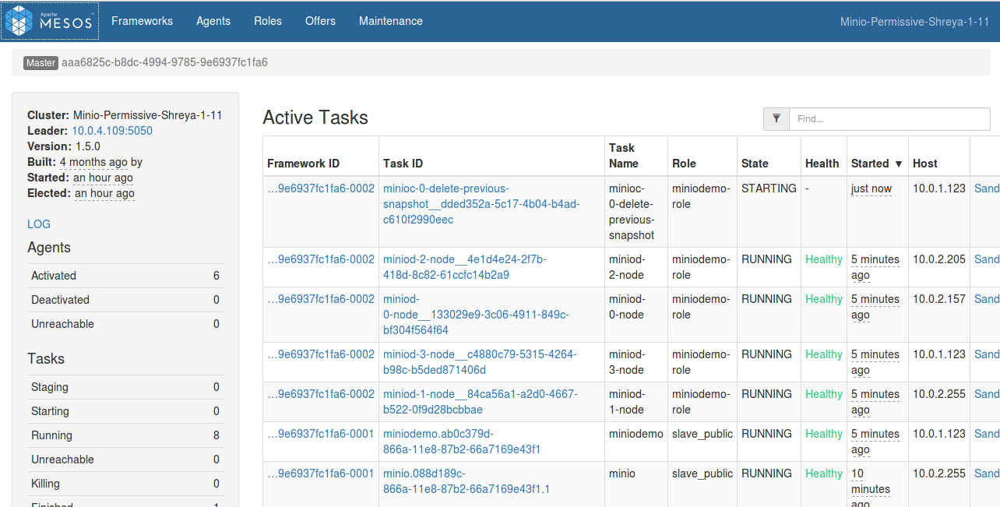
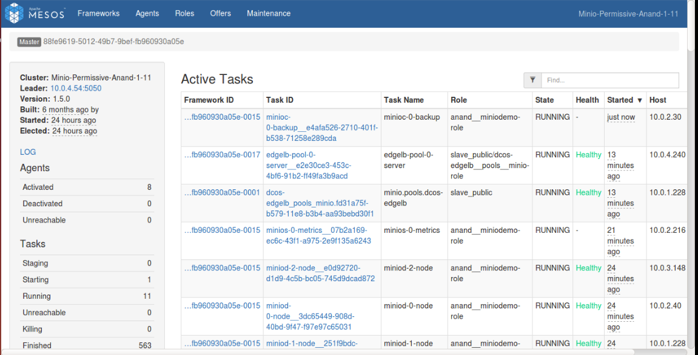

# Backing up

The DC/OS Minio Service allows you to back up your data to AWS S3 storage. For backing up data to AWS S3 bucket, DC/OS Minio uses ‘mc mirror’ command. Minio provides a ‘rsync’ like command line utility. It mirrors data from one bucket to another. The following information and values are required to back up your data.

    1. AWS_ACCESS_KEY_ID
    2. AWS_SECRET_ACCESS_KEY
    
To enable backup, trigger the backup-S3 Plan with the following plan parameters:
```shell
{
 'AWS_ACCESS_KEY_ID': aws_access_key_id,
 'AWS_SECRET_ACCESS_KEY': aws_secret_access_key
}
``` 

Plans are executed in DC/OS with the following command:
```shell
{
 dcos minio --name=<service_name> plan start <plan_name> -p <plan_parameters>
}
```
For launching backup-s3 plan, issue the below command with the requisite parameters:

```shell
{
 dcos minio --name=<SERVICE_NAME> plan start backup-s3 \
  -p AWS_ACCESS_KEY_ID=<ACCESS_KEY> \
  -p AWS_SECRET_ACCESS_KEY=<SECRET_ACCESS_KEY>
}
````

Once this plan is executed, the backup will be uploaded to S3.

Backup will be performed using three sidecar tasks:

1. `Init Task` - A separate Pod will be started at any Private Agent. An init task will be responsible to register both Minio as well as S3 client.

[](../img/Init_task.png)

   _Figure 1. - Register Minio and S3 client

2. `Delete-Previous-Snapshot` - This task is responsible to delete the buckets in the AWS S3 storage which were deleted in the DC/OS Minio since the last backup.

[](../img/Delete_Previous_Snapshot.png)

   _Figure 2. - Delete previous backup
   
3. `Backup Task` - The Backup task is responsible for making a backup of the data in the DC/OS Minio storage to the AWS S3. A backup task will run the ‘mc mirror’ command by taking AWS_ACCESS_KEY_ID and AWS_SECRET_ACCESS_KEY as parameters.
It will create new buckets in AWS S3 according to the current snapshot or state of Minio storage system.

[](../img/Backup.png)

   _Figure 3. - Backing Up to S3
   
'backup-s3' plan would execute all the three aforementioned tasks serially. 


