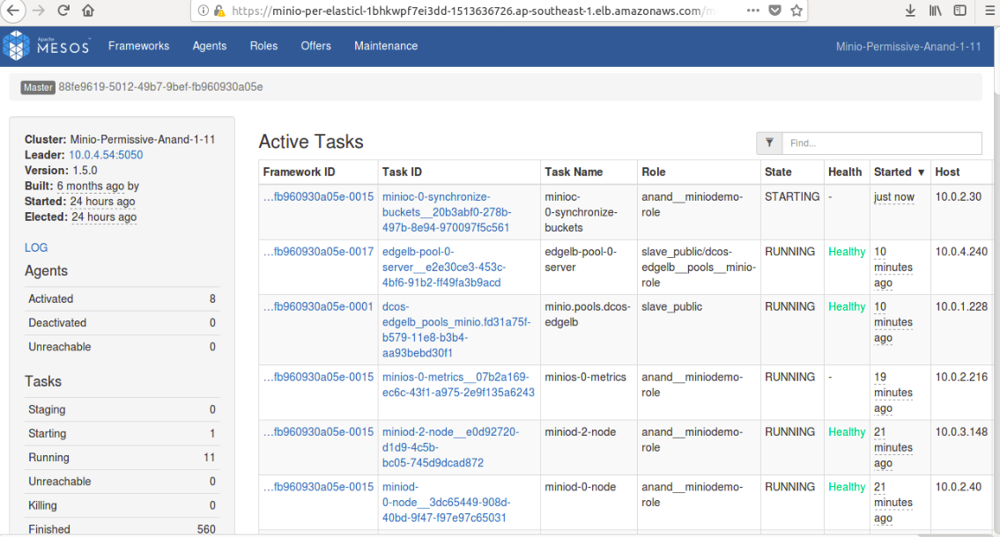

# Backing up

The DC/OS Minio Service allows you to back up the Minio application to Amazon S3. For backup of data to Amazon S3 bucket ‘mc mirror’ command will be used. Minio provides a ‘rsync’ like command line utility. It mirrors data from one bucket to another.The following information and values are required to back up your service.

    1. AWS_ACCESS_KEY_ID
    2. AWS_SECRET_ACCESS_KEY
    
To enable backup, trigger the backup-S3 Plan with the following plan parameters:
```shell
{
 'AWS_ACCESS_KEY_ID': key_id,
 'AWS_SECRET_ACCESS_KEY': aws_secret_access_key
}
``` 

This plan can be executed with the following command:
```shell
{
 dcos minio --name=<service_name> plan start <plan_name> -p <plan_parameters>
}
```
or with a command which includes plan parameters:

```shell
{
 dcos minio --name=<SERVICE_NAME> plan start backup-s3 \
  -p AWS_ACCESS_KEY_ID=<ACCESS_KEY> \
  -p AWS_SECRET_ACCESS_KEY=<SECRET_ACCESS_KEY>
}
````

However, the backup can also be started with the following command:

Once this plan is executed, the backup will be uploaded to S3.

The Minio backup will be performed using three sidecar tasks:

1. `Init Task` - A docker image of Minio client will be downloaded. A separate Pod will be started at any Private Agent. An init task will be responsible to register both Minio as well as S3 client.

[](../img/Init_task.png)

   _Figure 1. - Register Minio and S3 client

2. `Delete-Previous-Snapshot` - This task is responsible to delete all the data saved during last backup.

[](../img/Delete_Previous_Snapshot.png)

   _Figure 2. - Delete previous backup
   
3. `Backup Task` - The Backup task is responsible for making a backup of the local application and backing it up to the S3.  A backup task will run the ‘mc mirror’ command by taking AWS_ACCESS_KEY_ID and AWS_SECRET_ACCESS_KEY as parameters.
it will create new buckets to S3 according to the current snapshot or state of Minio storage system.

[](../img/Backup.png)

   _Figure 3. - Backing Up to S3
   
Users can execute Backup task by launching the backup-s3 plan. This plan would execute all the three aforementioned tasks serially. 


