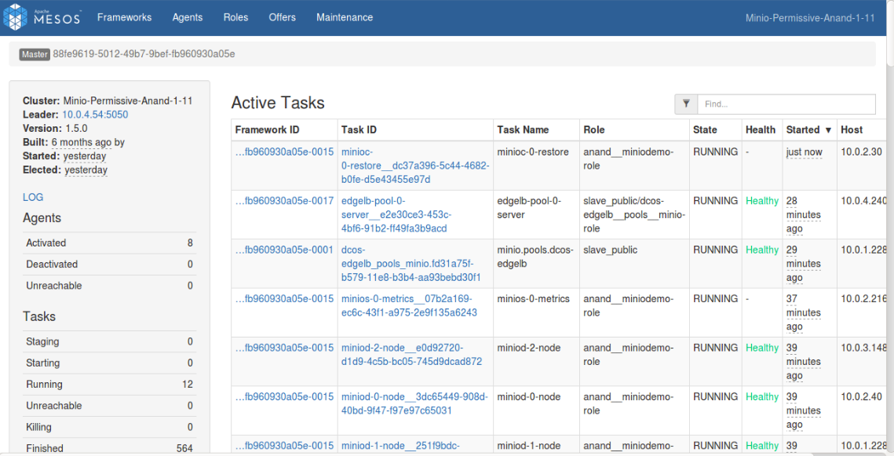

# Restore

The DC/OS Minio Service allows you to restore the backed up data back to the Minio application from Amazon S3 in case of drives failure.
The following information and values are required to restore your data.

    1. AWS_ACCESS_KEY_ID
    2. AWS_SECRET_ACCESS_KEY  
    3. S3_BUCKET_NAME
    
 To enable restore, trigger the restore Plan with the following plan parameters:
```shell
{
 'AWS_ACCESS_KEY_ID': aws_access_key_id,
 'AWS_SECRET_ACCESS_KEY': aws_secret_access_key,
 'S3_BUCKET': bucket_name
}
``` 

This plan can be executed with the following command:
```shell
{
 dcos minio --name=<service_name> plan start <plan_name> -p <plan_parameters>
}
```
by providing the following parameters:

```shell
{
 dcos minio --name=<SERVICE_NAME> plan start restore \
  -p AWS_ACCESS_KEY_ID=<ACCESS_KEY> \
  -p AWS_SECRET_ACCESS_KEY=<SECRET_ACCESS_KEY> \
  -p S3_BUCKET=<BUCKET_NAME>
}
````
However, the restore can also be started with the following command:

Once this plan is executed, it will restore the data.

The Minio restore will be performed using two sidecar tasks:

1. `Init Task` - A docker image of Minio client will be downloaded. A separate Pod will be started at any Private Agent. An init task will be responsible to register both Minio as well as S3 client.

[](../img/Init_task.png)

   _Figure 1. - Register Minio and S3 client

2. `Restore Task` -  Restore task is responsible to restore the data in case of drives failure. Restore plan will have to be launched against each backed up S3 bucket.A Restore task will run the ‘mc mirror’ command by taking AWS_ACCESS_KEY_ID and AWS_SECRET_ACCESS_KEY and S3_BUCKET_NAME as parameters. Restore task will dynamically create the same bucket in Minio storage system.

[](../img/Restore.png)

   _Figure 2. - Restoring the data
   
Users can execute Restore task by launching the restore plan. This plan would execute all the two aforementioned tasks serially. 


