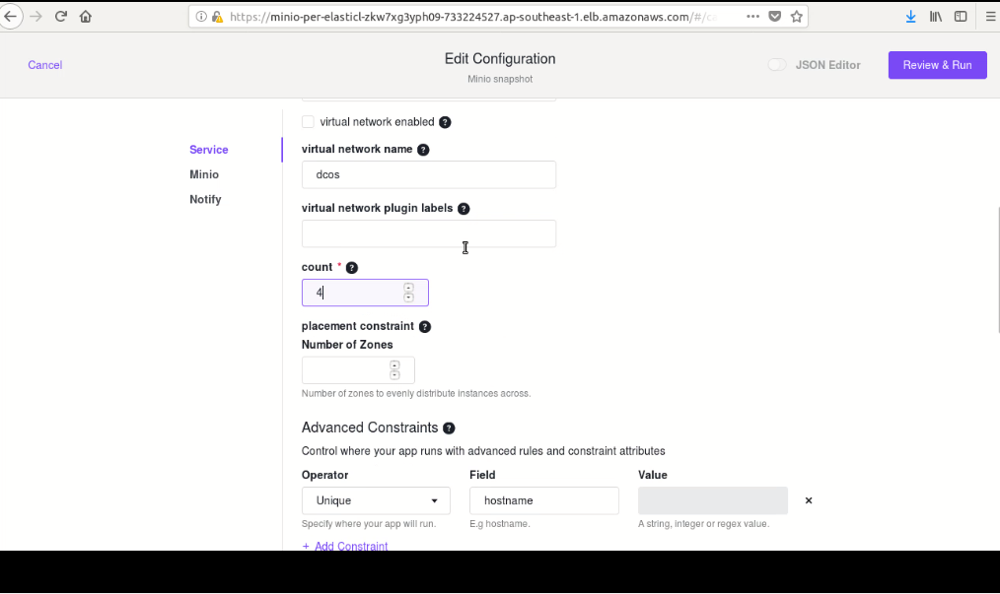
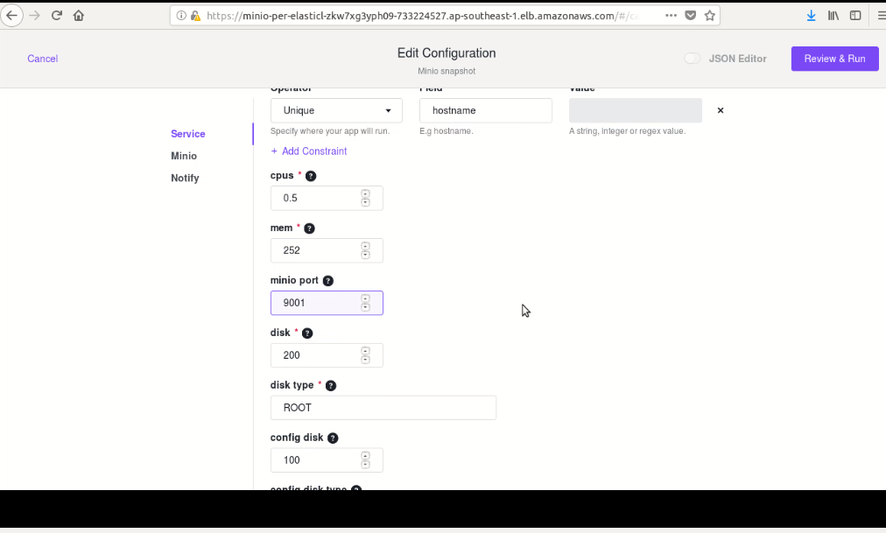
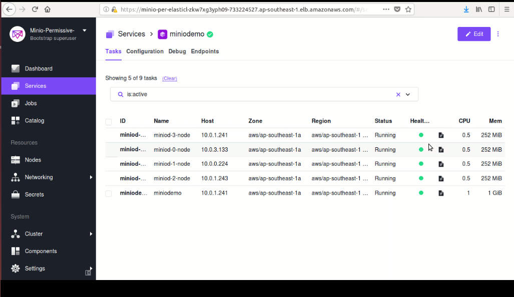
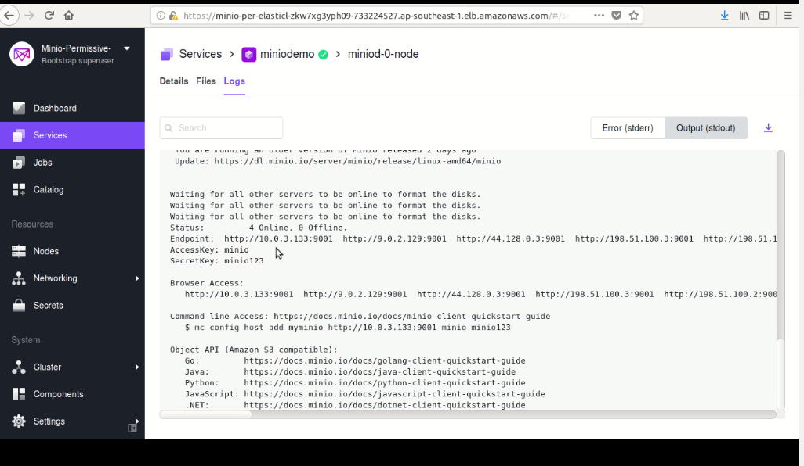

# How to use Minio with DC/OS

## Prerequisites

* A running DC/OS 1.11 cluster

* Secrets store should contain two secrets:
  1) Minio Access Key
  2) Minio Secret Key
  Minio service requires these two secrets to be specified during installation. By default, IDs for these secrets are expected as: __dcos_minio_access_key and __dcos_minio_secret_key.

## Install

Minio can be installed via either the DC/OS Catalog web interface or by using the CLI. The following command will launch the install via the DC/OS CLI:

```bash
dcos package install minio
```

[](../img/Catalog_Service_View.png)

[](../img/Node_Count.png)

[](../img/Port_Change.png)

[](../img/Running_Stage.png)

[](../img/Successful_Execution.png)


## Accessing the Minio UI with Edge-LB configuration

### Steps

For Edge-LB pool configuration:
  1. Add repo of Edge-LB-aws:
  ```shell
  dcos package repo add --index=0 edgelb-aws \ 
https://edge-lb-infinity-artifacts.s3.amazonaws.com/autodelete7d/master/edgelb/stub-universe-edgelb.json 
  ```
  2. Add repo of Edge-LB-Pool-aws:
  ```shell
  dcos package repo add --index=0 edgelb-pool-aws \ 
https://edge-lb-infinity-artifacts.s3.amazonaws.com/autodelete7d/master/edgelb-pool/stub-universe-edgelb-pool.json
  ```  
  3. Install the Edge-LB:
  ```shell
  dcos package install edgelb --yes
  ``` 
  4. Create the configuration JSON file with required parameters to access Minio:

  Example without TLS:

  ```shell
  {
  "apiVersion": "V2",
  "name": "minio",
  "count": 1,
  "haproxy": {
    "frontends": [
      {
        "bindPort": 9001,
        "protocol": "HTTP",
        "linkBackend": {
          "defaultBackend": "miniodemo"
        }
      },
      {
        "bindPort": 9000,
        "protocol": "HTTP",
        "linkBackend": {
          "defaultBackend": "minio"
        }
      }
    ],
    "backends": [
     {
      "name": "miniodemo",
      "protocol": "HTTP",
      "services": [{
        "endpoint": {
          "type": "ADDRESS",
          "address": "miniod.miniodemo.l4lb.thisdcos.directory",
          "port": 9001
        }
      }]
    },
    {
      "name": "minio",
      "protocol": "HTTP",
      "services": [{
        "endpoint": {
          "type": "ADDRESS",
          "address": "minio.marathon.l4lb.thisdcos.directory",
          "port": 9000
        }
      }]
   }
   ]
  }
}
  ```
 
 5. Create `edge-pool` using the JSON file created in the preceding:
  ```shell
  dcos edgelb create edgelb-pool-config.json
  ```    
 6. Access Minio:
  ```shell
  http://<Public IP of the Public Node of the cluster>>:9001/minio
  ```      
Now you can connect with the Minio server using Minio Client on the public IP of the public agent running EdgeLB and the port number at which Minio server is binded at EdgeLB. 

Example with TLS:

```shell
{
  "apiVersion": "V2",
  "name": "minio",
  "count": 1,
  "autoCertificate": true,
  "haproxy": {
    "frontends": [
      {
        "bindPort": 9001,
        "protocol": "HTTPS",
        "certificates": [
           "$AUTOCERT"
        ],
        "linkBackend": {
          "defaultBackend": "miniodemo"
        }
      },
      {
        "bindPort": 9000,
        "protocol": "HTTP",
        "linkBackend": {
          "defaultBackend": "minio"
        }
      }
    ],
    "backends": [
     {
      "name": "miniodemo",
      "protocol": "HTTPS",
      "rewriteHttp": {
         "host": "miniod.miniodemo.l4lb.thisdcos.directory"
         },
         "request": {
            "forwardfor": true,
            "xForwardedPort": true,
            "xForwardedProtoHttpsIfTls": true,
            "setHostHeader": true,
            "rewritePath": true
      },
      "services": [{
        "endpoint": {
          "type": "ADDRESS",
          "address": "miniod.miniodemo.l4lb.thisdcos.directory",
          "port": 9001
        }
      }]
    },

    {
      "name": "minio",
      "protocol": "HTTP",
      "services": [{
        "endpoint": {
          "type": "ADDRESS",
          "address": "minio.marathon.l4lb.thisdcos.directory",
          "port": 9000
        }
      }]
   }
   ]
  }
}

```
### Pre-requisites for EdgeLB with TLS configuration

1) DC/OS cluster with Service account and Service account secret configured.

2) Minio service installed with TLS enabled.

Follow the same steps as mentioned above to configure EdgeLB with TLS configuration.

Minio server can be accessed using Minio client by registering it to the Minio Server. To register Minio client, specify the public IP of the Public Agent running EdgeLB.

For more details on Minio Client, refer to the link:
   https://docs.minio.io/docs/minio-client-complete-guide.html
