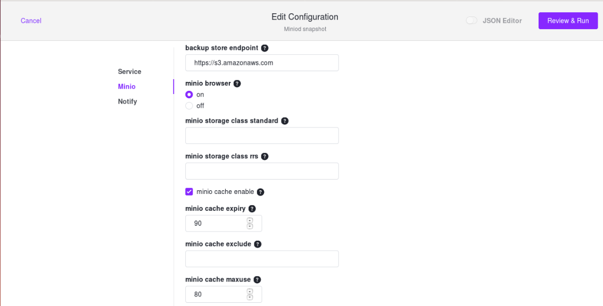

# Disk Caching in {{ model.techName }}
Disk caching refers to the use of caching disks to store content closer to the tenants. 
## Via CLI

The Disk Caching feature can be enabled by updating the cache settings in the `config.json` file of {{ model.techName }}.

You must specify 
* the number of volumes to be mounted
* cache expiry duration in days
* any wildcard patterns to exclude from being cached

<!-- Please provide an example of a config.json file which includes these settings. -->

## Via web interface 

You can enable disk caching in {{ model.techName }} by checking the **minio cache enable** checkbox while installing the {{ model.techName }} service from the DC/OS web interface. You will also need to specify the **minio cache expiry** duration as noted above.

  
  

  Figure 1. - **Edit Configuration** screen in DC/OS web interface

