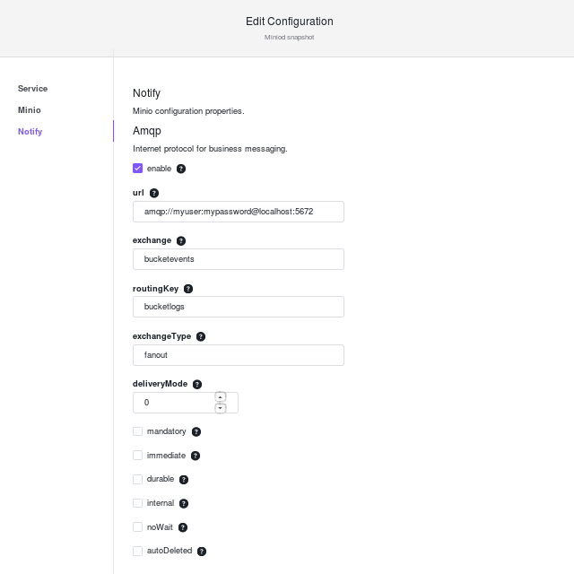
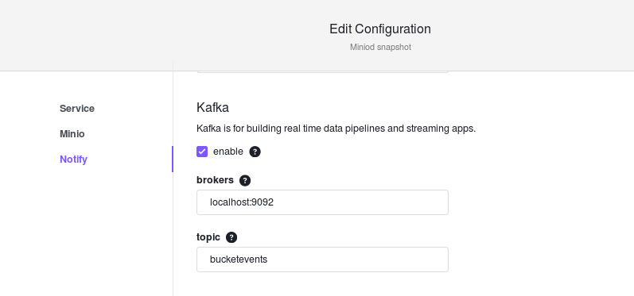
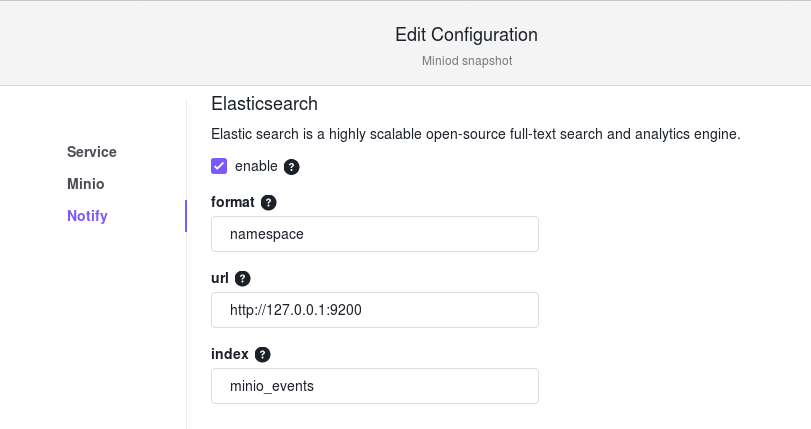
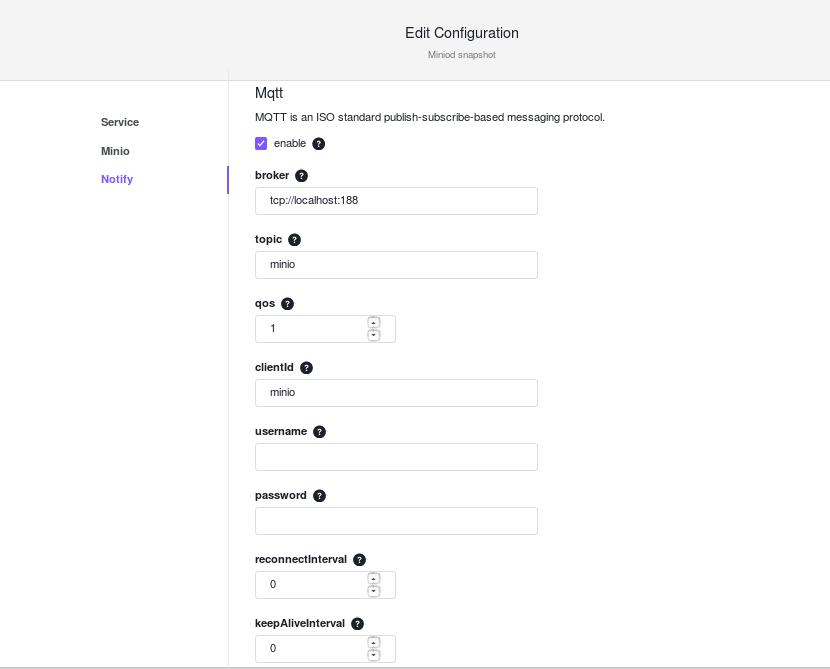
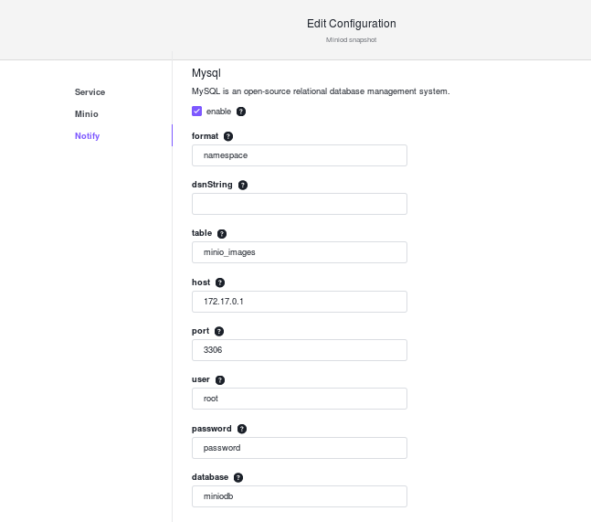
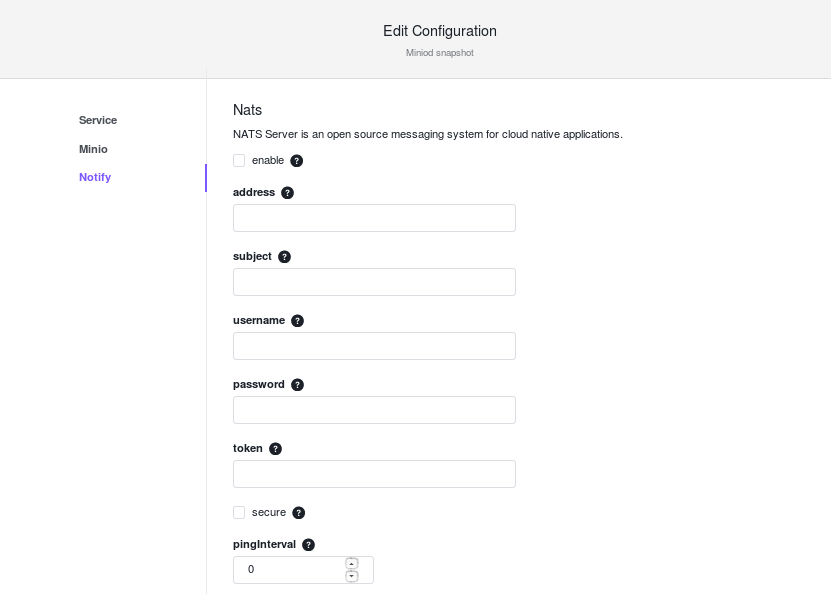
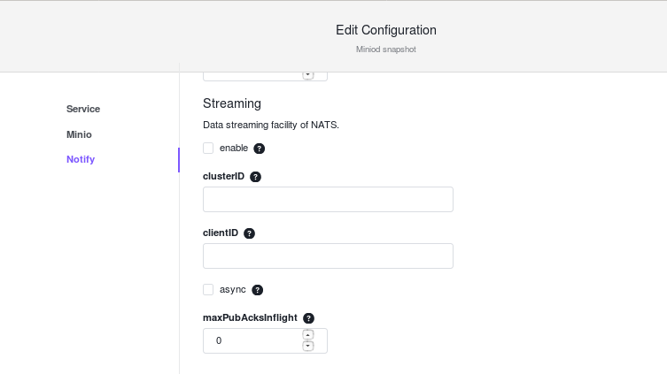
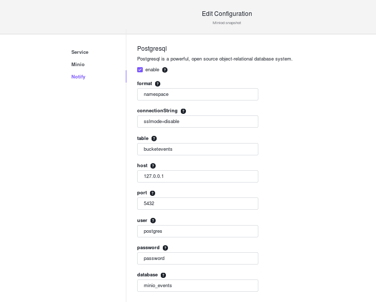
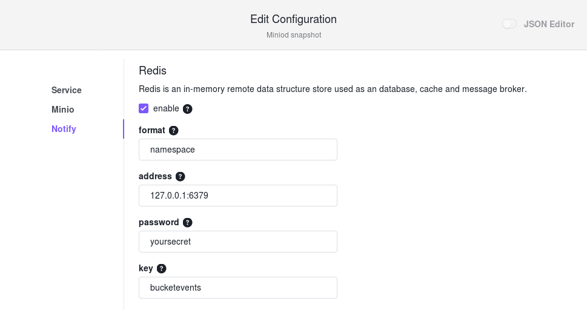
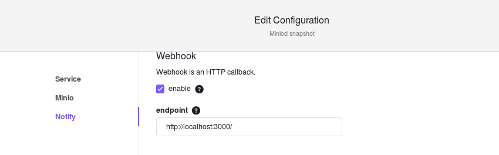

# Overview

You can enable Notification Services to monitor events occurring on objects in a bucket. DC/OS {{ model.techName }} supports the following targets to publish bucket events:

1. [AMQP](#amqp)
1. [Apache Kafka](#kafka)
1. [Elasticsearch](#elasticsearch) 
1. [MySQL](#mysql) 
1. [MQTT](#mqtt)
1. [NATS](#nats)
1. [PostgreSQL](#postgreSQL)
1. [Redis](#redis)
1. [Webhook](#webhook) 


Use client tools like `mc` to set and listen for event notifications using the `event` [sub-command](https://docs.{{ model.serviceName }}.io/docs/{{ model.serviceName }}-client-complete-guide#events).

# Notification Services

<a name="amqp"></a>

## AMQP

### Prerequisites
- Install RabbitMQ from [here](https://www.rabbitmq.com/).

### Configure
To enable the AMQP notification service, provide the following configurations through the DC/OS web interface:

[](../../img/AMQP.png)

Figure 1. - AMQP Edit Configuration page

Buckets can be configured to generate event through client tools like `mc`. For example, the `mc event add` command will add an event to a bucket named `images` through the `{{ model.serviceName }}` client named `my{{ model.serviceName }}` when you add or delete objects with the suffix .jpg.
```
mc event add my{{ model.serviceName }}/images arn:{{ model.techName }}:sqs::1:amqp --suffix .jpg
```

<a name="kafka"></a>

## Kafka

### Prerequisite

- Install [Apache Kafka](http://kafka.apache.org/).

### Configure
To enable the Kafka notification service, provide the following configurations through the DC/OS web interface.

[](../../img/Kafka.png)

Figure 4. - Kafka Edit Configuration page

Buckets can be configured to generate events through client tools like `mc`. For example, the `mc event add` command will add an event to a bucket named `images` through the `{{ model.serviceName }}` client named `my{{ model.serviceName }}` when you add or delete objects with the suffix .jpg.


```
mc event add  my{{ model.serviceName }}/images arn:{{ model.techName }}:sqs::1:kafka --suffix .jpg
```

<a name="elasticsearch"></a>


## Elasticsearch

### Prequisites

- Install [Elasticsearch](https://www.elastic.co/downloads/elasticsearch) server.

### Configure

This notification target supports two formats: `namespace` and `access`.

To enable the Elasticsearch notification service, provide the following configurations through the DC/OS web interface.

[](../../img/Elasticsearch.png)

Figure 5. - Elasticsearch Edit Configuration page

Buckets can be configured to generate event through client tools like `mc`. For example, the `mc event add` command will add an event to a bucket named `images` through the `{{ model.serviceName }}` client named `my{{ model.serviceName }}` when you add or delete objects with the suffix .jpg.

```
mc event add  my{{ model.serviceName }}/images arn:{{ model.techName }}:sqs::1:elasticsearch --suffix .jpg
```


<a name="mqtt"></a>

## MQTT

### Prerequisites

- Install [an MQTT Broker](https://mosquitto.org/).

### Configure

To enable the MQTT notification service, provide the following configurations through the DC/OS web interface.

[](../../img/MQTT.png)

Figure 7. - MQTT Edit Configuration page

Buckets can be configured to generate event through client tools like `mc`. For example, the `mc event add` command will add an event to a bucket named `images` through the `{{ model.serviceName }}` client named `my{{ model.serviceName }}` when you add or delete objects with the suffix .jpg.

```
mc event add  my{{ model.serviceName }}/images arn:{{ model.techName }}:sqs::1:mqtt --suffix .jpg
```


# Additional event listing

Additional event can be listed using the following command:

```
mc event list my{{ model.serviceName }}/images
```

For more information visit the [{{ model.techShortName }} Bucket Notification Guide](https://docs.{{ model.serviceName }}.io/docs/{{ model.serviceName }}-bucket-notification-guide.html).


<a name="mysql"></a>

## MySQL

### Prerequisite

- Install [MySQL](https://dev.mysql.com/downloads/mysql/).

### Configure

This notification target supports two formats: `namespace` and `access`.

To enable the MySQL notification service, provide the following configurations through the DC/OS web interface.

[](../../img/Mysql.png)

Figure 7. - Webhook Edit Configuration page

Buckets can be configured to generate event through client tools like `mc`. For example, the `mc event add` command will add an event to a bucket named `images` through the `{{ model.serviceName }}` client named `my{{ model.serviceName }}` when you add or delete objects with the suffix .jpg.

```
mc event add my{{ model.serviceName }}/images arn:{{ model.techName }}:sqs::1:postgresql --suffix .jpg
```


<a name="nats"></a>

## NATS

### Prerequisites
- Install [NATS](https://nats.io/).

### Configure

To enable the NATS notification service, provide the following configurations through the DC/OS web interface.

[](../../img/NATS.png)

Figure 8. - NATS Edit Configuration page (top)

[](../../img/NATS1.png)

Figure 9. - NATS Edit Configuration page (bottom)

Buckets can be configured to generate event through client tools like `mc`. For example, the `mc event add` command will add an event to a bucket named `images` through the `{{ model.serviceName }}` client named `my{{ model.serviceName }}` when you add or delete objects with the suffix .jpg.

```
mc event add  my{{ model.serviceName }}/images arn:{{ model.techName }}:sqs::1:nats --suffix .jpg
```


<a name="postgreSQL"></a>

## PostgreSQL

### Prequisite: 

- Install [PostgreSQL](https://www.postgresql.org/) database server.

This notification target supports two formats: `namespace` and `access`.

### Configure

To enable the PostgreSQL notification service, provide the following configurations through the DC/OS web interface.

[](../../img/PostgreSQL.png)

Figure 3. - PostgreSQL Edit Configuration page

Buckets can be configured to generate event through client tools like `mc`. For example, the `mc event add` command will add an event to a bucket named `images` through the `{{ model.serviceName }}` client named `my{{ model.serviceName }}` when you add or delete objects with the suffix .jpg.


```
mc event add my{{ model.serviceName }}/images arn:{{ model.techName }}:sqs::1:postgresql --suffix .jpg
```

<a name="redis"></a>

## Redis

### Prerequisite

- Install [Redis](https://redis.io/download) server. 

### Configure 
This notification target supports two formats: `namespace` and `access`.

To enable the Redis notification service, provide the following configurations through the DC/OS web interface:

[](../../img/Redis.png)

Figure 2. - Redis Edit Configuration page

Buckets can be configured to generate event through client tools like `mc`. For example, the `mc event add` command will add an event to a bucket named `images` through the `{{ model.serviceName }}` client named `my{{ model.serviceName }}` when you add or delete objects with the suffix .jpg.

```
mc event add  my{{ model.serviceName }}/images arn:{{ model.techName }}:sqs::1:redis --suffix .jpg
```


<a name="webhook"></a>

## Webhook

[Webhooks](https://en.wikipedia.org/wiki/Webhook) are a way to receive information when it happens, rather than continually polling for that data.

### Prerequisite

- Install [Webhooks](http://www.webhook.com/docs/).


### Configure

To enable the Webhook notification service, provide the following configurations through the DC/OS web interface.

[](../../img/Webhook.png)

Figure 6. - Webhook Edit Configuration page

Buckets can be configured to generate event through client tools like `mc`. For example, the `mc event add` command will add an event to a bucket named `images` through the `{{ model.serviceName }}` client named `my{{ model.serviceName }}` when you add or delete objects with the suffix .jpg.

```
mc event add my{{ model.serviceName }}/images arn:{{ model.techName }}:sqs::1:webhook --events put --suffix .jpg
```

