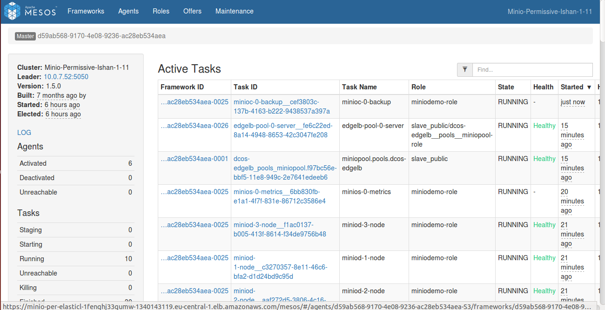
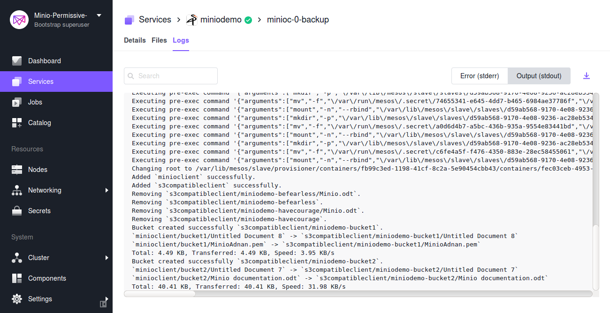

The DC/OS {{ model.techName }} service allows you to back up your data to AWS S3-compatible storage, using the `mc mirror` command. {{ model.techName }} provides an `rsync`-like command line utility. It mirrors data from one bucket to another. 
## Prerequisites

The following values are required to back up your data:

  1. ACCESS_KEY_ID
  2. SECRET_ACCESS_KEY

Set your plan parameters as follows:

```shell
{
 'ACCESS_KEY_ID': access_key_id,
 'SECRET_ACCESS_KEY': secret_access_key
}
``` 


## Back up
    
1. Run the following command to start your backup plan:

    ```shell
    {
    dcos {{ model.packageName }} --name=<service_name> plan start <plan_name> -p <plan_parameters>
    }
    ```

1. To launch the backup plan, run the following command with the requisite parameters:

    ```shell
    {
    dcos {{ model.packageName }} --name=<SERVICE_NAME> plan start backup \
      -p ACCESS_KEY_ID=<ACCESS_KEY> \
      -p SECRET_ACCESS_KEY=<SECRET_ACCESS_KEY>
    }
    ````

    Once this plan is executed, the backup will be uploaded to S3-compatible storage.

1. A backup task will run the `mc mirror` command by taking ACCESS_KEY_ID and SECRET_ACCESS_KEY as parameters.

1. It will create new buckets in the AWS S3-compatible storage according to the current snapshot or state of the {{ model.techName }} storage system. 

1. While creating a bucket in S3-compatible storage during backup, the task service name will be attached to the prefix of the actual bucket name in {{ model.techName }}. 

1. A `synchronize-buckets` command will delete the buckets in the AWS S3-compatible storage which were deleted in the {{ model.techName }} since the last backup. 

1. A separate Pod will be started at any Private Agent. 

1. An init script will register both {{ model.techName }} as well as an S3-compatible client.

   [](../../img/Backup.png)

   Figure 1. - Backing up to S3-compatible storage

   [](../../img/Backup.png)

   Figure 2. - Creation of bucket in S3-compatible storage
    
## Specifying an S3-compatible storage endpoint

While deploying the service from a catalog, you can specify S3-compatible storage by providing the URL of that storage.

   [](../../img/S3_Compatible_1.png)

   Figure 3. - Enter the storage URL

   [](../../img/S3_Compatible_2.png)

   Figure 4. - S3-compatible storage (for example,  {{ model.techName }})

