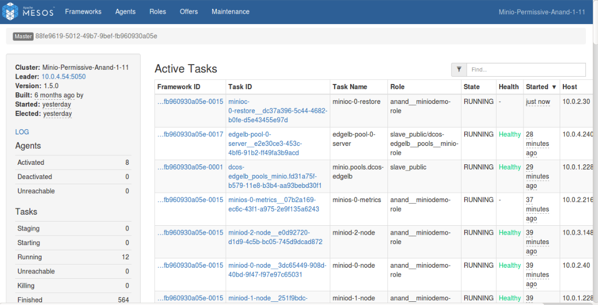

The DC/OS {{ model.techName }} service allows you to restore the backed up data in AWS S3-compatible storage to the DC/OS {{ model.techName }} storage system. A restoration plan is especially useful in case disk  or node failure prevents you from accessing your data. However, {{ model.techName }} is resilient to half the number of disk failures. The restoration plan will be useful if more than half the number of disks are corrupted. 

## Prerequisites

The following values are required to restore your data:

   1. ACCESS_KEY_ID
   2. SECRET_ACCESS_KEY  
   3. S3_BUCKET


The restore task is responsible for restoring the data in the DC/OS {{ model.techName }} storage system. The restore plan must be launched against each backed-up S3-compatible storage bucket. Once this plan is executed, it will restore the data in the specified bucket in AWS S3-compatible storage to DC/OS {{ model.techName }}.

## Restore

1. Run the following command to start your restore plan:
 
   ```shell
   {
   dcos {{ model.packageName }} --name=<SERVICE_NAME> plan start restore \
   -p ACCESS_KEY_ID=<ACCESS_KEY> \
   -p SECRET_ACCESS_KEY=<SECRET_ACCESS_KEY> \
   -p S3_BUCKET=<BUCKET_NAME>
   }
   ```

1. The restore task will run the `mc mirror` command, taking `ACCESS_KEY_ID`, `SECRET_ACCESS_KEY` and `S3_BUCKET` as parameters. 

1. The restore task will create a bucket with the same name which was in the DC/OS {{ model.techName }} storage system previously; it will drop the prefix service name from the bucket which was attached in S3-compatible storage in the backup plan.

   [](../img/Restore.png)

   Figure 2. - Restoring the data
   
A `restore` plan will execute the two aforementioned tasks serially. 


