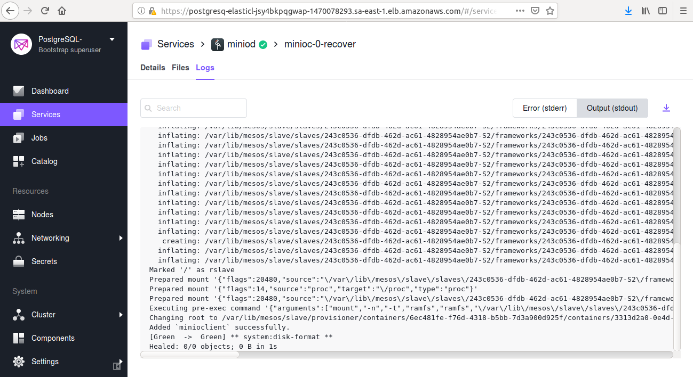
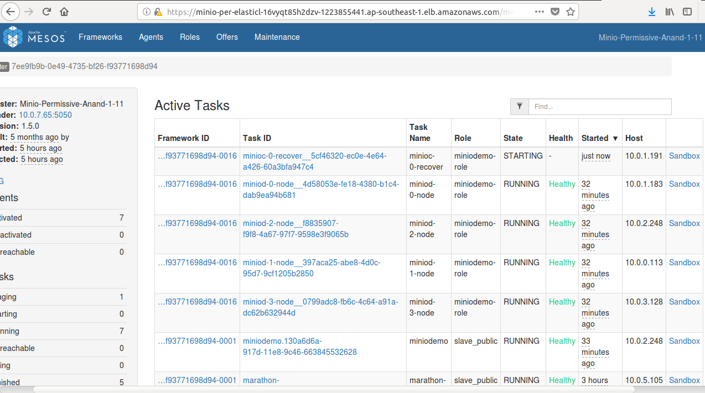

# Recover

The DC/OS {{ model.techName }} service allows you to heal buckets and objects on the DC/OS {{ model.techName }} server, such as in the case of disk/node failure. You must heal the DC/OS  {{ model.techName }} cluster if you intend to add new disks to the cluster. 

## Recover

1. Run the following command to execute the `recover` plan:
   ```shell
   {
   dcos {{ model.packageName }} --name=<service_name> plan start recover
   }
   ```

1. The 'recover' task will run the `mc heal` command.
   ```shell
   mc admin heal -r minioclient
   ```
   [](../../img/Recover1.png)


<p class="message--important"><strong>NOTE: </strong>The <tt>mc heal</tt> command is only applicable for a DC/OS  {{ model.techName}} erasure coded setup (standalone and distributed). See <a href="/0.1.0/configuration/erasure-coding-schemes/">Erasure Coding Scheme in {{ model.techName}} </a> or the <a href="https://docs.minio.io/docs/minio-admin-complete-guide.html#heal">{{ model.techName}}  Command Reference</a> for more information.</p>

### Node replace

If you have replaced a node using `node replace`, then when the pod starts on a different node, the recover task will be executed.

### Node failure
In case of node failure, when the node  comes up again, then the recover plan will be executed. Specifically, the number of parity blocks and number of data blocks will be restored.

   [](../../img/Recover.png)

   Figure 1. - Recovering the disk 
