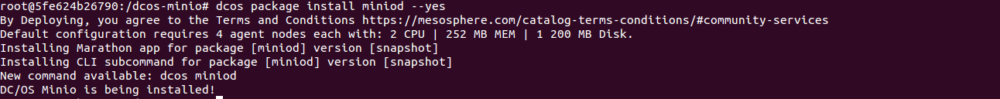
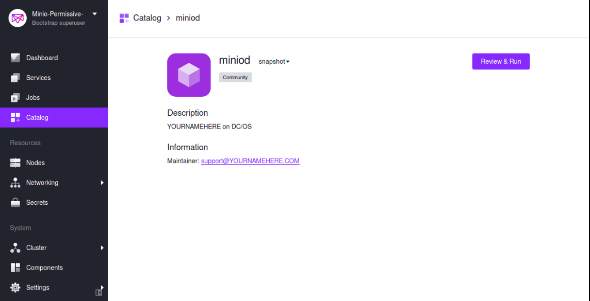
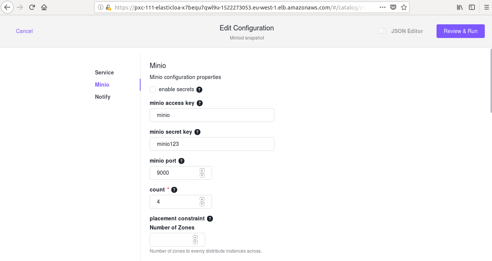
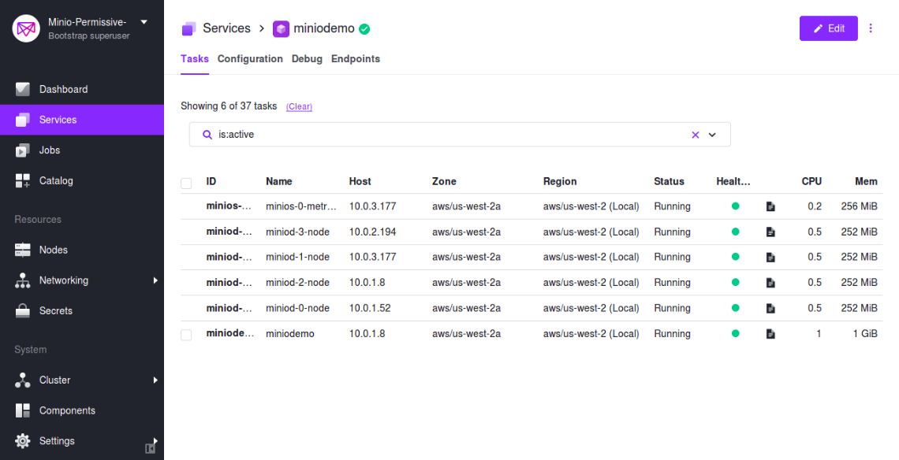
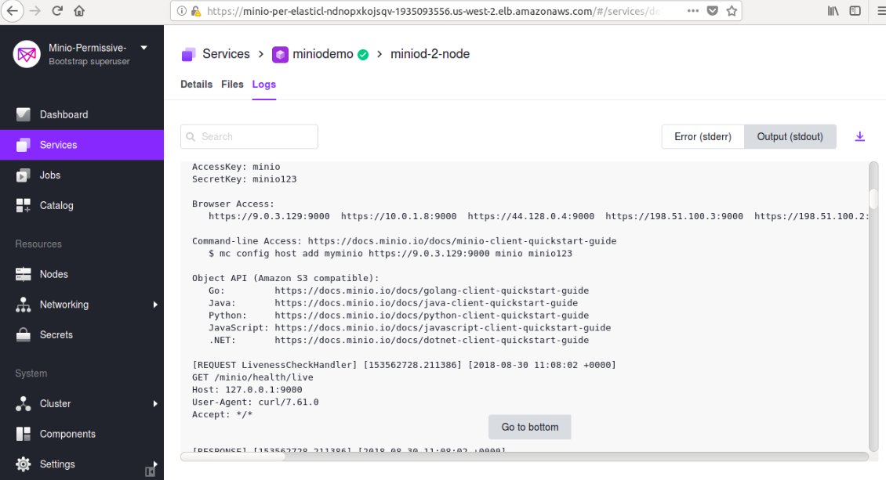

# How to use {{ model.techName }} with DC/OS 

This section will get you up and running with a basic DC/OS {{ model.techName }} configuration in a short time.

## Prerequisites

* A running DC/OS 1.11 cluster. (If you do not have one installed, see the instructions in [Getting Started](/services/minio/0.1.0/getting-started/#install-a-basic-cluster).)

* DC/OS {{ model.techName }} requires {{ model.install.minNodeCount}} to start in distributed mode. (DC/OS {{ model.techName }} requires that you start {{ model.install.nodeDescription }} in distributed mode.)

* Your DC/OS cluster must contain {{ model.install.minPrivateAgents }}. 

* If DC/OS Secrets are enabled to specify credentials for DC/OS {{ model.techName }}, then the following Secrets must be created:

  * `service.name/access_key`
  * `service.name/secret_key`

  where `service.name` is the name by which {{ model.techName }} service is installed on DC/OS.

# Install

{{ model.techName }} can be installed via either the DC/OS Catalog web interface or by using the CLI. 

## Via CLI

The following command will launch installation via the DC/OS CLI:

```bash
dcos package install {{ model.packageName }} 
```

You should see a response similar to this:
  
  [](../img/Package_installed.png)


## Via the web interface

Shown below are the steps to install {{ model.techName }} using the DC/OS Catalog web interface:

1. Navigate to the **Catalog** screen and choose **{{ model.packageName }}** from the list.

1. The **{{ model.packageName }}** package appears on the screen as shown below: 
    [](../img/Catalog_Service_View.png)
    Figure 1. - **{{ model.packageName }}** package  

1. Click on the package and edit the configuration accordingly. Then click the **Review & Run** button to run the service.
    [](../img/Node_Count1.png)
    Figure 2. - Edit Configuration

1. Once the service is started, verify that all the nodes are up and running by viewing the Tasks tab.
    [](../img/Running_Stage1.png)
    Figure 3. - Verify service is up and running

1.  Check the output log to verify that all the nodes of the DC/OS {{ model.techName }} server are up and running.
    [](../img/Successful_Execution1.png)
    Figure 4. - Service is installed successfully


