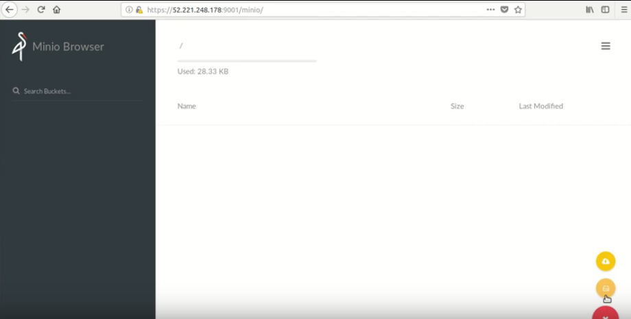

# Prerequisites
- [A DC/OS Service Account with a secret stored in the DC/OS Secret Store.](https://docs.mesosphere.com/latest/security/ent/service-auth/custom-service-auth/)
- DC/OS Superuser permissions for modifying the permissions of the service account.
- [DC/OS CLI](https://docs.mesosphere.com/1.10/cli/install/) installed and be logged in as a superuser.
- [Enterprise DC/OS CLI 1.10 or later installed](https://docs.mesosphere.com/1.10/cli/enterprise-cli/#ent-cli-install).
<!-- You have called for two different installations of DC/OS. Which one is correct? -->
<!-- There is no dependency of versions. We can use any version of DC/OS CLI. -->
- If your [security mode](https://docs.mesosphere.com/1.10/security/ent/) is permissive or strict, you must [get the root cert](https://docs.mesosphere.com/1.10/security/ent/tls-ssl/get-cert/) before issuing the curl commands in this section.

#include /services/include/service-account.tmpl

#include /services/include/security-configure-transport-encryption.tmpl

## Accessing the {{ model.techName }} web interface with Edge-LB TLS configuration

<!-- Is this section a duplicate of the Accessing Minion web interface with Edge-LB TLS configuration section in the Quick Start Guide? If so, why? Does it have to be in both places? -->
<!-- No it is not same. In Quick Start Guide it is Edge-lb without TLS configuration. -->

### Pre-requisites for EdgeLB with TLS configuration
1. DC/OS cluster with Service account and Service account secret configured.

1. {{ model.techName }} service installed with TLS enabled.

### Steps

<!-- This section is incomplete. Please provide commands for the following steps. Don't make the user look them up somewhere else. -->
<!-- Done. -->
For Edge-LB pool configuration:
1. Add repo of Edge-LB-aws.
   ```shell
   dcos package repo add --index=0 edgelb-aws \https://edge-lb-infinity-artifacts.s3.amazonaws.com/autodelete7d/master/edgelb/stub-universe-edgelb.json
   ```
1. Add repo of Edge-LB-Pool-aws.
   ```shell
   dcos package repo add --index=0 edgelb-pool-aws \https://edge-lb-infinity-artifacts.s3.amazonaws.com/autodelete7d/master/edgelb-pool/stub-universe-edgelb-pool.json
   ```
1. Install the Edge-LB:
   ```shell
   dcos package install edgelb --yes
   ``` 
1. Create the configuration JSON file with required parameters to access {{ model.techName }}:
   ```json
   {
   "apiVersion": "V2",
   "name": "minio",
   "count": 1,
   "autoCertificate": true,
   "haproxy": {
      "frontends": [
         {
         "bindPort": 9001,
         "protocol": "HTTPS",
         "certificates": [
            "$AUTOCERT"
         ],
         "linkBackend": {
            "defaultBackend": "miniodemo"
         }
         }
      ],
      "backends": [
      {
         "name": "miniodemo",
         "protocol": "HTTPS",
         "rewriteHttp": {
            "host": "miniod.miniodemo.l4lb.thisdcos.directory"
            },
            "request": {
               "forwardfor": true,
               "xForwardedPort": true,
               "xForwardedProtoHttpsIfTls": true,
               "setHostHeader": true,
               "rewritePath": true
         },
         "services": [{
         "endpoint": {
            "type": "ADDRESS",
            "address": "miniod.miniodemo.l4lb.thisdcos.directory",
            "port": 9000
         }
         }]
         }
         ]
      }
   }

   ```
1. Create `edge-pool` using the JSON file created in the preceding step:
   ```shell
   dcos edgelb create edgelb-pool-config.json
   ```    
1. Accessing {{ model.techName }}:
   ```shell
   https://<Public IP of the Public Node of the cluster>>:9001/minio
   ```  
   The {{ model.techName }} server can be accessed using the {{ model.techName }} client by registering it to the {{ model.techName }} Server. To register a {{ model.techName }} client, specify the public IP of the Public Agent running EdgeLB.

   [](../img/edgelb_with_tls.png)

   Figure 1. - Minio browser 

   For more details on the {{ model.techName }} Client, refer to the link:
   [minio-client-complete-guide](https://docs.minio.io/docs/minio-client-complete-guide.html)  

## Installing the service

1. Install the DC/OS {{ model.techName }} Service, including the following options in addition to your own:

   ```shell
   {
      "service": {
         "service_account": "<your service account name>",
         "service_account_secret": "<full path of service secret>",
         "security": {
            "tls_ssl": {
               "enabled": true
                     }
                     }
               }
   }
   ```
1. TLS service view
   [](../img/TLS_Service.png)

   Figure 2. - TLS service view
1. Running stage view
   [](../img/Running_Stage1.png)

   Figure 3. - Running stage view

1. Successful execution

   [](../img/TLS_Successful_Execution.png)

   Figure 4. - Successful execution

