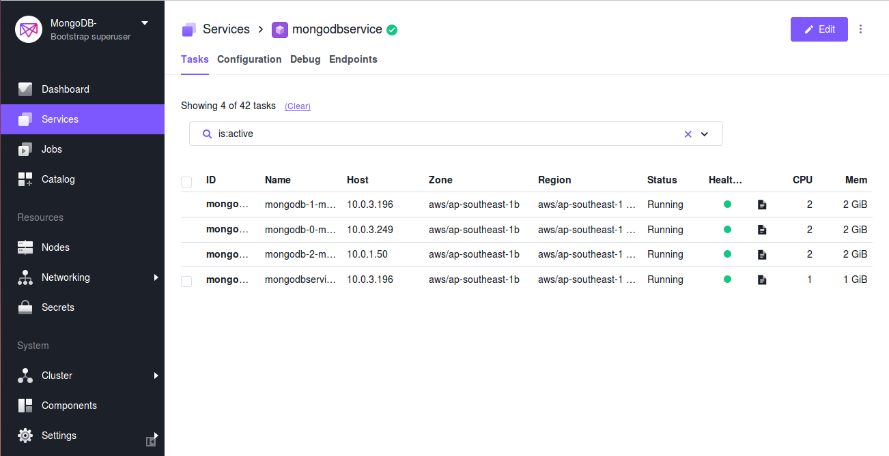

# Prerequisites

* A running DC/OS cluster
* Ops Manager base URL (host URL or path where the Ops Manager is hosted)
* Project ID (obtained after creating a project on Ops Manager)
* Generate a new or use an existing public API key from the Ops Manager.
* Username of the registered user at Ops Manager organization.
* Whitelist the IP of host in the Ops Manager.
* You will need the following values for both the CLI and web interface methods of installation:
    - `base_URL`
    - `project_ID`
    - `public_api_key`
    - `ops username`

## Installing {{ model.techName }} Ops Manager

To install the {{ model.techName }} Ops Manager on a host machine, please gather the requirements specified and follow the steps provided on the [{{ model.techName }} Ops Manager Installation](https://docs.opsmanager.mongodb.com/current/installation/) page.

# Installing {{ model.techName }} on DC/OS

{{ model.techName }} can be installed via either the DC/OS Catalog web interface or from the CLI. 

## Installing via the web interface
Listed below are the steps to install {{ model.techName }} using the DC/OS Catalog web interface:

1. Navigate to the **Catalog** screen and choose **{{ model.packageName }}** from the list. The **{{ model.packageName }}** package will appear on the screen as shown below :

    [](../img/Catalog_Service_View.png)

    Figure 1. - Catalog view of **{{ model.packageName }}** for installation

1. Click on the package and edit the configuration accordingly. Then click the **Review & Run** button to run the service.

    [](../img/Config_page.png)

    Figure 2. - Edit configuration to install  **{{ model.packageName }}**

3. Once the service is started, verify that all the nodes are up and running by their status.

    [](../img/Running_Stage.png)

    Figure 3. - Running instances of **{{ model.packageName }}**

4. Check the output log to verify that all nodes of the **{{ model.packageName }}** server are up and running.

    [](../img/Successful_execution.png)

    Figure 4. - Log view of successful running of  **{{ model.packageName }}** instance

## Installing via the CLI
Listed below are the steps to install {{ model.techName }} using the DC/OS command line interface:

1. Configure an `options.json` file with installation parameters. The `options.json` file should contain the required key pairs, which are `base_url`,`project_id`, `ops_user_name` and `public_api_key`.

    Sample `options.json` file:

    ```json
    {
      "service": {
        "base_url": "http://54.110.97.37:8080",
        "project_id": "5bf3d8fdcg3a9f3ff8588343",
        "ops_user_name": "user",
        "public_api_key": "4d215f3c-e241-4ea7-86fa-g06235a0e19d"
      }
    }
    ```

1. Launch the install via the DC/OS CLI:

    ```bash
    dcos package install {{ model.packageName }} --yes --options=options.json
    ```

1. Verify the installation of {{ model.packageName }}. Your output from the preceding command should look like this:
    ```
    By Deploying, you agree to the Terms and Conditions https://mesosphere.com/catalog-terms-conditions/#community-services
    Default configuration requires 3 agent nodes each with: 1 CPU | 2048 MB MEM | 1 5120 MB data Disk | 1 2048 MB log Disk.
    Installing Marathon app for package [{{ model.packageName }}] version [snapshot]
    Installing CLI subcommand for package [{{ model.packageName }}] version [snapshot]
    New command available: dcos {{ model.packageName }}
    DC/OS {{ model.packageName }} is being installed!
    ```


