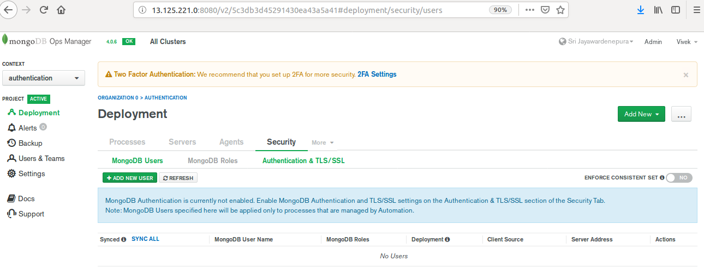
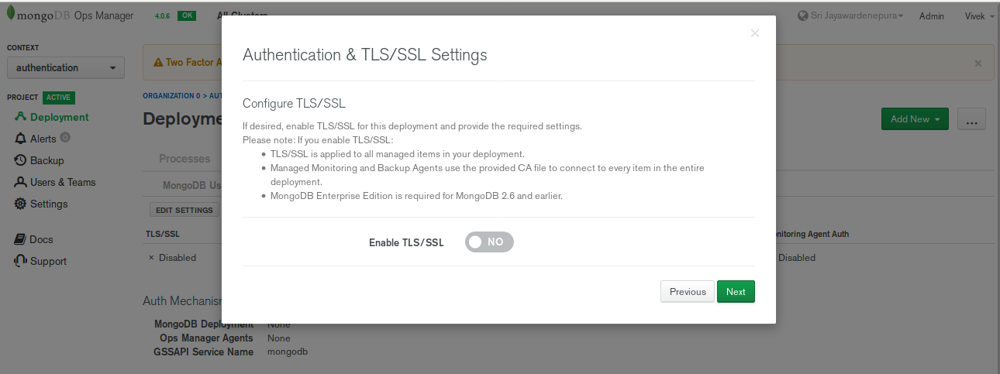
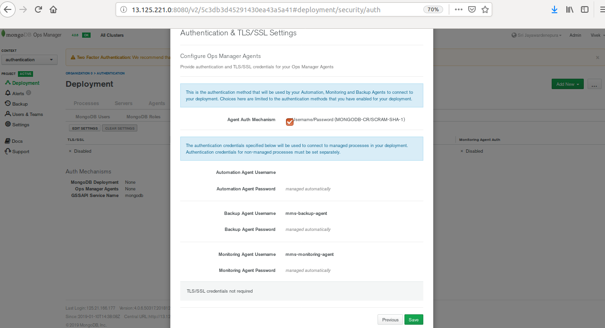

{{  model.techName  }} OpsManager provides support to enable authentication and authorization of users. This helps to ensure security of the servers by enabling access control. If a deployment uses access control, the Monitoring and Backup Agents must authenticate to the deployment as {{  model.techName  }} users with appropriate access. With access control enabled, you must create {{  model.techName  }} users so that clients can access your databases.

If you are using automation to manage your {{  model.techName  }} deployments, Ops Manager automatically creates users for the agents when you enable access control. The user created for the Automation Agent has privileges to administrate and manage other users. As such, the first user you create can have any role.

# Configuring {{  model.techName  }} Authentication
1. In the project dashboard of {{  model.techName  }} OpsManager, click on the **Security** tab.

    [](../../img/OpsManager_Project_Dashboard.png)

    Figure 1. - Dashboard view of {{  model.techName  }} OpsManager Project

1. Under the **Security** menu, click on the **Authentication & TLS/SSL** option.

    [](../../img/Security_Tab.png)

    Figure 2. - **Authentication & TLS/SSL** option under **Security**

1. Click on the **Edit Settings** option. A pop-up dialog will appear as **Authentication & TLS/SSL Settings**.

1. Enable the ```Username/Password (MONGODB-CR/SCRAM-SHA-1)``` Authentication mechanism by ticking the check-box against the option.

    [](../../img/Authentication_Mechanisms.png)

    Figure 3. - Authentication mechanisms under **Authentication & TLS/SSL Settings**

1. Click **Next** to continue to the next screen. Keep the **Configure TLS/SSL** parameter in the default state of `Disabled` (since TLS is not supported in this release).

    [](../../img/Authentication_Setting.png)

    Figure 4. - Authentication & TLS/SSL Settings

1. Click ```Next``` to **Configure Ops Manager Agents**.

    [](../../img/Authentication_Setting_2.png)

    Figure 5. - **Authentication & TLS/SSL** Settings Agents Configuration

1. Click **Save** to save the settings and close the dialog box.

1. Review the changes to be deployed and click on **Confirm and Deploy** in the pop-up dialog.

    [](../../img/Confirm_Deploy.png)

    Figure 6. - Confirm deployment of changes

1. The changes will start deploying. Once they have been completely deployed, you can now connect to the instance using appropriate users created and authorized for authentication.

    [](../../img/Authentication_Deploying.png)

    Figure 7. - Deployment of Authentication Setting changes

1. Under the **Replica Set** menu, click on the option **Connect to this instance**.

    [](../../img/Connect_to_cluster.png)

    Figure 8. - Connect to cluster with Authentication

1. A popup dialogue will appear with the command to access the {{ model.serviceName }} shell. 

    [](../../img/Connect_to_cluster_2.png)

    Figure 9. - Connect to replica set with Authentication

1. In order to connect to the Replica Set and access the ```mongod``` shell, you must connect to the DC/OS {{  model.techName  }} task.
To enter the DC/OS {{  model.techName  }} task shell, execute the following command over DC/OS CLI:

    ```bash
      dcos task exec -ti <dcos-task-id> bash
    ```

1. Enter the command to connect with the Replica Set in the CLI instance to access the ```mongod``` shell using authentication mechanism.

    [](../../img/Final_Connection.png)

    Figure 10. - {{  model.techName  }} shell with Authentication security

